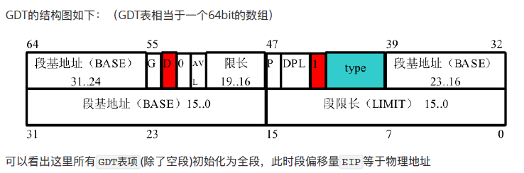
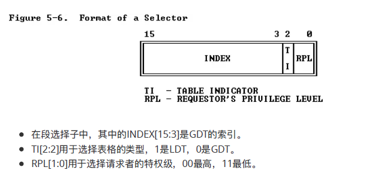
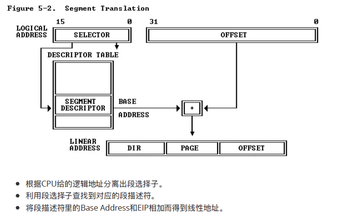
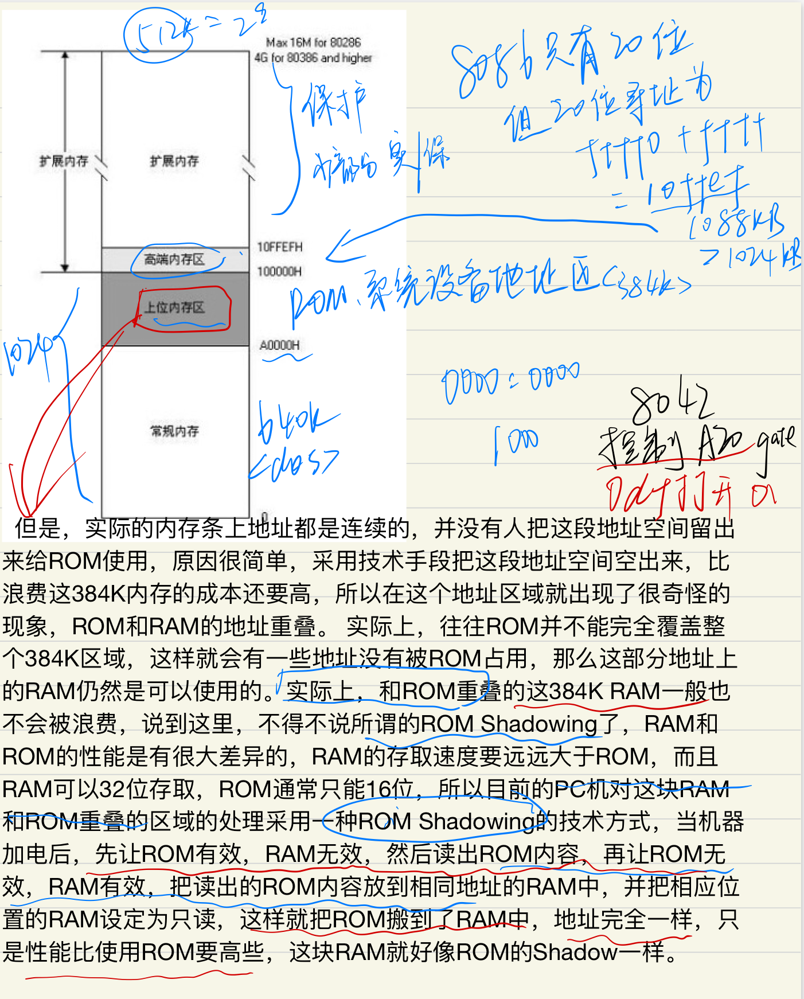
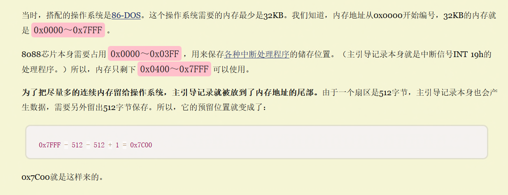

## lab1实验报告

#### 调用顺序：

  1. boot/bootasm.S  | bootasm.asm
     a. 开启A20   16位地址线 实现 20位地址访问  芯片版本兼容。
        （通过写 键盘控制器8042  的 64h端口 与 60h端口）

     b. 加载GDT全局描述符 lgdt gdtdesc
     c. 使能和进入保护模式 置位 cr0寄存器的 PE位 (内存分段访问) PE+PG（分页机制）

     ```
     movl %cr0, %eax 
     orl $CR0_PE_ON, %eax  或操作，置位 PE位 
     movl %eax, %cr0
     ```

     d. 调用载入系统的函数 call bootmain  # 转而调用 bootmain.c 

  2. boot/bootmain.c -> bootmain 函数
     a. 调用readseg函数从ELFHDR处读取8个扇区大小的 os 数据。
     b. 将输入读入 到 内存中以 进程(程序)块 proghdr 的方式存储
     c. 跳到ucore操作系统在内存中的入口位置（kern/init.c中的kern_init函数的起始地址）

  3. kern/init.c
     a. 初始化终端 cons_init(); init the console   kernel/driver/consore.c
         显示器初始化       cga_init();    
         串口初始化         serial_init(); 
         keyboard键盘初始化 kbd_init();
     b. 打印内核信息 & 欢迎信息 
        print_kerninfo();          //  内核信息  kernel/debug/kdebug.c
        cprintf("%s\n\n", message);//　欢迎信息 const char *message = “qwert”

     c. 显示堆栈中的多层函数调用关系 切换到保护模式，启用分段机制
        grade_backtrace();

     d. 初始化物理内存管理
        pmm_init();        // init physical memory management   kernel/mm/ppm.c
        --->gdt_init();    // 初始化默认的全局描述符表

     e. 初始化中断控制器，
        pic_init();        // 初始化 8259A 中断控制器   kernel/driver/picirq.c

     f. 设置中断描述符表
        idt_init();        // kernel/trap/trap.c 
        // __vectors[] 来对应中断描述符表中的256个中断符  tools/vector.c中

     g. 初始化时钟中断，使能整个系统的中断机制  8253定时器 
        clock_init();      // 10ms 时钟中断(1s中断100次)   kernel/driver/clock.c
        ----> pic_enable(IRQ_TIMER);// 使能定时器中断 

     h. 使能整个系统的中断机制 enable irq interrupt
        intr_enable();     // kernel/driver/intr.c
        // sti();          // set interrupt // x86.h

     i. lab1_switch_test();// 用户切换函数 会 触发中断用户切换中断

     4.kernel/trap/trap.c 

       trap中断(陷阱)处理函数
        trap() ---> trap_dispatch()   // kernel/trap/trap.c 

        a. 10ms 时钟中断处理 case IRQ_TIMER：
           if((ticks++)%100==0) print_ticks();//向终端打印时间信息（1s打印一次）
           
        b. 串口1 中断    case IRQ_COM1: 
           获取串口字符后打印
           
        c. 键盘中断      case IRQ_KBD: 
           获取键盘字符后打印
           
        d. 用户切换中断

-----------------------------------------------------

### 练习1：理解通过make生成执行文件的过程。（要求在报告中写出对下述问题的回答）

列出本实验各练习中对应的OS原理的知识点，并说明本实验中的实现部分如何对应和体现了原理中的基本概念和关键知识点。

在此练习中，大家需要通过静态分析代码来了解：

```
1. 操作系统镜像文件ucore.img是如何一步一步生成的？(需要比较详细地解释Makefile中每一条相关命令和命令参数的含义，以及说明命令导致的结果)
2. 一个被系统认为是符合规范的硬盘主引导扇区的特征是什么？
```

#### 问题1：操作系统镜像文件ucore.img是如何一步一步生成的？

1.输入make "V="获取详细信息

```
//cc 即编译kern和libs目录下的所有后缀为.c/.S的文件
+ cc kern/init/init.c
	gcc -c kern/init/init.c -o obj/kern/init/init.o
	-c 即编译该文件， -o即生成为该目录下的obj文件
+ cc kern/libs/readline.c
+ cc kern/libs/stdio.c
+ cc kern/debug/kdebug.c
+ cc kern/debug/kmonitor.c
+ cc kern/debug/panic.c
+ cc kern/driver/clock.c
+ cc kern/driver/console.c
+ cc kern/driver/intr.c
+ cc kern/driver/picirq.c
+ cc kern/trap/trap.c
+ cc kern/trap/trapentry.S
+ cc kern/trap/vectors.S
+ cc kern/mm/pmm.c
+ cc libs/printfmt.c
+ cc libs/string.c
// 链接得到bin/kernel文件
+ ld bin/kernel
  ld -m    elf_i386 -nostdlib -T tools/kernel.ld -o bin/kernel  obj/kern/init/init.o obj/kern/libs/readline.o
.....
obj/libs/string.o
// 编译boot目录下的所有后缀为.c/.S的文件
+ cc boot/bootasm.S
+ cc boot/bootmain.c
// 编译sign.c 由tools/sign.c -> ../sign.o -> bin/sign(注意是文件)
+ cc tools/sign.c
// 链接得到bin/bootblock
+ ld bin/bootblock
  ld -m    elf_i386 -nostdlib -N -e start -Ttext 0x7C00 obj/boot/bootasm.o obj/boot/bootmain.o -o obj/bootblock.o
  'obj/bootblock.out' size: 488 bytes
  build 512 bytes boot sector: 'bin/bootblock' success!
// 创建大小为10000个块的ucore.img，初始化为0，每个块为512字节
dd if=/dev/zero of=bin/ucore.img count=10000
10000+0 records in
10000+0 records out
5120000 bytes (5.1 MB) copied, 0.0561184 s, 91.2 MB/s
dd if=bin/bootblock of=bin/ucore.img conv=notrunc
// 把bootblock中的内容写到第一个块
1+0 records in
1+0 records out
512 bytes (512 B) copied, 0.000139138 s, 3.7 MB/s
dd if=bin/kernel of=bin/ucore.img seek=1 conv=notrunc
// 将bin/kernel写入到bin/ucore.img的一个block之后(seek=1)
```

```
dd 
使用权限: 所有使用者dd 这个指令在 manual 里的定义是 convert and copy a file
dd [选项]
if =输入文件（或设备名称）。
of =输出文件（或设备名称）。
conv = notrunc 不截断输出文件。
```

------------------------------

1. ###### 在**Makefile**文件中找到生成bootblock的代码如下

   生成目标文件bootblock需要依赖于**sign**和bootfiles

```
# create bootblock             //为了生成bootblock，首先应生成bootasm.o,bootmain.c和sign
bootfiles = $(call listf_cc,boot)      //用boot替换listf_cc里面的变量，将listf_cc的返回值赋给bootfiles
//listf_cc函数是过滤出对应目录下的.c和.S文件，因此等同于bootfiles=boot/\*.c boot/\*.S
$(foreach f,$(bootfiles),$(call cc_compile,$(f),$(CC),$(CFLAGS) -Os -nostdinc))

bootblock = $(call totarget,bootblock) 

$(bootblock): $(call toobj,$(bootfiles)) | $(call totarget,sign)  //生成目标文件bootblock需要依赖于sign和bootfiles
	@echo + ld $@        //将以下文件与bootblock连接起来
	$(V)$(LD) $(LDFLAGS) -N -e start -Ttext 0x7C00 $^ -o $(call toobj,bootblock)
	@$(OBJDUMP) -S $(call objfile,bootblock) > $(call asmfile,bootblock)    //移除bootblock中所有的符号和重定位信息
	@$(OBJCOPY) -S -O binary $(call objfile,bootblock) $(call outfile,bootblock)
	@$(call totarget,sign) $(call outfile,bootblock) $(bootblock)

$(call create_target,bootblock)
```

2. ###### 在**Makefile**文件中找到生成ucore.img的代码如下

​	发现ucore.img文件的生成依赖于kernel和bootblock

```
UCOREIMG := $(call totarget,ucore.img)   //此时通过call函数来实现创建ucore.img的过程，UCOREIMG代表的就是即将生成的ucore.img文件  
//totarget的作用是添加bin/前缀，因此UCOREIMG = bin/ucore.img
$(UCOREIMG): $(kernel) $(bootblock)        //这里表示ucore-img文件的生成依赖于kernel 和 bootblock 
     $(V)dd if=/dev/zero of=$@ count=10000    //为UCOREIMG分配一个10000*512字节大小的空间
     $(V)dd if=$(bootblock) of=$@ conv=notrunc  //将bootblock拷贝到UCOREIMG中，大小为512字节
     $(V)dd if=$(kernel) of=$@ seek=1 conv=notrunc //将kernel拷贝到UCOREIMG中，从文件开头跳过seek个块之后开始拷贝

$(call create_target,ucore.img)
```

##### **生成ucore.img的代码：**

**1. 设置了ucore.img的目标名**：

UCOREIMG := $(call totarget,ucore.img)，totarget的作用是添加bin/前缀，因此UCOREIMG = bin/ucore.img
**2. 指出bin/ucore.img依赖于bin/kernel和bin/bootblock**：

$(UCOREIMG): $(kernel) $(bootblock)

**3. (V)ddif=/dev/zeroof=@ count=10000**。

这里为bin/ucore.img分配10000个block的内存空间，并全部初始化为0。由于没指定block的大小，因此为默认值512bytes,那么10000个block约为5MB。
**4. $(V)dd if=$(bootblock) of=$@ conv=notrunc**。

这里将bin/bootblock复制到bin/ucore.img
**5. $(V)dd if=$(kernel) of=$@ seek=1 conv=notrunc。**

继续将bin/kernel复制到bin/ucore.img，这里使用了选项seek=1，意思是：复制时跳过bin/ucore.img的第一个block，从第2个block也就是第512个字节后面开始拷贝bin/kernel的内容。

**原因是显然的**：ucore.img的第1个block已经用来保存bootblock的内容了。

**6. $(call create_target,ucore.img)**

由于只有一个输入参数，因此这里会直接返回。

```
小知识1：在类UNIX 操作系统中, /dev/zero 是一个特殊的文件，当你读它的时候，它会提供无限的空字符(NULL, ASCII NUL, 0x00)。其中的一个典型用法是用它提供的字符流来覆盖信息，另一个常见用法是产生一个特定大小的空白文件。BSD就是通过mmap把/dev/zero映射到虚地址空间实现共享内存的。可以使用mmap将/dev/zero映射到一个虚拟的内存空间，这个操作的效果等同于使用一段匿名的内存（没有和任何文件相关）。
```

----

##### **总结ucore.img的生成过程**

    1.编译libs和kern目录下所有的.c和.S文件，生成.o文件，并链接得到bin/kernel文件
    2.编译boot目录下所有的.c和.S文件，生成.o文件，并链接得到bin/bootblock.out文件
    3.编译tools/sign.c文件，得到bin/sign文件
    4.利用bin/sign工具将bin/bootblock.out文件转化为512字节的bin/bootblock文件，并将bin/bootblock的最后两个字节设置为0x55AA
    5.为bin/ucore.img分配5MB的内存空间（内容全为0），并将bin/bootblock复制到bin/ucore.img的第一个block，紧接着将bin/kernel复制到bin/ucore.img第二个block开始的位置
---------------------

#### 问题2. 一个被系统认为是符合规范的硬盘主引导扇区的特征是什么？

**sign.c**文件中的部分源码如下：

```
    char buf[512];  //定义buf数组
    memset(buf, 0, sizeof(buf));
      // 把buf数组的最后两位置为 0x55, 0xAA
    buf[510] = 0x55;  
    buf[511] = 0xAA;
    FILE *ofp = fopen(argv[2], "wb+");
    size = fwrite(buf, 1, 512, ofp);
    if (size != 512) {       //大小为512字节
        fprintf(stderr, "write '%s' error, 
                         size is %d.\n", argv[2], size);
        return -1;
    }

```

**读tools/sign.c代码可知**

就是将输入文件拷贝至输出，并控制大小为512（char buf[512]）
    buf[510] = 0x55;
    buf[511] = 0xAA;
    可见将最后两个字节设为 55AA

即为ELF文件的magic number

```
小知识：AA展开为10101010,55展开为01010101,
变成串行电平的话就是一个占空比为50%的方波，
这种方波在电路中最容易被分辨是否受干扰或者畸变，
在实际波形的观察中也最容易看出毛病所在，
```

##### 回答问题：**主引导扇区的规则如下：**

- 大小为512字节
- 多余的空间填0
- 第510个（倒数第二个）字节是0x55，
- 第511个（倒数第一个）字节是0xAA。

-------------------------------

### 练习2：使用qemu执行并调试lab1中的软件。（要求在报告中简要写出练习过程）

为了熟悉使用qemu和gdb进行的调试工作，我们进行如下的小练习：

```
1. 从CPU加电后执行的第一条指令开始，单步跟踪BIOS的执行。
2. 在初始化位置0x7c00设置实地址断点,测试断点正常。
3. 从0x7c00开始跟踪代码运行,将单步跟踪反汇编得到的代码与bootasm.S和 bootblock.asm进行比较。
4. 自己找一个bootloader或内核中的代码位置，设置断点并进行测试。
```

---------------先搁在这，闲下来再码

--------------------------------------插个眼-------------------------这段时间忙完了回来码

----------------------------------------------------------------插--------------------------------------------------------------

----------------------------------------------------------------眼--------------------------------------------------------------

------------------------------------

### 练习3：分析bootloader进入保护模式的过程。（要求在报告中写出分析）

BIOS将通过读取硬盘主引导扇区到内存，并转跳到对应内存中的位置执行bootloader。请分析bootloader是如何完成从实模式进入保护模式的。

提示：需要阅读**小节“保护模式和分段机制”**和lab1/boot/bootasm.S源码，了解如何从实模式切换到保护模式，需要了解：

- 为何开启A20，以及如何开启A20
- 如何初始化GDT表
- 如何使能和进入保护模式

#### 问题1：为何开启A20，以及如何开启A20？

**首先**让我们来梳理一遍保护模式与实模式，以及GDT的由来

1. **实模式**：

   在bootloader接手BIOS的工作后，当前的PC系统处于实模式（16位模式）运行状态，在这种状态下软件可访问的物理内存空间不能超过1MB，且无法发挥Intel 80386以上级别的32位CPU的4GB内存管理能力。

   实模式将整个物理内存看成分段的区域，程序代码和数据位于不同区域，操作系统和用户程序并没有区别对待，而且每一个指针都是指向实际的物理地址。这样，用户程序的一个指针如果指向了操作系统区域或其他用户程序区域，并修改了内容，那么其后果就很可能是灾难性的。通过**修改A20地址线**可以完成从实模式到保护模式的转换。

2. **保护模式**:
   只有在保护模式下，80386的全部32根地址线有效，可寻址高达4G字节的线性地址空间和物理地址空间，可访问64TB（有2^14个段，每个段最大空间为2^32字节）的逻辑地址空间，可采用分段存储管理机制和分页存储管理机制。这不仅为存储共享和保护提供了硬件支持，而且为实现虚拟存储提供了硬件支持。通过提供4个特权级和完善的特权检查机制，既能实现资源共享又能保证代码数据的安全及任务的隔离。

   ```
   【补充】保护模式下，有两个段表：GDT（Global Descriptor Table）和LDT（Local Descriptor Table），每一张段表可以包含8192 (2^13)个描述符，因而最多可以同时存在2 * 2^13 = 2^14个段。虽然保护模式下可以有这么多段，逻辑地址空间看起来很大，但实际上段并不能扩展物理地址空间，很大程度上各个段的地址空间是相互重叠的。目前所谓的64TB（2^(14+32)=2^46）逻辑地址空间是一个理论值，没有实际意义。在32位保护模式下，真正的物理空间仍然只有2^32字节那么大。
   ```

----------------------------------------------

**其次**为什么要有GDT？我们首先考虑一下在实模式下的编程模型：

​	1.在**Real Mode**下，我们对一个内存地址的访问是通过Segment:Offset的方式来进行的，其中Segment是一个段的Base Address，一个Segment的最大长度是64KB，这是16-bit系统所能表示的最大长度。

​	而Offset 则是相对于此Segment Base Address的偏移量。Base Address+Offset就是一个内存绝对地址。由此，我们可以看出，一个段具备两个因素：	

- Base Address
- Limit（段的最大长度）

​	而对一个内存地址的访问，则是需要指出：使用哪个段？以及相对于这个段Base Address的Offset，这个Offset应该小于此段的Limit。当然对于16-bit系统，Limit不要指定，因为**默认最大长度是64KB(2^16=64KB) **，而16-bit的Offset 也永远不可能大于此Limit 。我们在实际编程的时候，使用16-bit段寄存器CS（Code Segment），DS（Data Segment），SS（Stack Segment）来指定Segment，CPU将段寄存器中的数值向左偏移4-bit，放到20-bit的地址线上就成为**20-bit**的Base Address。
​	2.到了**Protected Mode**，内存的管理模式分为两种，段模式和页模式，其中页模式也是基于段模式的。也就是说，Protected Mode的内存管理模式事实上是：纯段模式和段页式。**进一步说，段模式是必不可少的**，而页模式则是可选的——如果使用页模式，则是段页式；否则这是纯段模式。
​	既然是这样，我们就先不去考虑页模式。对于段模式来讲，访问一个内存地址仍然使用Segment:Offset的方式，这是很自然的。由于Protected Mode运行在32-bit系统上，那么Segment的两个因素：Base Address和Limit也都是32位的。
​	IA-32允许将一个段的Base Address设为32-bit所能表示的任何值（Limit则可以被设为32-bit所能表示的，以2^32为倍数的任何值），而不像 Real Mode下，一个段的Base Address只能是16的倍数（因为其低4-bit是通过左移运算得来的，只能为0，从而达到使用16-bit段寄存器表示20-bit Base Address的目的），而一个段的Limit只能为固定值64KB。另外，Protected Mode，顾名思义，又为段模式提供了保护机制，也就说一个段的描述符需要规定对自身的访问权限（Access）。
​	所以，在Protected Mode下，对一个段的描述则包括3方面因素：[Base Address，Limit，Access]，它们加在一起被放在一个64-bit长的数据结构中，被称为**段描述符**。这种情况下，如果我们直接通过一个64-
bit段描述符来引用一个段的时候，就必须使用一个64-bit长的段寄存器装入这个段描述符。但Intel为了保持向后兼容，将段积存器仍然规定为16-bit（尽管每个段积存器事实上有一个 64bit - 16bit长的**不可见部分**，但对于程序员来说，段寄存器就是16-bit的），那么很明显，我们无法通过16-bit长度的段积存器来直接引用64-bit的段描述符。
​	怎么办？解决的方法就是把这些长度为64-bit的段描述符放入一个数组中，而将段寄存器中的值作为下标索引来间接引用（事实上，是将段寄存器中的高13-bit（即段选择子）的内容作为索引）。这个全局的数组就是GDT。事实上，在GDT中存放的不仅仅是段描述符，还有其它描述符，它们都是64-bit长，我们随后再讨论。

​	GDT可以被放在内存的任何位置，那么当程序员通过段寄存器来引用一个段描述符时，CPU必须知道GDT的入口，也就是基地址放在哪里，所以Intel的设计者门提供了一个**寄存器GDTR**用来存放GDT的入口地址，程序员将GDT设定在内存中某个位置之后，可以通**过LGDT指令将GDT的入口地址装入此寄存器**，从此以后，CPU就根据此积存器中的内容作为GDT的入口来访问GDT了。

​	GDT是Protected Mode所必须的数据结构，也是唯一的——不应该，也不可能有多个。另外，正如它的名字（Global Descriptor Table）所蕴含的，它是全局可见的，对任何一个任务而言都是这样。
​	除了GDT之外，IA-32还允许程序员构建与GDT类似的数据结构，它们被称作LDT（Local Descriptor Table），但与GDT不同的是，LDT在系统中可以存在多个，并且从LDT的名字可以得知，LDT不是全局可见的，它们只对引用它们的任务可见，每个任务最多可以拥有一个LDT。另外，每一个LDT自身作为一个段存在，它们的段描述符被放在GDT中。（由于ucore中没有LDT，暂且不表，待来日有缘再见嘿嘿）



**段选择子**

```
在一个段寄存器里面，会保存一个值叫段选择子
offset是段机制下，是eip提供，当中断时，由IDT得到

实模式下段的基地址等于段寄存器的值得乘以16，
保护模式下段的基地址在描述符表中给出，段选择子的高13位就是描述符表（2个，全局和局部）的索引号（0~8191）。8192=2^13
```





**GDT的访问**

有了上面这些知识，我们可以来看看到底应该怎样通过GDT来获取需要访问的地址了。我们通过这个示意图来讲解：



------------------------------------------------------------------------------------

**那么现在开始进入A20的介绍**

http://hengch.blog.163.com/blog/static/107800672009013104623747/ 详细描述在此

1. ##### **历史背景**——为何开启A20？

   8088/8086只有20位地址线，寻址空间是2^20，应该是**1024KB**，但PC机的寻址结构是segment:offset，segment和offset都是16位的寄存器，最大值是0ffffh，换算成物理地址的计算方法是把segment左移4位，再加上offset，所以segment:offset所能表达的寻址空间最大应为0ffff0h + 0ffffh =  10ffefh，这个计算出的10ffefh是多大呢？大约是**1088KB**

   **就是说，segment:offset的地址表达能力，超过了20位地址线的物理寻址能力。**

   你说这是不是有点麻烦？在早先，由于所有的机器都没有那么大的内存，加上地址线只有20位，所以当你用segment:offset的方式企图寻址100000h这个地址时，由于没有实际的第21位地址线，你实际寻址的内存是00000h的位置，如果你企图寻址100001h这个地址时，你实际得到的内容是地址00001h上的内容，所以这个事对实际使用几乎没有任何影响，但是后来就不行了，出现了80286，地址线达到了24位，使segment:offset寻址100000h--10ffefh这将近64K的存储器成为可能，为了保持向下兼容，于是出现了A20 Gate

   ​	由下图可知，我们将80386内存（4G)大致分为以下

   ​	1.常规内存：DOS时，只有640K

   ​	2,上位内存区：实模式下，内存为1M，因此我们称dos之上，1M之下的为上位内存区

   ​	3.高端内存区：上文提到的10ffef到实模式1M之间的那段384K 



​	怪就怪在大家都喜欢从后面地址开始用起7C00h也是这个道理（后面也会细讲)

2. ##### **如何开启A20？**

**规定**：给 8042 发送命令 0xDF 置 A20 gate 有效，给 8042 送命令 0xDD 置 A20 gate 无效。

8042有4个寄存器
    1个8-bit长的Input buffer；Write-Only；
    1个8-bit长的Output buffer； Read-Only；
    1个8-bit长的Status Register；Read-Only；
    1个8-bit长的Control Register；Read/Write。

有两个端口地址：60h和64h，有关对它们的读写操作描述如下：

    读60h端口，读output buffer
    写60h端口，写input buffer
    读64h端口，读Status Register
    操作Control Register，首先要向64h端口写一个命令（20h为读命令，60h为写命令），然后根据命令从60h端口读出Control Register的数据或者向60h端口写入Control Register的数据（64h端口还可以接受许多其它的命令）。
    
    A20 Gate，出现80286以后，为了保持和8086的兼容，PC机在设计上在第21条地址线（也就是A20）上做了一个开关，当这个开关打开时，这条地址线和其它地址线一样可以使用，当这个开关关闭时，第21条地址线（A20）恒为0，这个开关就叫做A20 Gate，很显然，在实模式下要访问高端内存区，这个开关必须打开，在保护模式下，由于使用32位地址线，如果A20恒等于0，那么系统只能访问奇数兆的内存，即只能访问0--1M、2-3M、4-5M......，这显然是不行的，所以在保护模式下，这个开关也必须打开。


    读Output Port：向64h发送0d0h命令，然后从60h读取Output Port的内容
    写Output Port：向64h发送0d1h命令，然后向60h写入Output Port的数据
    禁止键盘操作命令：向64h发送0adh
    打开键盘操作命令：向64h发送0aeh

---------------------------------------------------------

    理论上讲，我们只要操作8042芯片的输出端口（64h）的bit 1，就可以控制A20 Gate，但实际上，当你准备向8042的输入缓冲区里写数据时，可能里面还有其它数据没有处理，所以，我们要首先禁止键盘操作，同时等待数据缓冲区中没有数据以后，才能真正地去操作8042打开或者关闭A20 Gate。打开A20 Gate的具体步骤大致如下：

//具体操作步骤

1. 等待8042 Input buffer为空；
2. 发送Write 8042 Output Port （P2）命令到8042 Input buffer；
3. 等待8042 Input buffer为空；
4. 将8042 Output Port（P2）得到字节的第2位置1，然后写入8042 Input buffer

**发送0xd1命令到0x64端口之后，发送0xdf到0x60。**

---------------------------------------------

##### **以下为lab1/boot/bootasm.S 代码解释分析：**

```
#include <asm.h>
 
# Start the CPU: switch to 32-bit protected mode, jump into C.
# The BIOS loads this code from the first sector of the hard disk into
# memory at physical address 0x7c00 and starts executing in real mode
# with %cs=0 %ip=7c00.
 
.set PROT_MODE_CSEG,        0x8                     # kernel code segment selector
.set PROT_MODE_DSEG,        0x10                    # kernel data segment selector
.set CR0_PE_ON,             0x1                     # protected mode enable flag
 
# start address should be 0:7c00, in real mode, the beginning address of the running bootloader
.globl start
start:
.code16                                             # Assemble for 16-bit mode
    cli                                             # Disable interrupts
    cld                                             # String operations increment
//在16位下关闭中断，并设置字符串操作是递增方向
    # Set up the important data segment registers (DS, ES, SS).
    # 这个xorw可以将%ax设置为零，而不管这个之前的值 
	# 使用 AT&T 样式的语法，所以其中的源和目的操作数和 Intel 文档中给出的顺序是相反的。
	# 全部设为0
    xorw %ax, %ax                                   # Segment number zero
    movw %ax, %ds                                   # -> Data Segment
    movw %ax, %es                                   # -> Extra Segment
    movw %ax, %ss                                   # -> Stack Segment
 
    # Enable A20:
    #  For backwards compatibility with the earliest PCs, physical
    #  address line 20 is tied low, so that addresses higher than
#  1MB wrap around to zero by default. This code undoes this.
 
 //接下来是A20操作：为了兼容早期的PC机，第20根地址线在实模式下不能使用，所以超过1MB的地址，默认就会返回到地址0，重新从0循环计数，而下面的代码能打开A20地址线
 
//具体操作步骤
1. 等待8042 Input buffer为空；
2. 发送Write 8042 Output Port （P2）命令到8042 Input buffer；
3. 等待8042 Input buffer为空；
4. 将8042 Output Port（P2）得到字节的第2位置1，然后写入8042 Input buffer
seta20.1:   //总体功能，通过将键盘控制器上的A20线置于高电位，全部32条地址线可用，可以访问4G的内存空间
 
inb $0x64, %al   //从0x64端口读入一个字节的数据到al（eax寄存器的低8位）
testb $0x2, %al  //检查最低的第2位是否为1，即键盘缓冲区是否为空
 
理论依据：我们只要操作8042芯片的输出端口（64h）的bit 1，就可以控制A20 Gate，但实际上，当你准备向8042的输入缓冲区里写数据时，可能里面还有其它数据没有处理，所以，我们要首先禁止键盘操作——来自参考书
 
jnz seta20.1   //如果上面的测试中发现al的第2位为0（00000010，代表键盘缓冲区为空），就不执行该指令，否则就循环检查（），即等待为空操作
 
    movb $0xd1, %al  //发送写8042输出端口的指令
    outb %al, $0x64
 
seta20.2:   //继续等待8042键盘控制器不忙
inb $0x64, %al
testb $0x2, %al
    jnz seta20.2   //和之前一样，不忙了就可以出来
 
    movb $0xdf, %al
outb %al, $0x60   //将al中的数据写入到0x60端口中，将全局描述符表描述符加载到全局描述符表寄存器 
 
    # Switch from real to protected mode, using a bootstrap GDT
    # and segment translation that makes virtual addresses
    # identical to physical addresses, so that the
# effective memory map does not change during the switch.
 
lgdt gdtdesc  //加载GDT表
 
    movl %cr0, %eax
    orl $CR0_PE_ON, %eax
	movl %eax, %cr0
 
//cr0的第0位为1表示处于保护模式，为0表示处于实时模式，这里将CR0的第0位置1【在这里转换了保护模式】
 
    # Jump to next instruction, but in 32-bit code segment.
    # Switches processor into 32-bit mode.
    ljmp $PROT_MODE_CSEG, $protcseg
.code32  //长跳转到32位代码段，重装CS、EIP、DS、ES等段寄存器等
    # Set up the protected-mode data segment registers
    movw $PROT_MODE_DSEG, %ax                       # Our data segment selector
    movw %ax, %ds                                   # -> DS: Data Segment
    movw %ax, %es                                   # -> ES: Extra Segment
    movw %ax, %fs                                   # -> FS
    movw %ax, %gs                                   # -> GS
    movw %ax, %ss                                   # -> SS: Stack Segment
    # Set up the stack pointer and call into C. The stack region is from 0--start(0x7c00)
    movl $0x0, %ebp
    movl $start, %esp
    call bootmain   //转到保护模式完成，进入boot主函数
 
    # If bootmain returns (it shouldn't), loop. spin:
    jmp spin
 
# Bootstrap GDT
.p2align 2                                          # force 4 byte alignment
gdt:
    SEG_NULLASM                                     # null seg
    SEG_ASM(STA_X|STA_R, 0x0, 0xffffffff)           # code seg for bootloader and kernel
    SEG_ASM(STA_W, 0x0, 0xffffffff)                 # data seg for bootloader and kernel
 
gdtdesc:
    .word 0x17 # 表示的是GDT表的大小                 # sizeof(gdt) - 1
    .long gdt  # 表示的是GDT表的入口地址             # address gdt
```

#### 问题2：如何初始化GDT表？

详见http://blog.chinaunix.net/uid-24585655-id-2125527.html

```
lgdt gdtdesc  //加载GDT表
```

​	装载全局描述符的基地址和长度进入全局描述符表寄存器

```
gdtdesc:   
	.word    0x17            # sizeof(gdt) - 1    0x17=23个字节 限长
    .long    gdt             # address gdt  基址
```

```
gdt:    //利用汇编进行的空间申请---静态空间
    SEG_NULLASM                                     # null seg
    SEG_ASM(STA_X|STA_R, 0x0, 0xffffffff)           # code seg for bootloader and kernel
    SEG_ASM(STA_W, 0x0, 0xffffffff)                 # data seg for bootloader and kernel
```

gdt是有三个全局描述符组成，

第一个是空描述符---全局描述符表中第一个段描述符设定为空段描述符。
第二个是代码段描述符，第三个是数据段描述符

```
------全局描述符表---(来源于实验指导书)
全局描述符表的是一个保存多个段描述符的“数组”，其起始地址保存在全局描述符表寄存器GDTR中。GDTR长48位，其中高32位为基地址，低16位为段界限。由于GDT 不能有GDT本身之内的描述符进行描述定义，所以处理器采用GDTR为GDT这一特殊的系统段。注意，全局描述符表中第一个段描述符设定为空段描述符。GDTR中的段界限以字节为单位。对于含有N个描述符的描述符表的段界限通常可设为8*N-1。在ucore中的boot/bootasm.S中的gdt地址处和kern/mm/pmm.c中的全局变量数组gdt[]分别有基于汇编语言和C语言的全局描述符表的具体实现。
```

可以知道：

1. 由界限值可以知道能定义最多多少个段描述符，2^16 = 64KB，而每一个段描述符是8个字节，所以64KB/8B = 8K个；
2. code段和数据段的基址和限界都是0x0,0xffffffff，
   这说明在ucore中，在boot这段时间里，逻辑地址和线性地址实际上是一样的。(还不是页机制)

**SEG_ASM的定义如下:**

```
#define SEG_ASM(type,base,lim) \
.word (((lim) >> 12) & 0xffff), ((base) & 0xffff); \
.byte (((base) >> 16) & 0xff), (0x90 | (type)), \
(0xC0 | (((lim) >> 28) & 0xf)), (((base) >> 24) & 0xff)
```

这个是声明了两个16bit的数据变量和4个8bit的数据变量
段描述符是上下两条 一共64bit

```
--nullasm:
.word 0x0000,0x0000;
.byte 0x00,0x00,0x00,0x00
--for code:
.word 0xFFFF,0x0000;
.byte 0x00,0x9A,0xCF,0x00
--for data
.word 0xFFFF,0x0000;
.byte 0x00,0x92,0xCF,0x00
```

#### 问题3：如何使能和进入保护模式？

将cr0寄存器的PE位（cr0寄存器的最低位）设置为1，便使能和进入保护模式了。

代码如下所示：

```
movl %cr0, %eax       //加载cro到eax
orl $CR0_PE_ON, %eax  //将eax的第0位置为1
movl %eax, %cr0       //将cr0的第0位置为1
```

#### 总结：

1. bootloader开始运行在实模式，物理地址为0x7c00，且是16位模式

2. bootloader关闭所有中断，方向标志位复位，ds，es，ss段寄存器清零

3. 打开A20使之能够使用高位地址线--->激活流程为：发送0xd1命令到0x64端口之后，发送0xdf到0x60。

4. 由实模式进入保护模式，使用lgdt指令把GDT描述符表的大小和起始地址存入gdt寄存器，修改寄存器CRO的最低位（or1 $CRO_PEON，$eax）完成从实模式到保护模式的转换，使用ljmp指令由代码段跳到protcseg的起始位置

5. 进入保护模式后，设置ds，es，fs，gs，ss段寄存器，堆栈指针，便可以进入程序bootmain.c

   

   ##### 补充：为何是0x7c00?(历史原因——尽可能留足够的空间给操作系统在32K内加载自己)

   开机扇区是512字节,开机程序需要的堆栈和数据空间至少要512字节.

   

   

----------------------------------------------------

### 练习4：分析bootloader加载ELF格式的OS的过程。

读bootmain.c，了解bootloader如何加载ELF文件。通过分析源代码和通过qemu来运行并调试bootloader&OS

```
- bootloader如何读取硬盘扇区的？
- bootloader是如何加载ELF格式的OS？
```

#### 问题1：BootLoader如何读取硬盘扇区？

​	即分析readsect函数

1. 等待硬盘空闲。waitdisk的函数实现只有一行：while ((inb(0x1F7) & 0xC0) != 0x40)，意思是不断查询读0x1F7寄存器的最高两位，直到最高位为0、次高位为1（这个状态应该意味着磁盘空闲）才返回。
2. 硬盘空闲后，发出读取扇区的命令。对应的命令字为0x20，放在0x1F7寄存器中；读取的扇区数为1，放在0x1F2寄存器中；读取的扇区起始编号共28位，分成4部分依次放在0x1F3~0x1F6寄存器中。
3. 发出命令后，再次等待硬盘空闲。
4. 硬盘再次空闲后，开始从0x1F0寄存器中读数据。
5. 调用ins1函数把磁盘扇区数据读到指定内存。注意insl的作用是"That function will read cnt dwords from the input port specified by port into the supplied output array addr."，是以dword即4字节为单位的，因此这里SECTIZE需要除以4.

进入保护模式之后，Bootloader 需要干的很重要的一件事就是加载ELF文件。因为我们的kernel（也就是ucore）是以ELF文件格式存在硬盘上的。

```
首先需要介绍：bootloader的访问硬盘都是LBA模式的PIO（Program IO）方式，即所有的IO操作是通过CPU访问硬盘的IO地址寄存器完成。
操作系统位于第一个硬盘上，而访问第一个硬盘的扇区可以设置I/O端口0x1f0~0x1f7来改变地址寄存器实现。下述表格所显示的即为0x1f0～0x1f7所对应的功能：
```

第6位：为1=LBA模式；0 = CHS模式        第7位和第5位必须为1

| IO地址 | 功能                                                         |
| :----: | :----------------------------------------------------------- |
| 0x1f0  | 读数据，当0x1f7不为忙状态时，可以读。                        |
| 0x1f2  | 要读写的扇区数，每次读写前，你需要表明你要读写几个扇区。最小是1个扇区 |
| 0x1f3  | 如果是LBA模式，就是LBA参数的0-7位                            |
| 0x1f4  | 如果是LBA模式，就是LBA参数的8-15位                           |
| 0x1f5  | 如果是LBA模式，就是LBA参数的16-23位                          |
| 0x1f6  | 第0~3位：如果是LBA模式就是24-27位     第4位：为0主盘；为1从盘 |
| 0x1f7  | 状态和命令寄存器。操作时先给命令，再读取，如果不是忙状态就从0x1f0端口读数据 |

```
易知：
	硬盘共有8个IO地址寄存器，其中第1个存储数据，第8个存储状态和命令，第3个存储要读写的扇区数，第4~7个存储要读写的起始扇区的编号（共28位）。
```

bootmain.c源码：

硬盘的最小访问单位是一个扇区，而一个扇区的大小为512（2\^8）字节，所以需要8个连续扇区才能放置一个4KB的页。

```
//第一步：wait_disk检查硬盘是否就绪
（检查0x1F7的最高两位，如果是01，则跳出循环；否则等待）
static void waitdisk(void) {
while ((inb(0x1F7) & 0xC0) != 0x40)
/*不断查询读0x1F7寄存器的最高两位，直到最高位为0、次高位为1（这个状态应该意味着磁盘空闲）才返回。*/
/* do nothing */;
}
 
static void readsect(void *dst, uint32_t secno) {
//等待磁盘准备就绪
  waitdisk();
  //读取的扇区起始编号共28位，分成4部分依次放在0x1F3~0x1F6寄存器中。
  outb(0x1F2, 1); #count = 1   		//读取一个扇区的相关信息
  outb(0x1F3, secno & 0xFF);        //要读取的扇区编号
  outb(0x1F4, (secno >> 8) & 0xFF);   //用来存放读写柱面的低 8位字节
  outb(0x1F5, (secno >> 16) & 0xFF);    //用来存放读写柱面的高 2位字节
  outb(0x1F6, ((secno >> 24) & 0xF) | 0xE0);   //用来存放要读/写的磁盘号及磁头号
  outb(0x1F7, 0x20);
  
  waitdisk();
  insl(0x1F0, dst, SECTSIZE / 4);
  //除以4是因为dword以4字节为单位 dword与insl作用有关
}
 
bootmain(void) {
    //首先判断是不是ELF
    readseg((uintptr_t)ELFHDR, SECTSIZE * 8, 0);
	//从硬盘读取第一页（读到内存的位置，大小，ELF文件偏移）
    
    if (ELFHDR->e_magic != ELF_MAGIC) {
        goto bad;                 
    }
    struct proghdr *ph, *eph;
    //定义两个程序头表段，其中ph表示ELF段表首地址；eph表示ELF段表末地址
    ph = (struct proghdr *)((uintptr_t)ELFHDR + ELFHDR->e_phoff);
    eph = ph + ELFHDR->e_phnum;
    
    //第三步：按照程序头表的描述，将ELF文件中的数据载入内存
    for (; ph < eph; ph ++) {
        readseg(ph->p_va & 0xFFFFFF, ph->p_memsz, ph->p_offset);
    }//循环读每个段
    //根据ELF头表中的入口信息，找到内核的入口并开始运行 
    ((void (*)(void))(ELFHDR->e_entry & 0xFFFFFF))();
   //调用头表中的内核入口地址实现内核链接地址转化为加载地址，无返回值
   
bad:   //这里是读取过程中如果出现了错误，如何处理
    outw(0x8A00, 0x8A00);
    outw(0x8A00, 0x8E00);
 
    /* do nothing */
    while (1);
}
```

readseg简单包装了readsect，可以从设备读取任意长度的内容。

```
static void
    readseg(uintptr_t va, uint32_t count, uint32_t offset) {
        uintptr_t end_va = va + count;

        va -= offset % SECTSIZE;

       	uint32_t secno = (offset / SECTSIZE) + 1; 
       	// 加1因为0扇区被引导占用
       	// ELF文件从1扇区开始

		for (; va < end_va; va += SECTSIZE, secno ++) {
        	readsect((void *)va, secno);
        }
	}
```

-----------------------------------

#### 问题2： bootloader如何加载ELF格式的OS

首先从原理上分析加载流程。ELF header-->program header-->offset

1. bootloader要加载的是bin/kernel文件，这是一个ELF文件。其开头是ELF header(包含整个执行文件的控制结构)，ELF Header里面含有phoff字段，用于记录program header表在ELF文件中的偏移，由该字段可以找到程序头表的起始地址。程序头表是一个结构体数组，其元素数目记录在ELF Header的phnum字段中。
2. 程序头表的每个成员分别记录一个Segment的信息，包括以下加载需要用到的信息：
       uint offset; // 段相对文件头的偏移值，由此可知怎么从文件中找到该Segment
       uint va; // 段的第一个字节将被放到内存中的虚拟地址，由此可知要将该 Segment加载到内存中哪个位置
       uint memsz; // 段在内存映像中占用的字节数，由此可知要加载多少内容
3. 根据ELF Header和Program Header表的信息，我们便可以将ELF文件中的所有Segment逐个加载到内存中

```
bootmain(void) {
    //首先判断是不是ELF
    readseg((uintptr_t)ELFHDR, SECTSIZE * 8, 0);
	//从硬盘读取第一页（读到内存的位置，大小，ELF文件偏移）
    
    if (ELFHDR->e_magic != ELF_MAGIC) {
        goto bad;                 
    }
    struct proghdr *ph, *eph;
    //定义两个程序头表段，其中ph表示ELF段表首地址；eph表示ELF段表末地址
    ph = (struct proghdr *)((uintptr_t)ELFHDR + ELFHDR->e_phoff);
    eph = ph + ELFHDR->e_phnum;
    
    //第三步：按照程序头表的描述，将ELF文件中的数据载入内存
    for (; ph < eph; ph ++) {
        readseg(ph->p_va & 0xFFFFFF, ph->p_memsz, ph->p_offset);
    }//循环读每个段
    //根据ELF头表中的入口信息，找到内核的入口并开始运行 
    ((void (*)(void))(ELFHDR->e_entry & 0xFFFFFF))();
   //调用头表中的内核入口地址实现内核链接地址转化为加载地址，无返回值
```

可执行文件的程序头部是一个program header结构的数组， 每个结构描述了一个段或者系统准备程序执行所必需的其它信息。

```
    struct proghdr {
      uint type;   // 段类型
      uint offset;  // 段相对文件头的偏移值
      uint va;     // 段的第一个字节将被放到内存中的虚拟地址
      uint pa;
      uint filesz;
      uint memsz;  // 段在内存映像中占用的字节数
      uint flags;
      uint align;
    };
```

**ELF定义：**

```
#define ELFHDR          ((struct elfhdr *)0x10000) 
#define SECTSIZE        512

/* file header */
    struct elfhdr {//ELF头表段
      uint magic;  // must equal ELF_MAGIC
      uchar elf[12];
      ushort type;
      ushort machine;
      uint version;
      uint entry;  // 程序入口的虚拟地址
      uint phoff;  // program header 表的位置偏移
      uint shoff;
      uint flags;
      ushort ehsize;
      ushort phentsize;
      ushort phnum; //program header表中的入口数目
      ushort shentsize;
      ushort shnum;
      ushort shstrndx;
    };
```

​	**回答问题**：

1. 首先从硬盘中将bin/kernel文件的第一页内容加载到内存地址为0x10000的位置，目的是读取kernel文件的ELF Header信息。
2. 校验ELF Header的e_magic字段，以确保这是一个ELF文件
3. 读取ELF Header的e_phoff字段，得到Program Header表的起始地址；读取ELF Header的e_phnum字段，得到Program Header表的元素数目。
4. 遍历Program Header表中的每个元素，得到每个Segment在文件中的偏移、要加载到内存中的位置（虚拟地址）及Segment的长度等信息，并通过磁盘I/O进行加载
5. 加载完毕，通过ELF Header的e_entry得到内核的入口地址，并跳转到该地址开始执行内核代码。

--------------------------------------------------------------

### 练习5：实现函数调用堆栈跟踪函数 （需要编程）

```
我们需要在lab1中完成kdebug.c中函数print_stackframe的实现，可以通过函数print_stackframe来跟踪函数调用堆栈中记录的返回地址。
```

##### 前置知识回顾(实际上是我汇编忘得差不多了555)

```
理解调用栈最重要的两点是：栈的结构，EBP寄存器的作用。

esp 专门用作堆栈指针，被形象地称为栈顶指针，堆栈的顶部是地址小的区域，压入堆栈的数据越多，ESP也就越来越小。在32位平台上，esp每次减少4字节。
ebp：寄存器存放当前线程的栈底指针
eip：寄存器存放下一个CPU指令存放的内存地址，当CPU执行完当前的指令后，从EIP寄存器中读取下一条指令的内存地址，然后继续执行。
```

-----------------------------------------------------------

    pushl   %ebp
    movl   %esp , %ebp	//注意是AT&T 即esp->ebp

```
函数调用栈的结构
    +|  栈底方向        | 高位地址
     |    ...        |
     |    ...        |
     |  参数3        |
     |  参数2        |
     |  参数1        |
     |  返回地址        |
     |  上一层[ebp]    | <-------- [ebp]
     |  局部变量        |  低位地址
```

这两条汇编指令的含义是：首先将ebp寄存器入栈，然后将栈顶指针esp赋值给ebp。

“mov ebp esp”这条指令表面上看是用esp覆盖ebp原来的值，其实不然。因为给ebp赋值之前，原ebp值已经被压栈（位于栈顶），而新的ebp又恰恰指向栈顶。此时ebp寄存器就已经处于一个非常重要的地位，该寄存器中存储着栈中的一个地址（原ebp入栈后的栈顶），从该地址为基准，向上（栈底方向）能获取返回地址、参数值，向下（栈顶方向）能获取函数局部变量值，而该地址处又存储着上一层函数调用时的ebp值。

```
函数调用时的栈空间：
1、调用者函数把被调函数所需要的参数按照与被调函数的形参顺序相反的顺序压入栈中,即:从右向左依次把被调函数所需要的参数压入栈;
2、调用者函数使用call指令调用被调函数,并把call指令的下一条指令的地址当成返回地址压入栈中(这个压栈操作隐含在call指令中);
3、在被调函数中,被调函数会先保存调用者函数的栈底地址(push ebp),然后再保存调用者函数的栈顶地址,即:当前被调函数的栈底地址(mov ebp,esp);
4、在被调函数中,从ebp的位置处开始存放被调函数中的局部变量和临时变量,并且这些变量的地址按照定义时的顺序依次减小,即:这些变量的地址是按照栈的延伸方向排列的,先定义的变量先入栈,后定义的变量后入栈;
所以,发生函数调用时,入栈的顺序为:
ss:[ebp+4]处为返回地址，ss:[ebp+8]处为第一个参数值（最后一个入栈的参数值，此处假设其占用4字节内存），ss:[ebp-4]处为第一个局部变量，ss:[ebp]处为上一层ebp值。由于ebp中的地址处总是“上一层函数调用时的ebp值”，而在每一层函数调用中，都能通过当时的ebp值“向上（栈底方向）”能获取返回地址、参数值，“向下（栈顶方向）”能获取函数局部变量值。如此形成递归，直至到达栈底。这就是函数调用栈。

```

-------------------------------------------------

**填写代码如下**：

```
void print_stackframe(void) {
     /* LAB1 YOUR CODE : STEP 1 */
     /* (1) call read_ebp() to get the value of ebp. the type is (uint32_t);
      * (2) call read_eip() to get the value of eip. the type is (uint32_t);
      * (3) from 0 .. STACKFRAME_DEPTH
      *    (3.1) printf value of ebp, eip
     *    (3.2) (uint32_t)calling arguments [0..4] = the contents in address (unit32_t)ebp +2 [0..4]
      *    (3.3) cprintf("\n");
      *    (3.4) call print_debuginfo(eip-1) to print the C calling function name and line number, etc.
      *    (3.5) popup a calling stackframe
      *           NOTICE: the calling funciton's return addr eip  = ss:[ebp+4]
      *                   the calling funciton's ebp = ss:[ebp]
      */
	uint32_t ebp=read_ebp();   //调用read ebp访问当前ebp的值，数据类型为32位。
	uint32_t eip=read_eip();   //调用read eip访问eip的值，数据类型同。
	int i;   //这里有个细节问题，就是不能for int i，这里面的C标准似乎不允许
	for(i=0;i<STACKFRAME_DEPTH&&ebp!=0;i++)
	{
		//(3) from 0 .. STACKFRAME_DEPTH
		cprintf("ebp:0x%08x eip:0x%08x ",ebp,eip);//(3.1)printf value of ebp, eip
		uint32_t *args=(uint32_t *)ebp+2;//此时args指向了ss:[ebp+8]的位置 此处存放着参数
		cprintf("arg :0x%08x 0x%08x 0x%08x 0x%08x\n",*(args+0),*		(args+1),*(args+2),*(args+3));//依次打印调用函数的参数1 2 3 4
 
//(3.2)(uint32_t)calling arguments [0..4] = the contents in address (unit32_t)ebp +2 [0..4]
 
//因为使用的是栈数据结构，因此可以直接根据ebp就能读取到各个栈帧的地址和值，ebp+4处为返回地址，ebp+8处为第一个参数值（最后一个入栈的参数值，对应32位系统），ebp-4处为第一个局部变量，ebp处为上一层 ebp 值。
 
//而这里，*代表指针，指针也是占用4个字节，因此可以直接对于指针加一，地址加4。
 
		print_debuginfo(eip-1);	//打印eip以及ebp相关的信息
		eip=((uint32_t *)ebp+1);//此时eip指向了返回地址
		ebp=((uint32_t *)ebp+0);//ebp指向了原ebp的位置
//最后更新ebp：ebp=ebp[0],更新eip：eip=ebp[1]，因为ebp[0]=ebp，ebp[1]=ebp[0]+4=eip。
	}
}
```

```
read_eip(void) {
   uint32_t eip;
    /*
    *asm表示后面的代码为汇编代码 即内联汇编
    *volatile 表示编译器不要优化代码,后面的指令 保留原样
    *%0表示列表开始的第一个寄存器 
    *“=r”(eip)表示gcc让eip对应一个通用寄存器
    *下面这条语句的作用是将ss:[ebp+4]对应的值保存到eip中，ss:[ebp+4]对应的值是
    *函数的返回地址，也就是说将函数的返回地址保存到eip中，然后返回eip
    */
   asm volatile("movl 4(%%ebp), %0" : "=r" (eip));   
   return eip;

}
```

阅读bootblock源码可知
```
Kernel executable memory footprint: 64KB
ebp: 0x00007b08  eip: 0x001009a6args: 0x00010094 0x00000000 0x00007b38 0x00100092 
    kern/debug/kdebug.c:306: print_stackframe+21
ebp: 0x00007b18  eip: 0x00100c9bargs: 0x00000000 0x00000000 0x00000000 0x00007b88 
    kern/debug/kmonitor.c:125: mon_backtrace+10
ebp: 0x00007b38  eip: 0x00100092args: 0x00000000 0x00007b60 0xffff0000 0x00007b64 
    kern/init/init.c:48: grade_backtrace2+33
ebp: 0x00007b58  eip: 0x001000bbargs: 0x00000000 0xffff0000 0x00007b84 0x00000029 
    kern/init/init.c:53: grade_backtrace1+38
ebp: 0x00007b78  eip: 0x001000d9args: 0x00000000 0x00100000 0xffff0000 0x0000001d 
    kern/init/init.c:58: grade_backtrace0+23
ebp: 0x00007b98  eip: 0x001000feargs: 0x001032fc 0x001032e0 0x0000130a 0x00000000 
    kern/init/init.c:63: grade_backtrace+34
ebp: 0x00007bc8  eip: 0x00100055args: 0x00000000 0x00000000 0x00000000 0x00010094 
    kern/init/init.c:28: kern_init+84
ebp: 0x00007bf8  eip: 0x00007d68args: 0xc031fcfa 0xc08ed88e 0x64e4d08e 0xfa7502a8 
    <unknow>: -- 0x00007d67 --
```

```
Set up the stack pointer and call into C. The stack region is from 0--start(0x7c00)

    movl $0x0, %ebp
    7c40:	bd 00 00 00 00       	mov    $0x0,%ebp
    movl $start, %esp
    7c45:	bc 00 7c 00 00       	mov    $0x7c00,%esp
    call bootmain
    7c4a:	e8 82 00 00 00       	call   7cd1 <bootmain>
```

**即——规定栈底  esp为7c00h**

打印输出

由于ebp寄存器指向栈中的位置存放的是调用者的ebp寄存器的值，据此可以继续顺藤摸瓜，不断回溯，直到ebp寄存器的值变为0
---------分析调用关系为：

> kern_init ->
> grade_backtrace ->
>    grade_backtrace0(0, (int)kern_init, 0xffff0000) ->
>            grade_backtrace1(0, 0xffff0000) ->
>                grade_backtrace2(0, (int)&0, 0xffff0000, (int)&(0xffff0000)) ->
>                    mon_backtrace(0, NULL, NULL) ->
>                        print_stackframe ->

-----------------------------------------------------------

**分析最后一行**：
ebp: 0x00007bf8  eip: 0x00007d68 	args: 0xc031fcfa 0xc08ed88e 0x64e4d08e 0xfa7502a8 
    <unknow>: -- 0x00007d67 --

      1. 发现最后是7bf8， 而栈底本为7c00h
    
    ebp指向的栈位置存放调用者的ebp寄存器的值，ebp+4指向的栈位置存放返回地址的值，这意味着kern_init函数的调用者（也就是bootmain函数）没有传递任何输入参数给它！因为单是存放旧的ebp、返回地址已经占用8字节了。

在Bootblock.asm中
    7d68:	b8 00 8a ff ff       	mov    $0xffff8a00,%eax
   2.
   一般来说，args存放的4个dword是对应4个输入参数的值。但这里比较特殊，由于bootmain函数调用kern_init并没传递任何输入参数，并且栈顶的位置恰好在boot loader第一条指令存放的地址的上面，而args恰好是kern_int的ebp寄存器指向的栈顶往上第2~5个单元，因此args存放的就是boot loader指令的前16个字节
args: 0xc031fcfa 0xc08ed88e 0x64e4d08e 0xfa7502a8 
 **而对比obj/bootblock.asm** 

```
00007c00 <start>:
7c00: fa cli
7c01: fc cld
7c02: 31 c0 xor %eax,%eax
7c04: 8e d8 mov %eax,%ds
7c06: 8e c0 mov %eax,%es
7c08: 8e d0 mov %eax,%ss
7c0a: e4 64 in $0x64,%al
7c0c: a8 02 test $0x2,%al
7c0e: 75 fa jne 7c0a <seta20.1>
```

​	**注意linux64为小端字节序！**

对照：0xc031fcfa 0xc08ed88e 0x64e4d08e 0xfa7502a8 一毛一样啊！

用”call bootmain”转入bootmain函数。
call指令压栈，所以bootmain中ebp为0x7bf8。
栈底两个为bootmain的返回地址+存放bsp的地址共8个字节

--------------------------------------------------

### 练习6：完善中断初始化和处理 （需要编程）

请完成编码工作和回答如下问题：

```
1. 中断描述符表（也可简称为保护模式下的中断向量表）中一个表项占多少字节？其中哪几位代表中断处理代码的入口？
2. 请编程完善kern/trap/trap.c中对中断向量表进行初始化的函数idt_init。在idt_init函数中，依次对所有中断入口进行初始化。使用mmu.h中的SETGATE宏，填充idt数组内容。每个中断的入口由tools/vectors.c生成，使用trap.c中声明的vectors数组即可。
3. 请编程完善trap.c中的中断处理函数trap，在对时钟中断进行处理的部分填写trap函数中处理时钟中断的部分，使操作系统每遇到100次时钟中断后，调用print_ticks子程序，向屏幕上打印一行文字”100 ticks”。
```

```
【注意】除了系统调用中断(T_SYSCALL)使用陷阱门描述符且权限为用户态权限以外，其它中断均使用特权级(DPL)为０的中断门描述符，权限为内核态权限；而ucore的应用程序处于特权级３，需要采用｀int 0x80`指令操作（这种方式称为软中断，软件中断，Tra中断，在lab5会碰到）来发出系统调用请求，并要能实现从特权级３到特权级０的转换，所以系统调用中断(T_SYSCALL)所对应的中断门描述符中的特权级（DPL）需要设置为３。
```

中断类型：

```
在操作系统中，有三种特殊的中断事件。
1.由CPU外部设备引起的外部事件如I/O中断、时钟中断、控制台中断等是异步产生的（即产生的时刻不确定），与CPU的执行无关，我们称之为异步中断(asynchronous interrupt)也称外部中断,简称中断(interrupt)。
2.而把在CPU执行指令期间检测到不正常的或非法的条件(如除零错、地址访问越界)所引起的内部事件称作同步中断(synchronous interrupt)，也称内部中断，简称异常(exception)。
3.把在程序中使用请求系统服务的系统调用而引发的事件，称作陷入中断(trap interrupt)，也称软中断(soft interrupt)，系统调用(system call)简称trap。
```

​	保护模式下，最多会存在256个Interrupt/Exception Vectors。范围[0，31]内的32个向量被异常Exception和NMI使用，但当前并非所有这32个向量都已经被使用，有几个当前没有被使用的，请不要擅自使用它们，它们被保留，以备将来可能增加新的Exception。范围[32，255]内的向量被保留给用户定义的Interrupts。Intel没有定义，也没有保留这些Interrupts。用户可以将它们用作外部I/O设备中断（8259A IRQ），或者系统调用（System Call 、Software Interrupts）等。

下图为中断处理过程

​	**大致为**：中断后, 会根据中断类型产生一个中断向量。用这个中断向量作为索引在IDT中找到相应的中断描述符，该中段描述符中含有段选择子，对GDT进行段描述符的选择得到base， 再 + IDT表项内的offset，从而调用这个中断服务例程。


-----------------------------------------

#### 问题1： 中断描述符表（也可简称为保护模式下的中断向量表）中一个表项占多少字节？其中哪几位代表中断处理代码的入口？

```
kern/mm/mmu.h
//  内存管理单元硬件 Memory Management Unit 	
	将线性地址映射为物理地址,包括EFLAGS寄存器等段定义
/* Gate descriptors for interrupts and traps */
struct gatedesc {
    unsigned gd_off_15_0 : 16; //0-15
   						       // low 16 bits of offset in segment
    unsigned gd_ss : 16;            // segment selector
    unsigned gd_args : 5;            // # args, 0 for interrupt/trap gates
    unsigned gd_rsv1 : 3;            // reserved(should be zero I guess)
    unsigned gd_type : 4;            // type(STS_{TG,IG32,TG32})
    unsigned gd_s : 1;                // must be 0 (system)
    unsigned gd_dpl : 2;            // descriptor(meaning new) privilege level
    unsigned gd_p : 1;                // Present
    unsigned gd_off_31_16 : 16;    //16-31
    							    // high bits of offset in segment
};
```

1. 共64个bit 即**8个字节**
   	offset占32位（分为前后） 0-15	48-63
      	段选择子占16位					16-31
      	属性信息占16位					32-47

2. 段选择子对GDT进行段描述符的选择得到base + idt表项内的offset

-----------------------------------------

#### 问题2： 请编程完善kern/trap/trap.c中对中断向量表进行初始化的函数idt_init。在idt_init函数中，依次对所有中断入口进行初始化。使用mmu.h中的SETGATE宏，填充idt数组内容。每个中断的入口由tools/vectors.c生成，使用trap.c中声明的vectors数组即可。

```
idt_init函数的功能是初始化IDT表。IDT表中每个元素均为门描述符，记录一个中断向量的属性，包括中断向量对应的中断处理函数的段选择子/偏移量、门类型（是中断门还是陷阱门）、DPL等。因此，初始化IDT表实际上是初始化每个中断向量的这些属性。
```

1. 题目已经提供中断向量的门类型和DPL的设置方法：除了系统调用的门类型为陷阱门、DPL=3外，其他中断的门类型均为中断门、DPL均为0.
2. 中断处理函数的段选择子及偏移量的设置要参考kern/trap/vectors.S文件：由该文件可知，所有中断向量的中断处理函数地址均保存在__vectors数组中，该数组中第i个元素对应第i个中断向量的中断处理函数地址（因此调用时需要*8）。而且由文件开头可知，中断处理函数属于.text的内容。因此，中断处理函数的段选择子即.text的段选择子GD_KTEXT。从kern/mm/pmm.c可知.text的段基址为0，因此中断处理函数地址的偏移量等于其地址本身。
3. 完成IDT表的初始化后，还要使用lidt命令将IDT表的起始地址加载到IDTR寄存器中。

```
/* idt_init - initialize IDT to each of the entry points in kern/trap/vectors.S */
void idt_init(void) {
    extern uintptr_t __vectors[];  //保存在vectors.S中的256个中断处理例程的入口地址数组
    int i;
    /* along: how to set istrap and dpl? */
   //使用SETGATE宏，对中断描述符表中的每一个表项进行设置
    for (i = 0; i < sizeof(idt) / sizeof(struct gatedesc); i ++) { //IDT表项的个数
    //在中断门描述符表中通过建立中断门描述符，其中存储了中断处理例程的代码段GD_KTEXT和偏移量__vectors[i]，特权级为DPL_KERNEL。这样通过查询idt[i]就可定位到中断服务例程的起始地址。
     SETGATE(idt[i], 0, GD_KTEXT, __vectors[i], DPL_KERNEL);
     /*
      * lab1统一将第二个参数设置为interrupt(即0）, 是因为lab1暂时不用处理trap, 所以进行了简化处理.
      * 类似情形在ucore labs中时常出现, 所以以后的lab会时常补充修正之前lab的代码.
      */
    }
    SETGATE(idt[T_SWITCH_TOK], 0, GD_KTEXT,     
    __vectors[T_SWITCH_TOK], DPL_USER);
     //建立好中断门描述符表后，通过指令lidt把中断门描述符表的起始地址装入IDTR寄存器中，从而完成中段描述符表的初始化工作。
    lidt(&idt_pd);
}
```

Interrupts/Exceptions应该使用Interrupt Gate和Trap Gate，它们之间的唯一区别就是：
当调用Interrupt Gate时，Interrupt会被CPU自动禁止；

而调用Trap Gate时，CPU则不会去禁止或打开中断，而是保留它原来的样子。

​	一个简单的例子就是，当我们的应用程序产生了一个trap的时候，我们本来可以通过键盘强制关闭该程序，但是此时键盘的中断信号无法被接收，必须等到trap处理完才能得到响应。

 	即便如此，在大多数情况，操作系统仍然可以正常完成其功能，而且用户很难发现有何不同。

------

使用mmu.h中的SETGATE宏，填充idt数组内容。

```
SETGATE宏
#define SETGATE(gate, istrap, sel, off, dpl) {            \
    (gate).gd_off_15_0 = (uint32_t)(off) & 0xffff;        \
    (gate).gd_ss = (sel);                                \
    (gate).gd_args = 0;                                    \
    (gate).gd_rsv1 = 0;                                    \
    (gate).gd_type = (istrap) ? STS_TG32 : STS_IG32;    \
    (gate).gd_s = 0;                                    \
    (gate).gd_dpl = (dpl);                                \
    (gate).gd_p = 1;                                    \
    (gate).gd_off_31_16 = (uint32_t)(off) >> 16;        \
}
```

由代码看出SETGATE本质是设置生成一个8字节的中断描述表项
    gate为中断描述符表项对应的数据结构，定义在mmu.h为struct gatedesc
    istrap标识是中断还是系统调用，唯一区别在于，中断会清空IF标志，不允许被打断
    sel与off分别为中断服务例程的代码段（为8）与偏移量，
    dpl为访问权限设为3

    sel:GD_KTEXT为8 定义在memlayout.h中，是表示全局描述符表中的内核代码段选择子
    	为什么为8？ 因为全局描述符表中第一个段描述符设定为空段描述符。因此要从8开始作为base
    off:offset就用__vector所规定的地址即可
    DPL_KERNEL：即3

中断向量表是__ vectors，该表的每一项存储一个中断向量的地址。中断服务例程在__ alltraps中被调用。 __alltraps除了调用中断服务例程外，还会做现场保护等工作。

CPU把中断（异常）号乘以8（因为一个占8个字节）做为IDT的索引

```
# kern/trap/vectors.S
.globl vector0
vector0:
  pushl $0
  pushl $0
  jmp __alltraps
  ...
.globl vector255
vector255:
  pushl $0
  pushl $255
  jmp __alltraps

# vector table
.data
.globl __vectors
__vectors:
  .long vector0
  .long vector1
  .long vector2
  .long vector3
  ...
  .long vector255
  
# kern/trap/trapentry.S
.globl __alltraps
__alltraps:
    pushl %ds
	...
	pushl %gs
	pushal
    ...
    
    # push %esp to pass a pointer to the trapframe as an argument to trap()
    # 我这里补充一下, 在call __alltraps 之前, $esp指向最后压入的一个参数, 也就是interrupt number(比如pushl $255). 所以说这里 pushl %esp 就是把 $255 在stack中的地址压入stack作为 trap() 的参数
    pushl %esp

    # call trap(tf), where tf=%esp
    call trap
```

  中断处理流程大致为：

1. 当系统接收到中断后, 会根据中断类型产生一个中断向量。
2. 用这个中断向量作为索引在IDT中找到相应的中断描述符。
3. 利用中断描述符中的Segment Selector在GDT中找到相应的Segment。
4. 将3中找到的Segment和中断描述符中的Offset(也就是中断向量表中存储的中断向量的地址)相加得到中断服务例程的地址。
5. 调用这个中断服务例程。


设置自定义的陷阱中断T_SWITCH_TOK（用于用户态切换到内核态）和实现对自定义的陷阱中断T_SWITCH_TOK/T_SWITCH_TOU的中断处理例程，使得CPU能够在内核态和用户态之间切换。

--------------------------------------插个眼-------------------------这段时间忙完了回来做challenge

----------------------------------------------------------------插--------------------------------------------------------------

----------------------------------------------------------------眼--------------------------------------------------------------

------------------------

vectors中存储了中断处理程序的入口程序和入口地址，即该数组中第i个元素对应第i个中断向量的中断处理函数地址。vectors定义在vector.S文件中，通过一个工具程序vector.c生成。而且由vector.S文件开头可知，中断处理函数属于.text的内容。因此，中断处理函数的段选择子即.text的段选择子GD_KTEXT。从kern/mm/pmm.c可知.text的段基址为0
  │   │   ├── memlayout.h  // 操作系统有关段管理（段描述符编号、段号等）的一些宏定义
  
```
#define GD_KTEXT    ((SEG_KTEXT) << 3)        // kernel text
#define DPL_KERNEL    (0)
#define DPL_USER    (3)
#define T_SWITCH_TOK                121    // user/kernel switch

static struct gatedesc idt[256] = {{0}};
```


#### 问题3：请编程完善trap.c中的中断处理函数trap，在对时钟中断进行处理的部分填写trap函数中处理时钟中断的部分，使操作系统每遇到100次时钟中断后，调用print_ticks子程序，向屏幕上打印一行文字”100 ticks”。

```
trap函数只是直接调用了trap_dispatch函数，而trap_dispatch函数实现对各种中断的处理，题目要求我们完成对时钟中断的处理，实现非常简单：定义一个全局变量ticks，每次时钟中断将ticks加1，加到100后打印"100 ticks"，然后将ticks清零重新计数。代码实现如下：
```

```
//使用kern/driver/clock.c中的变量ticks，每次中断时加1，达到TICKNUM次后归零并执行print ticks 

void trap（struct trapframe*tf）{
	//dispatch based on what type of trap occurred 
	trap_dispatch(tf);
}

static void trap_dispatch（struct trapframe*tf）{
	char c;
	switch（tf->tf_trapno）{
	case IRQ OFFSET+IRQTIMER:
		/*LAB1YOUR CODE:STEP3*/
		/*handle the timer interrupt*/
		/*（1）After a timer interrupt，you should record this event using aglobal variable（increase it），such as ticks in kern/driver/clock.c
		 *（2）Every TICK NUM cycle，you can print some info using a funciton，such as print_ticks（）.
		 *（3）Too Simple？Yes，I think so！
		 */
		 ticks++;
		 if（ticks==TICK NUM）{
			print_ticks();
			ticks=0;
		}
		.....
```


-------------------------------------------------

这些问题问得很好。不仔细琢磨，是问不出来的。

 

Q（1） 为什么第二个参数是0（代表是trap而不是interrupt），trap和interrupt的区别是什么？如果只为trap建立了idt那interrupt的idt在哪里建立？

A：因为将来应用程序的系统调用需要通过trap gate来实现。 在ucore labs中,trap用来实现系统调用，interrupt用来实现对外设中断的处理等。trap和intr都在idt处要建立。trap gate与interrupt gate的唯一区别，是调用interrupt gate里的handler前会清EFLAGS的IF位（即关中断），而调用trap gate的handler时对IF位没有影响。

 

Q（2）第三个参数，用的是GD_KTEXT，是因为vector.S的开头是 “.text” 吗？ 为什么GD_KTEXT在memlayout.h中是一个常量？这个段的选择址在编译前就确定了吗？还是和bootloader协商过？

A：GD_KTEXT代表中断服务例程在内核代码段。vector.S的开头的 “.text” 是GNU assembly 语言中的一个表示：下面是代码 section。GD_KTEXT=8, 8是内核代码段的选择子，根据这个值（即index）可以定位到GDT的段描述符。这个段的选择子是ucore编码设定的，也可以理解在编译前就确定了。没有与bootloader协商，因为ucore调用gdt_init函数又初始化了一次GDT.

 

Q(3) 对于__vectors[]在vector.S中的定义，为什么每个idt的offset都要先pushl 0，再pushl相应的数？ 

A: 不是每个idt的offset都要先pushl 0，再pushl相应的数。因为有些异常会产生错误码（比如页访问错误异常），有些异常不产生，为了统一，对于不产生的会pushl 0。请仔细看看tools/vector.c （生成 vectors.S），应该就了解了。http://pdos.csail.mit.edu/6.828/2011/lec/x86_idt.pdf 给出了每个中断向量是否有错误码。

 

Q（4）在mmu.h的struct gatedesc的定义里，gd_dpl的位数是2，也就是说有4种不同的特权级。在memlayout.h中，DP_KERNEL和DP_USER分别是0和3，那1和2分别是什么？

A: Intel CPU设计时，认为设置4级特权级可以适应更多的应用方式。但当前的主流OS只用了两个特权级，内核态（0级）和用户态（3级）就满足了需求。1,2特权级一般就没啥人用了。

补充一下第一小问.

1. mmu.h中有说明, "istrap: 1 for a trap (= exception) gate, 0 for an interrupt gate", 所以0表示interrupt, 该问题便有错误.

2. vectors的256个元素中, 0~31是保留的, 用于处理异常和NMI(不可屏蔽中断); 32~255由用户定义, 可以是设备中断或系统调用.

3. Interrupt Gate 和 Trap Gate,它们之间的唯一区别就是:当调用Interrupt Gate 时,Interrupt 会被 CPU 自动禁止;而调用 Trap Gate 时,CPU 则不会去禁止或打开中断,而是保留它原来的样子

4. 我认为在这里应该根据vectors中的具体类型(trap或interrupt)分别初始化. lab1统一将第二个参数设置为interrupt, 是因为lab1暂时不用处理trap, 所以进行了简化处理. 类似情形在ucore labs中时常出现, 所以以后的lab会时常补充修正之前lab的代码.