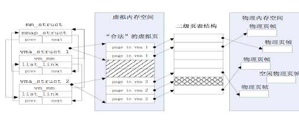
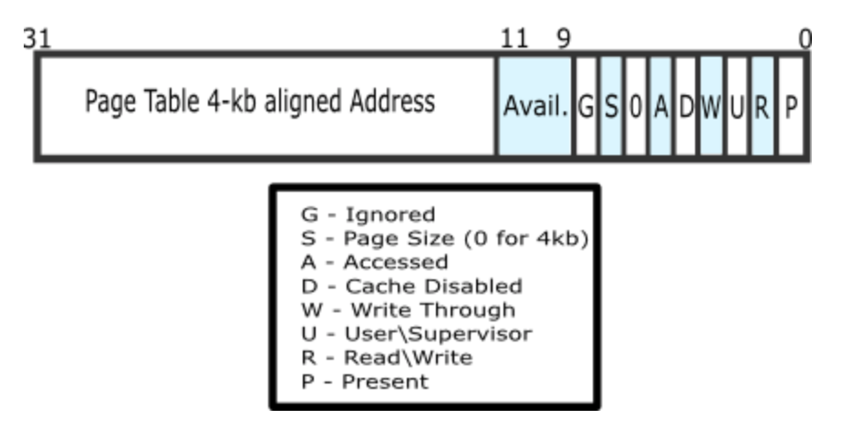
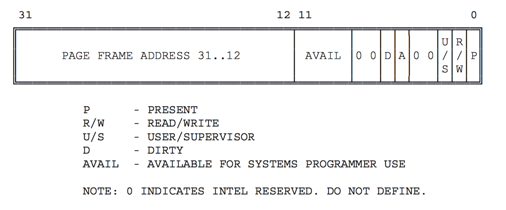

虚拟内存

### 基本原理概述

什么是虚拟内存？简单地说是指程序员或CPU“看到”的内存。但有几点需要注意：

1. 虚拟内存单元不一定有实际的物理内存单元对应，即实际的物理内存单元可能不存在；
2. 如果虚拟内存单元对应有实际的物理内存单元，那二者的地址一般是不相等的；
3. 通过操作系统实现的某种内存映射可建立虚拟内存与物理内存的对应关系，使得程序员或CPU访问的虚拟内存地址会自动转换为一个物理内存地址。

那么这个“虚拟”的作用或意义在哪里体现呢？在操作系统中，虚拟内存其实包含多个虚拟层次，在不同的层次体现了不同的作用。首先，在有了分页机制后，程序员或CPU“看到”的地址已经不是实际的物理地址了，这已经有一层虚拟化，我们可简称为**内存地址虚拟化**。有了内存地址虚拟化，我们就可以通过设置页表项来限定软件运行时的访问空间，确保软件运行不越界，完成内存访问保护的功能。

通过内存地址虚拟化，可以使得软件在没有访问某虚拟内存地址时不分配具体的物理内存，而只有在实际访问某虚拟内存地址时，操作系统再动态地分配物理内存，建立虚拟内存到物理内存的页映射关系，这种技术称为按需分页（demand  paging）。把不经常访问的数据所占的内存空间临时写到硬盘上，这样可以腾出更多的空闲内存空间给经常访问的数据；当CPU访问到不经常访问的数据时，再把这些数据从硬盘读入到内存中，这种技术称为页换入换出（page　swap in/out）。这种内存管理技术给了程序员更大的内存“空间”，从而可以让更多的程序在内存中并发运行。

### 练习1：给未被映射的地址映射上物理页（需要编程）

完成do_pgfault（mm/vmm.c）函数，给未被映射的地址映射上物理页。设置访问权限
的时候需要参考页面所在 VMA的权限，同时需要注意映射物理页时需要操作内存控制
结构所指定的页表，而不是内核的页表。



​														图 1 虚拟地址空间和物理地址空间的示意图


#### 关键数据结构与相关函数分析

```
vmm.h
struct vma_struct {
    struct mm_struct *vm_mm; // the set of vma using the same PDT 
    uintptr_t vm_start;      // start addr of vma      
    uintptr_t vm_end;        // end addr of vma, not include the vm_end itself
    uint32_t vm_flags;       // flags of vma
    list_entry_t list_link;  // linear list link which sorted by start addr of vma
};
```

1. vm_start和vm_end描述了一个连续地址的虚拟内存空间的起始位置和结束位置，这两个值都应该是PGSIZE  对齐的，而且描述的是一个合理的地址空间范围（即严格确保 vm_start <  vm_end的关系）；
2. list_link是一个双向链表，按照从小到大的顺序把一系列用vma_struct表示的虚拟内存空间链接起来，并且还要求这些链起来的vma_struct应该是不相交的，即**vma之间的地址空间无交集**；
3. vm_flags表示了这个虚拟内存空间的属性，目前的属性包括：

```
    #define VM_READ 0x00000001 //只读
    #define VM_WRITE 0x00000002 //可读写
    #define VM_EXEC 0x00000004 //可执行
```

​		vm_mm是一个指针，指向一个比vma_struct更高的抽象层次的数据结构mm_struct，这里把一个mm_struct结构的变量简称为mm变量。这个数据结构表示了**包含所有虚拟内存空间的共同属性**，具体定义如下

```
    struct mm_struct {
        // linear list link which sorted by start addr of vma
        list_entry_t mmap_list;
        // current accessed vma, used for speed purpose
        struct vma_struct *mmap_cache;
        pde_t *pgdir; // the PDT of these vma
        int map_count; // the count of these vma
        void *sm_priv; // the private data for swap manager
    };
```

1. mmap_list是双向链表头，链接了所有属于同一页目录表的虚拟内存空间，
2. mmap_cache是指向当前正在使用的虚拟内存空间，由于操作系统执行的“局部性”原理，当前正在用到的虚拟内存空间在接下来的操作中可能还会用到，这时就不需要查链表，而是直接使用此指针就可找到下一次要用到的虚拟内存空间。由于mmap_cache 的引入，可使得 mm_struct 数据结构的查询加速 30% 以上。
3. pgdir所指向的就是  mm_struct数据结构所维护的一级页表。每个应用程序都有页表，那么这里指向应用程序正在操作的那个；通过访问pgdir可以查找某虚拟地址对应的页表项是否存在以及页表项的属性等。
4. map_count记录mmap_list 里面链接的  vma_struct的个数。（该程序用了多少个虚拟页）
5. sm_priv指向用来链接记录页访问情况的链表头，这建立了mm_struct和后续要讲到的swap_manager之间的联系。用于FIFO替换策略的访问

**涉及vma_struct的操作函数**也比较简单，主要包括三个：

- vma_create—创建vma
- insert_vma_struct—插入一个vma
- find_vma—查询vma。

vma_create函数根据输入参数vm_start、vm_end、vm_flags来创建并初始化描述一个虚拟内存空间的vma_struct结构变量。

insert_vma_struct函数完成把一个vma变量按照其空间位置[vma->vm_start,vma->vm_end]从小到大的顺序插入到所属的mm变量中的mmap_list双向链表中。

find_vma根据输入参数addr和mm变量，查找在mm变量中的mmap_list双向链表中某个vma包含此addr，即vma->vm_start<=addr end。这三个函数与后续讲到的page fault异常处理有紧密联系。

**涉及mm_struct的操作函数**比较简单，只有mm_create和mm_destroy两个函数，从字面意思就可以看出是是完成mm_struct结构的变量创建和删除。在mm_create中用kmalloc分配了一块空间，所以在mm_destroy中也要对应进行释放。在ucore运行过程中，会产生描述虚拟内存空间的vma_struct结构，所以在mm_destroy中也要进对这些mmap_list中的vma进行释放。

--------------------------------------

#### 产生页访问异常

产生页访问异常的原因主要有：

- 目标页帧不存在（页表项全为0，即该线性地址与物理地址尚未建立映射或者已经撤销)；
- 相应的物理页帧不在内存中（页表项非空，但Present标志位=0，比如在swap分区或磁盘文件上)，这在本次实验中会出现，我们将在下面介绍换页机制实现时进一步讲解如何处理；
- 不满足访问权限(此时页表项P标志=1，但低权限的程序试图访问高权限的地址空间，或者有程序试图写只读页面).

当出现上面情况之一，那么就会产生页面page fault（#PF）异常。**CPU会把产生异常的线性地址存储在CR2中**，并且把表示页访问异常类型的值（简称页访问异常错误码，errorCode）保存在中断栈中。

```
    [提示]页访问异常错误码有32位。位0为１表示对应物理页不存在；位１为１表示写异常（比如写了只读页；位２为１表示访问权限异常（比如用户态程序访问内核空间的数据）

    [提示]　CR2是页故障线性地址寄存器，保存最后一次出现页故障的全32位线性地址。CR2用于发生页异常时报告出错信息。当发生页异常时，处理器把引起页异常的线性地址保存在CR2中。操作系统中对应的中断服务例程可以检查CR2的内容，从而查出线性地址空间中的哪个页引起本次异常。

```

产生页访问异常后，CPU硬件和软件都会做一些事情来应对此事。首先页访问异常也是一种异常，所以针对一般异常的硬件处理操作是必须要做的，即CPU在当前内核栈保存当前被打断的程序现场，即依次压入当前被打断程序使用的EFLAGS，CS，EIP，errorCode；由于页访问异常的中断号是0xE，CPU把异常中断号0xE对应的中断服务例程的地址（vectors.S中的标号vector14处）加载到CS和EIP寄存器中，开始执行中断服务例程。

这时ucore开始处理异常中断，首先需要保存硬件没有保存的寄存器。在vectors.S中的标号vector14处先把中断号压入内核栈，然后再在trapentry.S中的标号__alltraps处把DS、ES和其他通用寄存器都压栈。自此，被打断的程序执行现场（context）被保存在内核栈中。接下来，在trap.c的trap函数开始了中断服务例程的处理流程，大致调用关系为：

> trap—> trap_dispatch—>pgfault_handler—>do_pgfault


​																		图2  do_pgfault的调用关系

产生页访问异常后，CPU把引起页访问异常的线性地址装到寄存器CR2中，并给出了出错码errorCode，说明了页访问异常的类型。ucore OS会把这个值保存在struct trapframe  中tf_err成员变量中。而中断服务例程会调用页访问异常处理函数do_pgfault进行具体处理。这里的页访问异常处理是**实现按需分页、页换入换出机制**的关键之处。

ucore中do_pgfault函数是完成页访问异常处理的主要函数，它根据从CPU的控制寄存器CR2中获取的页访问异常的物理地址以及根据errorCode的错误类型来查找此地址是否在某个VMA的地址范围内以及是否满足正确的读写权限，如果在此范围内并且权限也正确，这认为这是一次合法访问，但没有建立虚实对应关系。所以需要分配一个空闲的内存页，并修改页表完成虚地址到物理地址的映射，刷新TLB，然后调用iret中断，返回到产生页访问异常的指令处重新执行此指令。如果该虚地址不在某VMA范围内，则认为是一次非法访问。

 **trap_dispatch**（kern/trap/trap.c\）

```

trap_dispatch(struct trapframe *tf) {
    char c;
    int ret;
 
    switch (tf->tf_trapno) {//中断类型
    case T_PGFLT:  //page fault
    /************   #define T_PGFLT                 14  // page fault   ***/
    if ((ret = pgfault_handler(tf)) != 0) {
            print_trapframe(tf);
            panic("handle pgfault failed. %e\n", ret);
        }
        break;
……
```

传入参数是一个中断指针tf，接下来会对于这个中断指针进行switch进行判断，确认一下在各种中断情况中，它具体是由于什么情况中断的，这里我到的中断原因是T_PGFLT，即页访问错误，对应于之前的trap14中断，那么我们会调用一个函数pgfault_handler函数去进一步处理页访问错误的情况。

**pgfault_handler（kern/trap/trap.c）**

```
static int
pgfault_handler(struct trapframe *tf) {
    extern struct mm_struct *check_mm_struct;
    print_pgfault(tf);
    if (check_mm_struct != NULL) {
        return do_pgfault(check_mm_struct, tf->tf_err, rcr2());
    }
    panic("unhandled page fault.\n");
}
```


打印错误信息：

​			位0为１表示对应物理页不存在；位１为１表示写异常（比如写了只读页；位２为１表示访问权限异常（比如用户态程序访问内核空间的数据）

```
static inline void
print_pgfault(struct trapframe *tf) {
    /* error_code:
     * bit 0 == 0 means no page found, 1 means protection fault
     * bit 1 == 0 means read, 1 means write
     * bit 2 == 0 means kernel, 1 means user
     * */
    cprintf("page fault at 0x%08x: %c/%c [%s].\n", rcr2(),
            (tf->tf_err & 4) ? 'U' : 'K',
            (tf->tf_err & 2) ? 'W' : 'R',
            (tf->tf_err & 1) ? "protection fault" : "no page found");
}

static inline uintptr_t
rcr2(void) {
    uintptr_t cr2;
    asm volatile ("mov %%cr2, %0" : "=r" (cr2) :: "memory");
    return cr2;
}
```

当虚拟页通过合法性检查后，此时，页访问异常的原因，是由于该合法虚拟页，没有对应物理页的映射导致，因此下一步要建立起这个映射。

```
#define PTE_W           0x002                   // Writeable
#define PTE_U           0x004                   // User
```


分析函数 int do_pgfault(struct mm_struct *mm, uint32_t error_code, uintptr_t addr)

该函数的传入参数总共有三个，其中第一个是一个mm_struct变量，其中保存了所使用的PDT，合法的虚拟地址空间（使用链表组织），以及与后文的swap机制相关的数据；而第二个参数是产生pagefault的时候硬件产生的error code，可以用于帮助判断发生page fault的原因，而最后一个参数则是出现page fault的线性地址（保存在cr2寄存器中的线性地址）；

在函数中，首先查询mm_struct中的合法的虚拟地址(事实上是线性地址，但是由于在ucore中弱化了段机制，段仅仅起到对等映射的作用，因此虚拟地址等于线性地址)链表，用于确定当前出现page fault的线性地址是否合法，如果合法则继续执行调出物理页，否则直接返回；

接下来使用error code（其中包含了这次内存访问是否为读/写，以及对应的物理页是否存在），以及查找到的该线性地址的内存页是否允许读写来判断是否出现了读/写不允许读/写的页这种情况，如果出现了上述情况，则应该直接返回，否则继续执行page fault的处理流程；

接下来根据合法虚拟地址（mm_struct中保存的合法虚拟地址链表中可查询到）的标志，来生成对应产生的物理页的权限；

接下来的部分则是在本练习中需要完成代码补全的部分，首先使用在lab2中实现的函数get_pte来获取出错的线性地址对应的虚拟页起始地址对应到的页表项，在ucore中同时使用页表项来保存物理地址（在Present位为1的时候）以及被换出的物理页在swap外存中的位置（以页为单位，每页大小刚好为8个扇区，此时P位为0），并且规定swap中的第0个页空出来不用于交换，因此如果查询到的PTE不为0，则表示对应的物理页可能在内存中或者在外存中（根据P位决定），否则则表示对应的物理页尚未被分配，此时则需要调用在lab2中实现的内存分配功能来获取对应的物理页，并且将其与当前的虚拟页设置上映射关系，这个部分在lab3中被封装成了pgdir_alloc_page函数；根据上述分析练习1中需要编写的代码实现如下：

------------------------

#### 请回答以下问题：

- **请描述页目录项（Page Directory Entry）和页表项（Page Table Entry）中组成部分对ucore实现页替换算法的潜在用处。**

首先不妨先分析PDE以及PTE中各个组成部分以及其含义；

接下来先描述页目录项的每个组成部分，PDE（页目录项）的具体组成如下图所示；描述每一个组成部分的含义如下[1]：
 \- 前20位表示4K对齐的该PDE对应的页表起始位置（物理地址，该物理地址的高20位即PDE中的高20位，低12位为0）；
 \- 第9-11位未被CPU使用，可保留给OS使用；
 \- 接下来的第8位可忽略；
 \- 第7位用于设置Page大小，0表示4KB；
 \- 第6位恒为0；
 \- 第5位用于表示该页是否被使用过；
 \- 第4位设置为1则表示不对该页进行缓存；
 \- 第3位设置是否使用write through缓存写策略；
 \- 第2位表示该页的访问需要的特权级；
 \- 第1位表示是否允许读写；
 \- 第0位为该PDE的存在位；



接下来描述页表项（PTE）中的每个组成部分的含义，具体组成如下图所示[2]：

- 高20位与PDE相似的，用于表示该PTE指向的物理页的物理地址；

- 9-11位保留给OS使用；

- 7-8位恒为0；

- 第6位表示该页是否为dirty，即是否需要在swap out的时候写回外存；

- 第5位表示是否被访问；

- 3-4位恒为0；

- 0-2位分别表示存在位、是否允许读写、访问该页需要的特权级；

  

可以发现无论是PTE还是TDE，都具有着一些保留的位供操作系统使用，也就是说ucore可以利用这些位来完成一些其他的**内存管理相关的算法**，比如可以在这些位里保存最近一段时间内该页的被访问的次数（仅能表示0-7次），用于辅助近似地实现虚拟内存管理中的换出策略的LRU之类的算法；也就是说这些保留位有利于OS进行功能的拓展；

```
- 通过上述分析可以发现，无论是页目录项还是页表项，表项中均保留了3位供操作系统进行使用，可以为实现一些页替换算法的时候提供支持，并且事实上在PTE的Present位为0的时候，CPU将不会使用PTE上的内容，这就使得当P位为0的时候，可以使用PTE上的其他位用于保存操作系统需要的信息，事实上ucore也正是利用这些位来保存页替换算法里被换出的物理页的在交换分区中的位置；此外PTE中还有dirty位，用于表示当前的页是否经过修改，这就使得OS可以使用这个位来判断是否可以省去某些已经在外存中存在着，内存中的数据与外存相一致的物理页面换出到外存这种多余的操作；而PTE和PDE中均有表示是否被使用过的位，这就使得OS可以粗略地得知当前的页面是否具有着较大的被访问概率，使得OS可以利用程序的局部性原理来对也替换算法进行优化(时钟替换算法中使用)；

```


- 如果ucore的缺页服务例程在执行过程中访问内存，出现了页访问异常，请问硬件要做哪些事情？

考虑到ucore的缺页服务例程如果在访问内容中出现了缺页异常，则会有可能导致ucore最终无法完成缺页的处理，因此一般不应该将缺页的ISR以及OS中的其他一些关键代码或者数据换出到外存中，以确保操作系统的正常运行；（ISR指的是中断服务处理）

如果缺页ISR在执行过程中遇到页访问异常，则最终硬件需要完成的处理与正常出现页访问异常的处理相一致，均为：

- 将发生错误的线性地址保存在cr2寄存器中;
- 在中断栈中依次压入EFLAGS，CS, EIP，以及页访问异常码error code，由于ISR一定是运行在内核态下的，因此不需要压入ss和esp以及进行栈的切换；
- 根据中断描述符表查询到对应页访问异常的ISR，跳转到对应的ISR处执行，接下来将由软件进行处理；

----------------------------

#### 练习2：补充完成基于FIFO的页面替换算法（需要编程）

完成vmm.c中的do_pgfault函数，并且在实现FIFO算法的swap_fifo.c中完成map_swappable和swap_out_victim函数。通过对swap的测试。


如果要实现页面置换机制，只考虑页替换算法的设计与实现是远远不够的，还需考虑其他问题：

- 哪些页可以被换出？
- 一个虚拟的页如何与硬盘上的扇区建立对应关系？
- 何时进行换入和换出操作？
- 如何设计数据结构以支持页替换算法？
- 如何完成页的换入换出操作？

##### 1.可以被换出的页

并非所有的物理页都可以交换出去的，只有映射到用户空间且被用户程序直接访问的页面才能被交换，而被内核直接使用的内核空间的页面不能被换出。

但在实验三实现的ucore中，我们只是实现了换入换出机制，还没有设计用户态执行的程序，所以我们在实验三中仅仅通过执行check_swap函数在内核中分配一些页，模拟对这些页的访问，然后通过do_pgfault来调用swap_map_swappable函数来查询这些页的访问情况并间接调用相关函数，换出“不常用”的页到磁盘上。


##### 2. 虚存中的页与硬盘上的扇区之间的映射关系

如果一个页被置换到了硬盘上，那操作系统如何能简捷来表示这种情况呢？在ucore的设计上，充分利用了页表中的PTE来表示这种情况：当一个PTE用来**描述一般意义上的物理页**时，显然它应该维护各种权限和映射关系，以及**应该有PTE_P标记**；但当它用来描述一个被置换出去的物理页时，它被用来维护该物理页与 swap 磁盘上扇区的映射关系，并且该 PTE 不应该由 MMU 将它解释成物理页映射(即没有 PTE_P 标记)，与此同时对应的权限则交由  mm_struct 来维护，当对位于该页的内存地址进行访问的时候，必然导致 page fault，然后ucore能够根据 PTE 描述的  swap 项将相应的物理页重新建立起来，并根据虚存所描述的权限重新设置好 PTE 使得内存访问能够继续正常进行。

如果一个页（4KB/页）被置换到了硬盘某8个扇区（0.5KB/扇区），该PTE的最低位—present位应该为0 （即 PTE_P  标记为空，表示虚实地址映射关系不存在），接下来的7位暂时保留，可以用作各种扩展；而原来用来表示页帧号的高24位地址，恰好可以用来表示此页在硬盘上的起始扇区的位置（其从第几个扇区开始）。为了在页表项中区别 0 和 swap 分区的映射，将 swap 分区的一个 page  空出来不用，也就是说一个高24位不为0，而最低位为0的PTE表示了一个放在硬盘上的页的起始扇区号（见swap.h中对swap_entry_t的描述）：

```
swap_entry_t
-------------------------
| offset | reserved | 0 |
-------------------------
24 bits    7 bits   1 bit
```

考虑到硬盘的最小访问单位是一个扇区，而一个扇区的大小为512（2\^8）字节，所以需要8个连续扇区才能放置一个4KB的页。在ucore中，用了第二个IDE硬盘来保存被换出的扇区，根据实验三的输出信息

```
“ide 1: 262144(sectors), 'QEMU HARDDISK'.”
```

0x38000000/4096 = 32766个页，是最大物理内存分页的页数

13420536b=128MB  大概物理地址的最大值为128MB

```
【小知识】即896MB = 0x1 C000 0000‬，与之前说到的0x1 0000 0000映射到0x1 C000 0000相对应‬‬

进程可以寻址4G，其中0~3G为用户态，3G~4G为内核态。如果内存不超过1G那么最后这1G线性空间足够映射物理内存了，如果物理内存大于1G，为了使内核空间的1G线性地址可以访问到大于1G的物理内存，把物理内存分为两部分，0~896MB的进行直接内存映射，也就是说存在一个线性关系：virtual address=physical address+
PAGE_OFFSET，这里的PAGE_OFFSET为3G。还剩下一个128MB的空间，这个空间作为一个窗口动态进行映射，这样就可以访问大于1G的内存，但是同一时刻内核空间还是只有1G的线性地址，只是不同时刻可以映射到不同的地方。综上，大于896MB的物理内存就是高端内存，内核引入高端内存这个概念是为了通过128MB这个窗口访问大于1G的物理内存。
```

我们可以知道实验三可以保存262144/8=32768个页，即128MB的内存空间。swap分区的大小是 swapfs_init 里面根据磁盘驱动的接口计算出来的，目前 ucore里面要求 swap 磁盘至少包含 1000 个 page，并且至多能使用 1<<24 个page。


##### 3.执行换入换出的时机

ucore Lab3中采用的是消极换出策略，指：只是当试图得到空闲页时，发现当前没有空闲的物理页可供分配，这时才开始查找“不常用”页面，并把一个或多个这样的页换出到硬盘上。

在ucore调用alloc_pages函数获取空闲页时，此函数如果发现无法从物理内存页分配器获得空闲页，就会进一步调用swap_out函数换出某页，实现一种消极的换出策略。


##### 4. 页替换算法的数据结构设计

为了表示物理页可被换出或已被换出的情况，可对Page数据结构进行**扩展**：

```
struct Page 
{  ……   
list_entry_t pra_page_link;   
uintptr_t pra_vaddr;   
};
```

pra_page_link可用来构造按页的第一次**访问时间**进行排序的一个链表，这个**链表的开始表示第一次访问时间最近的页**，链表结尾表示第一次访问时间最远的页。当然链表头可以就可设置为pra_list_head（定义在swap_fifo.c中），构造的时机是在page fault发生后，进行do_pgfault函数时。pra_vaddr可以用来记录此物理页对应的虚拟页起始地址。

当一个物理页 （struct Page） 需要被 swap 出去的时候，首先需要确保它已经分配了一个位于磁盘上的swap  page（由连续的8个扇区组成）。这里为了简化设计，在swap_check函数中建立了每个虚拟页唯一对应的swap  page，其对应关系设定为：虚拟页对应的PTE的索引值 = swap page的扇区起始位置*8。


##### 5.为了实现各种页替换算法

设计了一个页替换算法的类框架swap_manager:

```
struct swap_manager
{
     const char *name;
     /* Global initialization for the swap manager */
     int (*init)            (void);
     /* Initialize the priv data inside mm_struct */
     int (*init_mm)         (struct mm_struct *mm);
     /* Called when tick interrupt occured */
     int (*tick_event)      (struct mm_struct *mm);
     /* Called when map a swappable page into the mm_struct */
     int (*map_swappable)   (struct mm_struct *mm, uintptr_t addr, struct Page *page, int swap_in);
     /* When a page is marked as shared, this routine is called to
      * delete the addr entry from the swap manager */
     int (*set_unswappable) (struct mm_struct *mm, uintptr_t addr);
     /* Try to swap out a page, return then victim */
     int (*swap_out_victim) (struct mm_struct *mm, struct Page **ptr_page, int in_tick);
     /* check the page relpacement algorithm */
     int (*check_swap)(void);     
};
```

两个关键函数指针是map_swappable和swap_out_vistim，前一个函数用于记录页访问情况相关属性，后一个函数用于挑选需要换出的页。显然第二个函数依赖于第一个函数记录的页访问情况。tick_event函数指针也很重要，结合定时产生的中断，可以实现一种积极的换页策略。


##### 6.swap_check的检查实现

下面具体讲述一下实验三中实现置换算法的页面置换的检查执行逻辑，便于大家实现练习2。实验三的检查过程在函数swap_check（kern/mm/swap.c中）中，其大致流程如下。

```
1. 调用mm_create建立mm变量，并调用vma_create创建vma变量，设置合法的访问范围为4KB~24KB；
2. 调用free_page等操作，模拟形成一个只有4个空闲 physical page；并设置了从4KB~24KB的连续5个虚拟页的访问操作；
3. 设置记录缺页次数的变量pgfault_num=0，执行check_content_set函数，使得起始地址分别对起始地址为0x1000, 0x2000, 0x3000, 0x4000的虚拟页按时间顺序先后写操作访问，由于之前没有建立页表，所以会产生page  fault异常，如果完成练习1，则这些从4KB~20KB的4虚拟页会与ucore保存的4个物理页帧建立映射关系；
4. 然后对虚页对应的新产生的页表项进行合法性检查；
5. 然后进入测试页替换算法的主体，执行函数check_content_access，并进一步调用到_fifo_check_swap函数，如果通过了所有的assert。这进一步表示FIFO页替换算法基本正确实现；
6. 最后恢复ucore环境。
```


#### 问题回答

- 如果要在ucore上实现"extended clock页替换算法"请给你的设计方案，现有的swap_manager框架是否足以支持在ucore中实现此算法？如果是，请给你的设计方案。如果不是，请给出你的新的扩展和基此扩展的设计方案。并需要回答如下问题
  - 在现有框架基础上可以支持Extended clock算法，具体设计方案如下所示：
    - 根据上文中提及到的PTE的组成部分可知，PTE中包含了dirty位和访问位，因此可以确定某一个虚拟页是否被访问过以及写过，但是，考虑到在替换算法的时候是将物理页面进行换出，而可能存在着多个虚拟页面映射到同一个物理页面这种情况，也就是说某一个物理页面是否dirty和是否被访问过是有这些所有的虚拟页面共同决定的，而在原先的实验框架中，物理页的描述信息Page结构中默认只包括了一个对应的虚拟页的地址，应当采用链表的方式，在Page中扩充一个成员，把物理页对应的所有虚拟页都给保存下来；而物理页的dirty位和访问位均为只需要某一个对应的虚拟页对应位被置成1即可置成1；
    - 完成了上述对物理页描述信息的拓展之后，考虑对FIFO算法的框架进行修改得到拓展时钟算法的框架，由于这两种算法都是将所有可以换出的物理页面均按照进入内存的顺序连成一个环形链表，因此初始化，将某个页面置为可以/不可以换出这些函数均不需要进行大的修改(小的修改包括在初始化当前指针等)，唯一需要进行重写的函数是选择换出物理页的函数swap_out_victim，对该函数的修改如下：
      - 从当前指针开始，对环形链表进行扫描，根据指针指向的物理页的状态（表示为(access, dirty)）来确定应当进行何种修改：
        - 如果状态是(0, 0)，则将该物理页面从链表上去下，该物理页面记为换出页面，但是由于这个时候这个页面不是dirty的，因此事实上不需要将其写入swap分区；
        - 如果状态是(0, 1)，则将该物理页对应的虚拟页的PTE中的dirty位都改成0，并且将该物理页写入到外存中，然后指针跳转到下一个物理页；
        - 如果状态是(1, 0), 将该物理页对应的虚拟页的PTE中的访问位都置成0，然后指针跳转到下一个物理页面；
        - 如果状态是(1, 1)，则该物理页的所有对应虚拟页的PTE中的访问为置成0，然后指针跳转到下一个物理页面；
  - 需要被换出的页的特征是什么？
    - 该物理页在当前指针上一次扫过之前没有被访问过；
    - 该物理页的内容与其在外存中保存的数据是一致的, 即没有被修改过;
  - 在ucore中如何判断具有这样特征的页？
    - 在ucore中判断具有这种特征的页的方式已经在上文设计方案中提及过了，具体为：
      - 假如某物理页对应的所有虚拟页中存在一个dirty的页，则认为这个物理页为dirty，否则不这么认为；
      - 假如某物理页对应的所有虚拟页中存在一个被访问过的页，则认为这个物理页为被访问过的，否则不这么认为；
  - 何时进行换入和换出操作？
    - 在产生page fault的时候进行换入操作；
    - 换出操作源于在算法中将物理页的dirty从1修改成0的时候，因此这个时候如果不进行写出到外存，就会造成数据的不一致，具体写出内存的时机是比较细节的问题, 可以在修改dirty的时候写入外存，或者是在这个物理页面上打一个需要写出的标记，到了最终删除这个物理页面的时候，如果发现了这个写出的标记，则在这个时候再写入外存；后者使用一个写延迟标记，有利于多个写操作的合并，从而降低缺页的代价


