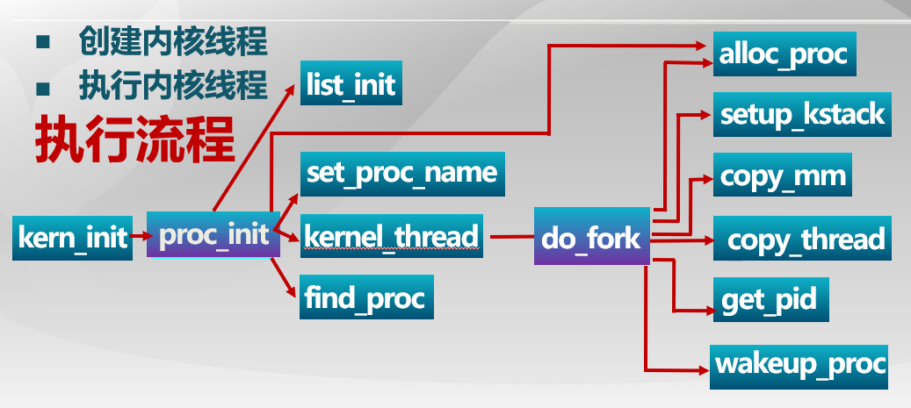
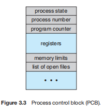
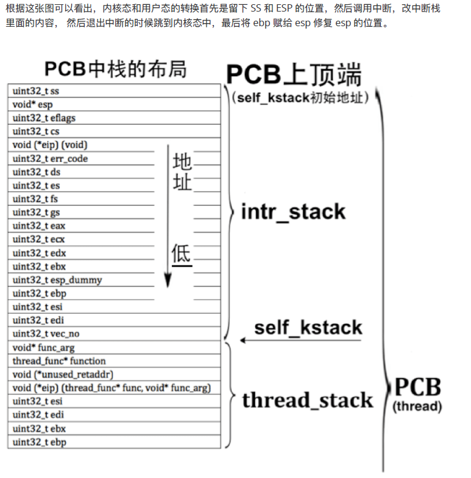
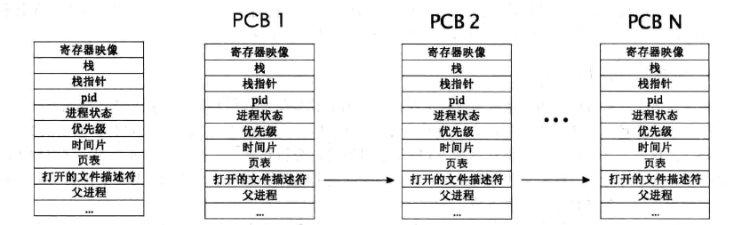
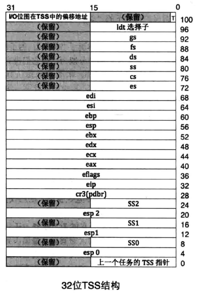

**流程为：**

1. 在init.c的kern_init() ->proc_int()
2. proc_init()->完成alloc idleproc-  -> 设置current = idleproc;  -> 调用kernel_thread()  ->do_fork()  ->至此创建好了两个内核线程：idleproc和initproc
3. 值得注意的是，
   1. kernel_Thread函数参数为int_main,即现在ebx(即调用函数)=init_main。 
   2. 在进行initproc的初始化时，使用copy_thread函数，设置当前进程的eip = forkret,  esp =proc->tf;即esp为中断帧的栈顶
4. kern_init() 完成proc_int()后，开始进入cpu_idle(),此函数主要完成通过 idleproc 跳转到schedule()中
5. cpu_idle()  -> schedule()  此函数内部主要完成fifo找到idle下一个进程为就绪态的进程，此处即initproc， 并进入proc_run()函数
6. proc_run()  ->设置0堆栈的TSS的esp0，修改cr3为当前线程的地址->运用switch_to
7. 将next的上下文切换，当执行完ret 指令后，切换到initproc执行
8. initproc在3步骤可知，current->tf.tf_eip=kernel_thread_entry，initproc->tf.tf_cs = KERNEL_CS
9. 即跳转到  kernel_thread_entry函数中执行   --->进行call ebx，而由步骤3可知，此时ebx为init_mian，因此进入init_main, 然后输出三行语句
10. kernel_thread_entry在执行完call ebx后，进行do_exit函数，输出结束语句


lab2和lab3完成了对内存的虚拟化，但整个控制流还是一条线串行执行。lab4将在此基础上**进行CPU的虚拟化**，即**让ucore实现分时共享CPU**，实现多条控制流能够并发执行。从某种程度上，我们可以把控制流看作是一个内核线程。本次实验将首先接触的是内核线程的管理。

内核线程是一种特殊的进程，内核线程与用户进程的区别有两个：内核线程只运行在内核态而用户进程会在在用户态和内核态交替运行；所有内核线程直接使用共同的ucore内核内存空间，不需为每个内核线程维护单独的内存空间而用户进程需要维护各自的用户内存空间。从内存空间占用情况这个角度上看，我们可以把线程看作是一种共享内存空间的轻量级进程。

为了实现内核线程，需要设计管理线程的数据结构，即进程控制块（在这里也可叫做线程控制块）。如果要让内核线程运行，我们首先要创建内核线程对应的进程控制块，还需把这些进程控制块通过链表连在一起，便于随时进行插入，删除和查找操作等进程管理事务。这个链表就是进程控制块链表。然后在通过调度器（scheduler）来让不同的内核线程在不同的时间段占用CPU执行，实现对CPU的分时共享。那lab4中是如何一步一步实现这个过程的呢？


### 练习0：填写已有实验

本实验依赖实验1/2/3。请把你做的实验1/2/3的代码填入本实验中代码中有“LAB1”,“LAB2”,“LAB3”的注释相应部分。

值得注意的是，在进行meld diff时，不能将lab3全部换过来

kern/pmm.c 在752行中，有kmalloc与kfree的定义

```
void *
kmalloc(size_t n) {
    void * ptr=NULL;
    struct Page *base=NULL;
    assert(n > 0 && n < 1024*0124);
    int num_pages=(n+PGSIZE-1)/PGSIZE;
    base = alloc_pages(num_pages);
    assert(base != NULL);
    ptr=page2kva(base);
    return ptr;
}

void 
kfree(void *ptr, size_t n) {
    assert(n > 0 && n < 1024*0124);
    assert(ptr != NULL);
    struct Page *base=NULL;
    int num_pages=(n+PGSIZE-1)/PGSIZE;
    base = kva2page(ptr);
    free_pages(base, num_pages);
}
```

而在lab4中，将kmalloc和kfree均放在mm/kmalloc.c中

```
void kfree(void *block)
void *kmalloc(size_t size)
```

------------------------------

#### 函数调用关系：

 **1、pmm_init**
（1）初始化物理内存管理器。
（2）初始化空闲页，主要是初始化物理页的Page数据结构，以及建立页目录表和页表。
（3）初始化boot_cr3使之指向了ucore内核虚拟空间的页目录表首地址，即一级页表的起始物理地址。
（4）初始化第一个页表boot pgdir。
（5）初始化GDT，即全局描述符表。
 **2、pic-_init**
初始化8259A中断控制器
 **3、idt_init（）**
初始化IDT，即中断描述符表
 **4、vmm_init（）**
主要就是实验了一个do_pgfault（）函数达到页错误异常处理功能，以及虚拟内存相关的mm，vma结构数据的创建/销毁/查找/插入等函数
 **5、proc_init（）**
这个函数启动了创建内核线程的步骤，完成了idleproc内核线程和initproc内核线程的创建或复制工作，这是本次实验分析的重点，后面将详细分析。
 **6、ide_init（）**
完成对用于页换入换出的硬盘（简称swap硬盘）的初始化工作
 **7、swap_init（）**
swap_init（）函数首先建立完成页面替换过程的主要功能模块，即 swap_manager，其中包含了页面置换算法的实现
操作系统是以进程为中心设计的，所以其首要任务是为进程建立档案，进程档案用于表示、标识或描述进程，即进程控制块。这里需要完成的就是一个进程控制块的初始化。

#### 执行流程：

​	lab4/kern/init/init.c中的**kern_init**函数入手分析。在kern_init函数中，当完成虚拟内存的初始化工作后，就调用了proc_init函数，这个函数完成了idleproc内核线程和initproc内核线程的创建或复制工作，这也是本次实验要完成的练习。

1. **idleproc**内核线程：其工作就是不停地查询，看是否有其他内核线程可以执行了，如果有，马上让调度器选择那个内核线程执行。所以idleproc内核线程是在ucore操作系统没有其他内核线程可执行的情况下才会被调用。
2. **initproc**内核线程：接着就是调用kernel_thread函数来**创建initproc**内核线程。initproc内核线程的工作就是显示“Hello World”，表明自己存在且能正常工作了。



3. 调度器会在特定的调度点上执行调度，完成进程切换。在lab4中，这个调度点就一处，即在cpu_idle函数中，此函数如果发现当前进程（也就是idleproc）的need_resched置为1（在初始化idleproc的进程控制块时就置为1了），则调用schedule函数，完成进程调度和进程切换。进程调度的过程其实比较简单，就是在进程控制块链表中查找到一个“合适”的内核线程，所谓“合适”就是指内核线程处于“PROC_RUNNABLE”状态。在接下来的switch_to函数(在后续有详细分析，有一定难度，需深入了解一下)完成具体的进程切换过程。一旦切换成功，那么initproc内核线程就可以通过显示字符串来表明本次实验成功。

#### 进程控制块     kern/process/proc.h

```
struct proc_struct {
    enum proc_state state;                      // Process state
    int pid;                                    // Process ID
    int runs;                                   // the running times of Proces
    uintptr_t kstack;                           // Process kernel stack
    volatile bool need_resched;                 // bool value: need to be rescheduled to release CPU?
    struct proc_struct *parent;                 // the parent process
    struct mm_struct *mm;                       // Process's memory management field
    struct context context;                     // Switch here to run process
    struct trapframe *tf;                       // Trap frame for current interrupt
    uintptr_t cr3;                              // CR3 register: the base addr of Page Directroy Table(PDT)
    uint32_t flags;                             // Process flag
    char name[PROC_NAME_LEN + 1];               // Process name
    list_entry_t list_link;                     // Process link list 
    list_entry_t hash_link;                     // Process hash list
};
```

下面重点解释一下几个比较重要的成员变量：

● **proc_state** 进程状态

```
// process's state in his life cycle
enum proc_state {
    PROC_UNINIT = 0,  // uninitialized未初始
    PROC_SLEEPING,    // sleeping睡眠/阻塞
    PROC_RUNNABLE,    // runnable(maybe running)运行/就绪态
    PROC_ZOMBIE,      // almost dead, and wait parent proc to reclaim his resource僵死
};
```

●  **mm**：内存管理的信息，包括内存映射列表、页表指针等。mm成员变量在lab3中用于虚存管理。但在实际OS中，内核线程**常驻内存**，**不需要考虑swap  page**问题，在lab5中涉及到了用户进程，才考虑进程用户内存空间的swap  page问题，mm才会发挥作用。所以在lab4中mm对于内核线程就没有用了，这样内核线程的proc_struct的成员变量* mm=0是合理的。mm里有个很重要的项pgdir，记录的是该进程使用的一级页表的物理地址。由于*mm=NULL，所以在proc_struct数据结构中需要有一个代替pgdir项来记录页表起始地址，这就是proc_struct数据结构中的**cr3**成员变量。

● **parent**：用户进程的父进程（创建它的进程）。在所有进程中，**只有一个进程idleproc没有父进程**，就是内核创建的**第一个内核线程**idleproc。内核根据这个父子关系建立一个树形结构，用于维护一些特殊的操作，例如确定某个进程是否可以对另外一个进程进行某种操作等等。

● **context**：进程的上下文，用于进程切换（参见switch.S）。在  uCore中，所有的进程在内核中也是相对独立的（例如独立的内核堆栈以及上下文等等）。使用 context  保存寄存器的目的就在于在内核态中能够进行上下文之间的切换。实际利用context进行上下文切换的函数是在*kern/process/switch.S*中定义switch_to。

```
struct context {
    uint32_t eip;
    uint32_t esp;
    uint32_t ebx;
    uint32_t ecx;
    uint32_t edx;
    uint32_t esi;
    uint32_t edi;
    uint32_t ebp;
};
```

●  **tf**：中断帧的指针，总是指向内核栈的某个位置：当进程从用户空间跳到内核空间时，**中断帧记录了进程在被中断前的状态。**当内核需要跳回用户空间时，需要调整中断帧以恢复让进程继续执行的各寄存器值。除此之外，uCore内核允许嵌套中断。因此为了保证嵌套中断发生时**tf 总是能够指向当前的trapframe**，uCore 在内核栈上维护了 tf 的链，可以参考trap.c::trap函数做进一步的了解。

```
struct trapframe {
    struct pushregs tf_regs;
    uint16_t tf_gs;
    uint16_t tf_padding0;
    uint16_t tf_fs;
    uint16_t tf_padding1;
    uint16_t tf_es;
    uint16_t tf_padding2;
    uint16_t tf_ds;
    uint16_t tf_padding3;
    uint32_t tf_trapno;
    /* below here defined by x86 hardware */
    uint32_t tf_err;
    uintptr_t tf_eip;
    uint16_t tf_cs;
    uint16_t tf_padding4;
    uint32_t tf_eflags;
    /* below here only when crossing rings, such as from user to kernel */
    uintptr_t tf_esp;
    uint16_t tf_ss;
    uint16_t tf_padding5;
} __attribute__((packed));
```

● cr3: **cr3 保存页表的物理地址**，**目的就是进程切换的时候方便直接使用 lcr3实现页表切换，避免每次都根据 mm 来计算  cr3。**mm数据结构是用来实现用户空间的虚存管理的，但是内核线程没有用户空间，它执行的只是内核中的一小段代码（通常是一小段函数），所以它没有mm 结构，也就是NULL。当某个进程是一个**普通用户态进程**的时候，PCB 中的 **cr3 就是 mm  中页表（pgdir）的物理地址**；而当它是**内核线程**的时候，**cr3  等于**boot_cr3。而boot_cr3指向了**uCore启动时建立好的内核虚拟空间的页目录表首地址**。

● kstack:  每个线程都有一个内核栈，并且位于内核地址空间的不同位置。**对于内核线程，该栈就是运行时的程序使用的栈；而对于普通进程，该栈是发生特权级改变的时候使保存被打断的硬件信息用的栈**。uCore在创建进程时**分配了 2  个连续的物理页**（参见memlayout.h中KSTACKSIZE的定义）作为内核栈的空间。

```
#define KSTACKPAGE          2                          
#define KSTACKSIZE          (KSTACKPAGE * PGSIZE) 
```

​	这个栈很小，所以内核中的代码应该尽可能的紧凑，并且避免在栈上分配大的数据结构，以免栈溢出，导致系统崩溃。**kstack**记录了分配给该进程/线程的内核**栈的位置。**主要**作用**有以下几点。**首先**，当内核准备从一个进程切换到另一个的时候，需要根据kstack 的值正确的设置好 tss （可以回顾一下在实验一中讲述的 tss  在中断处理过程中的作用），以便在进程切换以后再发生中断时能够使用正确的栈。**其次**，内核栈位于内核地址空间，并且是不共享的（每个线程都拥有自己的内核栈），因此不受到 mm 的管理，当进程退出的时候，内核能够根据 kstack 的值快速定位栈的位置并进行回收。uCore 的这种内核栈的设计借鉴的是 linux 的方法（但由于内存管理实现的差异，它实现的远不如 linux  的灵活），它使得每个线程的内核栈在不同的位置，这样从某种程度上方便调试，但同时也使得内核对栈溢出变得十分不敏感，因为一旦发生溢出，它极可能污染内核中其它的数据使得内核崩溃。如果能够通过页表，将所有进程的内核栈映射到固定的地址上去，能够避免这种问题，但又会使得进程切换过程中对栈的修改变得相当繁琐。感兴趣的同学可以参考 linux kernel 的代码对此进行尝试。

为了管理系统中所有的进程控制块，uCore维护了如下全局变量（位于*kern/process/proc.c*）：

● static struct proc  *current：**当前占用CPU且处于“运行”状态进程控制块指针**。通常这个变量是只读的，只有在进程切换的时候才进行修改，并且整个切换和修改过程需要保证操作的原子性，目前至少需要屏蔽中断。可以参考 switch_to 的实现。

● static struct proc *initproc：本实验中，指向一个内核线程。本实验以后，此指针将指向第一个用户态进程。

● static list_entry_t hash_list[HASH_LIST_SIZE]：**所有进程控制块的哈希表**，proc_struct中的成员变量hash_link将基于pid链接入这个哈希表中。

```
#define HASH_SHIFT          10
```

```
/* 2^31 + 2^29 - 2^25 + 2^22 - 2^19 - 2^16 + 1 */
#define GOLDEN_RATIO_PRIME_32       0x9e370001UL
/* *
 * hash32 - generate a hash value in the range [0, 2^@bits - 1] 
 * @val:    the input value
 * @bits:   the number of bits in a return value
 *
 * High bits are more random, so we use them.
 * */
uint32_t
hash32(uint32_t val, unsigned int bits) {
    uint32_t hash = val * GOLDEN_RATIO_PRIME_32;
    return (hash >> (32 - bits));
}
```

● list_entry_t proc_list：所有进程控制块的双向线性列表，proc_struct中的成员变量list_link将链接入这个链表中。

### 练习1：分配并初始化一个进程控制块（需要编码）

alloc_proc函数（位于kern/process/proc.c中）负责分配并返回一个新的struct proc_struct结构，用于存储新建立的内核线程的管理信息。ucore需要对这个结构进行最基本的初始化，你需要完成这个初始化过程。

> 【提示】在alloc_proc函数的实现中，需要初始化的proc_struct结构中的成员变量至少包括：state/pid/runs/kstack/need_resched/parent/mm/context/tf/cr3/flags/name。



PCB包括进程状态，进程编号，程序计数器、寄存器等各种参数，和上面这个结构体一比较，可以确定这就是一个标准的PCB，我们需要做的东西就是初始化它，也可以看做给一个新开辟的内核线程（进程）做初始化。

```
proc->state = PROC_UNINIT;	        //给进程设置为未初始化状态
proc->pid = -1;				//未初始化的进程，其pid为-1
proc->runs = 0;				//刚刚初始化的进程，运行时间一定为零		
proc->kstack = 0;			//为该进程分配的地址为0，因为还没有执行，也没有被重定位，因为默认地址都是从0开始的。
（上个学期计组课里面学过，刚刚编译出来的代码地址都是从0开始，只有在重定位之后，地址才会分配到内存里的0x8048......这样子的地方）	
proc->need_resched = 0;		    //刚刚分配出来的进程，都还没有进入CPU，还需要提什么分配么？
proc->parent = NULL;		    //同样的道理，父进程，虚拟memory，这些东西刚刚分出来，都是不存在的
proc->mm = NULL;
memset(&(proc->context), 0, sizeof(struct context));	  // 使用memset函数清零占用空间较大的成员变量，如数组，结构体等
proc->tf = NULL;		        //中断帧指针置为空
proc->cr3 = boot_cr3;	                //页目录设为内核页目录表的基址
proc->flags = 0;
memset(proc->name, 0, PROC_NAME_LEN);		//初始化进程名字为空
```

**请回答如下问题**：

- 请说明proc_struct中`struct context context`和`struct trapframe *tf`成员变量含义和在本实验中的作用是啥？（提示通过看代码和编程调试可以判断出来）

1. 对于context

● **context**：进程的上下文，用于进程切换（参见switch.S）。在  uCore中，所有的进程在内核中也是相对独立的（例如独立的内核堆栈以及上下文等等）。使用 context  保存寄存器的目的就在于在内核态中能够进行上下文之间的切换。实际利用context进行上下文切换的函数是在*kern/process/switch.S*中定义switch_to。

```
struct context {
    uint32_t eip;
    uint32_t esp;
    uint32_t ebx;
    uint32_t ecx;
    uint32_t edx;
    uint32_t esi;
    uint32_t edi;
    uint32_t ebp;
};
```

kern/process/proc.c

```
void switch_to(struct context *from, struct context *to);
```

kern/process/switch.s

在context中保存着各种寄存器的内容，主要保存了前一个进程的现场（各个寄存器的状态），是进程切换的上下文内容，这是为了保存进程上下文，用于进程切换，为进程调度做准备。
在ucore中，所有的进程在内核中也是相对独立的。使用context保存寄存器的目的就在于在内核态中能够进行上下文之间的切换。实际利用context进行上下文切换的函数是在kern/process/switch.S中定义switch_to函数。

对switch_to函数进行分析：   另：关于函数调用详情见lab1 (向上是栈底)

```
注：
基址寻址：只使用ADDRESS_OR_OFFSET和BASE_OR_OFFSET寻址，例如movl 4(%eax), %ebx，用于访问结构体成员比较方便，例如一个结构体的基地址保存在eax寄存器中，其中一个成员在结构体内偏移量是4字节，要把这个成员读上来就可以用这条指令。
.globl _start(start是一个符号)
.globl指示告诉汇编器_start这个符号要被链接器用到，所以要在目标文件的符号表中给它特殊标记。_start就像C程序的main函数一样特殊是整个程序的入口，链接器在链接时会查找目标文件中的_start符号代表的地址，把它设置为整个程序的入口地址，所以每个汇编程序都要提供一个_start符号并且用.globl声明。如果一个符号没有用.globl指示声明这个符号就不会被链接器用到。
```

```
switch_to 的作用是 保存当前进程的上下文 并且 恢复被调度上处理机的进程的上下文
.text
.globl switch_to
switch_to:                      # switch_to(from, to)

    调用 switch_to 后栈的情况  |     To    esp + 8 |
                             |   From   esp + 4  |
                             |  Ret Addr <- esp  | 
    movl 4(%esp), %eax       此处要取的是 From 因此为 esp + 4 即：from->eax
    popl 0(%eax)  			此时eax中为FROM的地址值，因此0(%eax)即为FORM的context中的eip值	
    	pop掉返回地址 存到 From 的 eip 为栈顶    故而 context 的 eip 当返回地址
    movl %esp, 4(%eax)         这之后都只是将寄存器的内容 保存到FROM栈底的context中
    movl %ebx, 8(%eax)
    movl %ecx, 12(%eax)
    movl %edx, 16(%eax)
    movl %esi, 20(%eax)
    movl %edi, 24(%eax)
    movl %ebp, 28(%eax)		经历该过程后，esp一直都没变，在pop之后，便指向的是FROM

    此时的 栈的情况                                     |    To  esp + 4   |
    因为在上面已经将 返回地址 pop掉了 因此这里没有返回地址了  |   From <- esp    |
    movl 4(%esp), %eax       此处要取 To 的地址 因为 返回地址之前已经被 pop掉了 所以此时为 esp + 4
  
    movl 28(%eax), %ebp         这之后也没啥好说的 都是将 TO的context 移到寄存器 恢复环境
    movl 24(%eax), %edi
    movl 20(%eax), %esi
    movl 16(%eax), %edx
    movl 12(%eax), %ecx
    movl 8(%eax), %ebx
    movl 4(%eax), %esp

    pushl 0(%eax)     To的 eip 作返回地址 因为原先的 返回地址已经被pop掉了
/****其实把context中保存的下一个进程要执行的指令地址context.eip放到了堆栈顶，这样接下来执行最后一条指令“ret”时，会把栈顶的内容赋值给EIP寄存器，这样就切换到下一个进程执行了，即当前进程已经是下一个进程了****/
    ret		
```

那么根据Switch中代码的语义，可以确定context变量的意义就在于内核线程之间进行切换的时候，将原先的线程运行的上下文保存下来这一作用，

**那么为什么没有对eax进行保存呢？**注意到在进行切换的时候调用了switch_to这一个函数，也就是说这个函数的里面才是线程之间切换的切换点，而在这个函数里面，由于eax是一个caller-save寄存器，并且在函数里eax的数值一直都可以在栈上找到对应，因此没有比较对其进行保存。

●  **tf**：中断帧的指针，总是指向内核栈的某个位置：当进程从用户空间跳到内核空间时，**中断帧记录了进程在被中断前的状态。**当内核需要跳回用户空间时，需要调整中断帧以恢复让进程继续执行的各寄存器值。除此之外，uCore内核允许嵌套中断。因此为了保证嵌套中断发生时**tf 总是能够指向当前的trapframe**，uCore 在内核栈上维护了 tf 的链，可以参考trap.c::trap函数做进一步的了解。

```
struct trapframe {
    struct pushregs tf_regs;
    uint16_t tf_gs;
    uint16_t tf_padding0;
    uint16_t tf_fs;
    uint16_t tf_padding1;
    uint16_t tf_es;
    uint16_t tf_padding2;
    uint16_t tf_ds;
    uint16_t tf_padding3;
    uint32_t tf_trapno;
    /* below here defined by x86 hardware */
    uint32_t tf_err;
    uintptr_t tf_eip;
    uint16_t tf_cs;
    uint16_t tf_padding4;
    uint32_t tf_eflags;
    /* below here only when crossing rings, such as from user to kernel */
    uintptr_t tf_esp;
    uint16_t tf_ss;
    uint16_t tf_padding5;
} __attribute__((packed));
```

trap/trapentry.s

```
    # return falls through to trapret...
.globl __trapret
__trapret:
    # restore registers from stack
    popal

    # restore %ds, %es, %fs and %gs
    popl %gs
    popl %fs
    popl %es
    popl %ds

    # get rid of the trap number and error code
    addl $0x8, %esp
    iret
    
.globl forkrets
forkrets:
    # set stack to this new process's trapframe
    movl 4(%esp), %esp
    jmp __trapret
```

struct trapframe *tf的作用：

- 接下来同样在代码中寻找对tf变量进行了定义的地方，最后可以发现在copy_thread函数中对tf进行了设置，但是值得注意的是，在这个函数中，同时对context变量的esp和eip进行了设置，前者设置为tf变量的地址、后者设置为forkret这个函数的指针，接下来观察forkret函数，发现这个函数最终调用了__ trapret进行中断返回.

  这样的话**tf变量的作用**就变得清晰起来了：

  tf变量的作用在于在构造出了新的线程的时候，如果要将控制权交给这个线程，是**使用中断返回的方式**进行的（跟1ab1中切换特权级类似的技巧），因此需要构造出一个伪造的中断返回现场，也就是trapframe，使得可以正确地将控制权转交给新的线程；具体切换到新的线程的做法为：

  * 调用switch to函数。

  * 然后在该函数中进行函数返回，直接跳转到forkret函数。

  * 最终进行中断返回函数trapret，之后便可以根据tf中构造的中断返回地址，切换到新的线程了。
    trapframe保存着用于特权级转换的栈esp寄存器，当进程发生特权级转换的时候，中断帧记录了进入中断时任务的上下文。当退出中断时恢复环境。

    ---------------------

    tf是一个中断帧的指针，总是指向内核栈的某个位置：

  * 当进程从用户空间跳到内核空间时，中断帧记录了进程在**被中断前的状态**。

  * 当内核需要跳回用户空间时，需要调整中断帧以恢复让进程继续执行的各寄存器值。

  * 除此之外，ucore内核允许嵌套中断，因此为了保证嵌套中断发生时tf总是能够指向当前的trapframe，ucore 在内核栈上维护了tf的链。

kern/process/proc.c/copy_thread

```
static void
copy_thread(struct proc_struct *proc, uintptr_t esp, struct trapframe *tf) {
    proc->tf = (struct trapframe *)(proc->kstack + KSTACKSIZE) - 1;
    *(proc->tf) = *tf;
    proc->tf->tf_regs.reg_eax = 0;
    proc->tf->tf_esp = esp;
    proc->tf->tf_eflags |= FL_IF;

    proc->context.eip = (uintptr_t)forkret;//设置为forkret这个函数的指针
    proc->context.esp = (uintptr_t)(proc->tf);//设置为tf变量的地址
}
```

intr_stack为中断栈





```
“寄存器映像”是用来保存进程的“现场”，进程在处理器上运行时，所有寄存器的值都将保存到此处。一般情况下它位于PCB 的顶端，不过位置也不固定，具体位置取决于0 级栈指针的位置，总之它会在PCB 中上下滑动。从PCB 中把寄存器映像加载到寄存器中就行了。
```


### 练习2：为新创建的内核线程分配资源（需要编码）

创建一个内核线程需要分配和设置好很多资源。kernel_thread函数通过调用**do_fork**函数完成具体内核线程的创建工作。do_kernel函数会调用alloc_proc函数来分配并初始化一个进程控制块，但alloc_proc只是找到了一小块内存用以记录进程的必要信息，并没有实际分配这些资源。ucore一般通过do_fork实际创建新的内核线程。do_fork的作用是，创建当前内核线程的一个副本，它们的执行上下文、代码、数据都一样，但是存储位置不同。在这个过程中，需要给新内核线程分配资源，并且复制原进程的状态。你需要完成在kern/process/proc.c中的do_fork函数中的处理过程。它的大致执行步骤包括：

- 调用alloc_proc，首先获得一块用户信息块。
- 为进程分配一个内核栈。setup_stack函数
- 复制原进程的内存管理信息到新进程（但内核线程不必做此事）
- 复制原进程上下文到新进程
- 将新进程添加到进程列表
- 唤醒新进程
- 返回新进程号

```
实现过程如下：*实现思路：
该函数的语义为为内核线程创建新的线程控制块，并且对控制块中的每个成员变量进行正确的设置，使得：
后可以正确切换到对应的线程中执行。
proc=alloc_proc（）；//为要创建的新的线程分配线程控制块的空间
if（proc==NULL）goto fork_out；//判断是否分配到内存空间
assert（setup_kstack（proc）==0）；//为新的线程设置栈，在本实验中，每个线程的栈的大小始均为2个Page，即8KB 
assert（copy_mm（clone_flags，proc）==0）；//对虚拟内存空间进行拷贝，由于在本实验中，内核线程之间共享一个虚拟内存空间，因此实际上该函数不需要进行任何操作
copy_thread（proc，stack，tf）；//在新创建的内核线程的栈上面设置伪造好的中端帧，便于后中利用iret 命令将控制权转移给新的线程
proc->pid=get pid（）；//为新的线程创建pid hash_proc（proc）；//将线程放入使用hash组织的链表中，便于加速以后对某个指定的线程的查书nr process++；//将全局线程的数目加1
1ist_add（&proc_list，sproc->list_1ink）；//将线程加入到所有线程的链表中，便于进行调试wakeup_proc（proc）；//唤醒该线程，即将该线程的状态设置为可以运行ret=proc->pid；//返回新线程的pid
```

#### 问题回答

- 请说明ucore是否做到给每个新fork的线程一个唯一的id？请说明你的分析和理由。
  - 可以。ucore中为新的fork的线程分配pid的函数为get_pid，接下来不妨分析该函数的内容:
    - 在该函数中使用到了两个静态的局部变量next_safe和last_pid，根据命名推测，在每次进入get_pid函数的时候，这两个变量的数值之间的取值均是合法的pid（也就是说没有被使用过），这样的话，如果有严格的next_safe > last_pid + 1，那么久可以直接取last_pid + 1作为新的pid（需要last_pid没有超出MAX_PID从而变成1）；
    - 如果在进入函数的时候，这两个变量之后没有合法的取值，也就是说next_safe > last_pid + 1不成立，那么进入循环，在循环之中首先通过`if (proc->pid == last_pid)`这一分支确保了不存在任何进程的pid与last_pid重合，然后再通过`if (proc->pid > last_pid && next_safe > proc->pid)`这一判断语句保证了不存在任何已经存在的pid满足：last_pid<pid<next_safe，这样就确保了最后能够找到这么一个满足条件的区间，获得合法的pid；
    - 之所以在该函数中使用了如此曲折的方法，维护一个合法的pid的区间，是为了优化时间效率，如果简单的暴力的话，每次需要枚举所有的pid，并且遍历所有的线程，这就使得时间代价过大，并且不同的调用get_pid函数的时候不能利用到先前调用这个函数的中间结果；


### 练习3：阅读代码，理解 proc_run 函数和它调用的函数如何完成进程切换的。（无编码工作）

请在实验报告中简要说明你对proc_run函数的分析。并回答如下问题：

- 在本实验的执行过程中，创建且运行了几个内核线程？
- 语句`local_intr_save(intr_flag);....local_intr_restore(intr_flag);`在这里有何作用?请说明理由

完成代码编写后，编译并运行代码：make qemu

如果可以得到如 附录A所示的显示内容（仅供参考，不是标准答案输出），则基本正确。

### 分析（大致流程见开头）

#### 1.创建第 0 个内核线程 idleproc

```
    //首先设置第一个进程id等于0，当前正在运行，分配了栈空间，需要调度，名字叫做idle。
    idleproc->pid = 0;
    idleproc->state = PROC_RUNNABLE;
    idleproc->kstack = (uintptr_t)bootstack;
    /*
     * 当前CPU应该做更有用的工作，而不是运行idleproc这个“无所事事”的内核线程，
     * 所以把idleproc->need_resched设置为“1”，
     * 结合idleproc的执行主体—cpu_idle函数的实现，
     * 可以清楚看出如果当前idleproc在执行，则只要此标志为1，
     * 马上就调用schedule函数要求调度器切换其他进程执行。
     */
    idleproc->need_resched = 1;
    set_proc_nam
```

idleproc内核子线程自己不想做，于是就通过调用kernel_thread函数创建了一个内核线程init_main。

```
// kernel_thread - create a kernel thread using "fn" function
// NOTE: the contents of temp trapframe tf will be copied to 
//       proc->tf in do_fork-->copy_thread function
int
kernel_thread(int (*fn)(void *), void *arg, uint32_t clone_flags) {
    struct trapframe tf;
    memset(&tf, 0, sizeof(struct trapframe));
    tf.tf_cs = KERNEL_CS;
    tf.tf_ds = tf.tf_es = tf.tf_ss = KERNEL_DS;
    tf.tf_regs.reg_ebx = (uint32_t)fn;
    tf.tf_regs.reg_edx = (uint32_t)arg;
    tf.tf_eip = (uint32_t)kernel_thread_entry;
    return do_fork(clone_flags | CLONE_VM, 0, &tf);
}
```

​	kernel_thread_entry函数主要为内核线程的主体fn函数做了一个准备开始和结束运行的“壳”，并把函数fn的参数arg（保存在edx寄存器中）压栈，然后调用fn函数，把函数返回值eax寄存器内容压栈，调用do_exit函数退出线程执行。

#### **fork**

查看练习2的步骤

在完成do_fork后，initproc的中断帧便建立好了

对于initproc而言，它的中断帧如下所示：

```
    //所在地址位置
    initproc->tf= (proc->kstack+KSTACKSIZE) – sizeof (struct trapframe);
    //具体内容
    initproc->tf.tf_cs = KERNEL_CS;
    initproc->tf.tf_ds = initproc->tf.tf_es = initproc->tf.tf_ss = KERNEL_DS;
    initproc->tf.tf_regs.reg_ebx = (uint32_t)init_main;
    initproc->tf.tf_regs.reg_edx = (uint32_t) ADDRESS of "Helloworld!!";
    initproc->tf.tf_eip = (uint32_t)kernel_thread_entry;
    initproc->tf.tf_regs.reg_eax = 0;
    initproc->tf.tf_esp = esp;
    initproc->tf.tf_eflags |= FL_IF;
```

​	设置好中断帧后，最后就是设置initproc的进程上下文，（process  context，也称执行现场）了。只有设置好执行现场后，一旦uCore调度器选择了initproc执行，就需要根据initproc->context中保存的执行现场来恢复initproc的执行。

​	这里设置了initproc的执行现场中主要的两个信息：上次停止执行时的下一条指令地址context.eip和上次停止执行时的堆栈地址context.esp。其实initproc还没有执行过，所以这其实就是initproc实际执行的第一条指令地址和堆栈指针。可以看出，由于**initproc的中断帧占用了实际给initproc分配的栈空间的顶部**，所以initproc就只能把栈顶指针context.esp设置在initproc的中断帧的起始位置。根据context.eip的赋值，可以知道initproc实际开始执行的地方在forkret函数（主要完成do_fork函数返回的处理工作）处。至此，initproc内核线程已经做好准备执行了。


​	而initproc内核线程从哪里开始执行呢？tf.tf_eip的指出了是kernel_thread_entry（位于kern/process/entry.S中），kernel_thread_entry是entry.S中实现的汇编函数，它做的事情很简单：

```
kernel_thread_entry: # void kernel_thread(void)
pushl %edx # push argcall *%ebx # call fn
pushl %eax # save the return value of fn(arg)
call do_exit # call do_exit to terminate current thread
```

从上可以看出，kernel_thread_entry函数主要为内核线程的主体fn函数做了一个准备开始和结束运行的“壳”，并把函数fn的参数arg（保存在edx寄存器中）压栈，然后调用fn函数，把函数返回值eax寄存器内容压栈，调用do_exit函数退出线程执行。


idleproc内核线程的工作就是不停地查询，看是否有其他内核线程可以执行了，如果有，马上让调度器选择那个内核线程执行（请参考cpu_idle函数的实现）。所以idleproc内核线程是在ucore操作系统没有其他内核线程可执行的情况下才会被调用。

​	调度器会在特定的调度点上执行调度，完成进程切换。在lab4中，这个**调度点**就一处，**即在cpu_idle函数中**，此函数如果发现当前进程（也就是idleproc）的**need_resched置为1**（在初始化idleproc的进程控制块时就置为1了），则调用schedule函数，完成进程调度和进程切换。

```
-----kern_init（kern/init/init.c）函数中，调用了cpu_idle（process/proc.c）
// cpu_idle - at the end of kern_init, the first kernel thread idleproc will do below works
void
cpu_idle(void) {
    while (1) {
        if (current->need_resched) {
            schedule();
        }
    }
}
```

​	进程调度的过程其实比较简单，就是在进程控制块链表中查找到一个“合适”的内核线程，所谓“合适”就是指内核线程处于“**PROC_RUNNABLE**”状态。在接下来的switch_to函数(在后续有详细分析，有一定难度，需深入了解一下)完成具体的进程切换过程。一旦切换成功，那么initproc内核线程就可以通过显示字符串来表明本次实验成功。

```
void
schedule(void) {
    bool intr_flag;
    list_entry_t *le, *last;
    struct proc_struct *next = NULL;
    local_intr_save(intr_flag);
    {
        current->need_resched = 0;
        last = (current == idleproc) ? &proc_list : &(current->list_link);
        le = last;
        do {
            if ((le = list_next(le)) != &proc_list) {
                next = le2proc(le, list_link);
                if (next->state == PROC_RUNNABLE) {
                    break;
                }
            }
        } while (le != last);
        if (next == NULL || next->state != PROC_RUNNABLE) {
            next = idleproc;
        }
        next->runs ++;
        if (next != current) {
            proc_run(next);
        }
    }
    local_intr_restore(intr_flag);
}
```

此时进入proc_run函数

主要完成：

1. 让current指向next内核线程initproc；
2. 设置任务状态段tss中特权态0下的栈顶指针esp0为next内核线程initproc的内核栈的栈顶，即next->kstack + KSTACKSIZE ；
3. 设置CR3寄存器的值为next内核线程initproc的页目录表起始地址next->cr3，这实际上是完成进程间的页表切换；
4. 由switch_to函数完成具体的两个线程的执行现场切换，即切换各个寄存器，当switch_to函数执行完“ret”指令后，就切换到initproc执行了

```
void
proc_run(struct proc_struct *proc) {
    if (proc != current) {
        bool intr_flag;
        struct proc_struct *prev = current, *next = proc;
        local_intr_save(intr_flag);
        {
            current = proc;
            load_esp0(next->kstack + KSTACKSIZE);
            lcr3(next->cr3);
            switch_to(&(prev->context), &(next->context));
        }
        local_intr_restore(intr_flag);
    }
}
```

​	注意，在第二步**设置任务状态段tss中特权态0下的栈顶指针esp0的目的** ：是建立好内核线程或将来用户线程在执行特权态切换（从特权态0<—>特权态3，或从特权态3<—>特权态0）时能够正确定位处于特权态0时进程的内核栈的栈顶，而这个栈顶其实放了一个trapframe结构的内存空间。

​	如果是在特权态3(低->高)发生了中断/异常/系统调用，则CPU会从特权态3—>特权态0，且CPU从此栈顶（当前被打断进程的内核栈顶）开始压栈来保存被中断/异常/系统调用打断的用户态执行现场；

​	如果是在特权态0发生了中断/异常/系统调用，则CPU会从从当前内核栈指针esp所指的位置开始压栈保存被中断/异常/系统调用打断的内核态执行现场。

​	反之，当**执行完**对中断/异常/系统调用打断的处理后，**最后会执行一个“iret”指令**。在执行此指令之前，CPU的当前栈指针**esp一定指向上次**产生中断/异常/系统调用时**CPU保存的被打断的指令地址CS和EIP**，“iret”指令会根据ESP所指的保存的址CS和EIP恢复到上次被打断的地方继续执行。

```
《真像摘录》P231
	首先明白，不同特权级的TSS中，会储存比他高特权级的栈地址！！！
	特权级转移分为两类， 一类是由中断门、调用门等手段实现低特权级转向高特权级，另一类则相反，是由调用返回指令从高特权级返回到低特权级，这是唯一一种能让处理器降低特权级的情况。
	对于第1 种——特权级由低到高的情况，由于不同特权级的TSS中，会储存比他高特权级的栈地址，因此直接取出即可
	对于第2 种——由高到低，正常情况下，特权级由低向高转移在先，由高向低返回在后，即只有先向更高特权级转移，才能谈得上再从高特权级回到低特权级，否则没有“去”就谈不上“回”。当处理器由低向高特权级转移时，它自动地把当时低特权级的战地址（ SS 和ESP ）压入了转移后的高特权级所在的战中（随着以后深入学习大家会明白这一点），所以，当用返回指令如retf 或 iret 从高特权级向低特权级返回时，处理器可以从当前使用的高特权级的战中获取低特权级的钱段选择子及偏移量。由高特权级返回低特权级的过程称为“向外层转移”
	当下次处理器再进入到高特权级时，它依然会在TSS 中寻找对应的高特权级枝，而TSS 中战指针值都是固定的，每次进入高特权级都会重复使用它们。也就是说，即使曾经转移到高特权级下用过高特权级栈，处理器也不会自动把该高特权级战指针更新到TSS 中，因为在从高特权级返回时，处理器需要把栈更新为低特权级的栈选择子及esp 指针，而原先在段寄存器SS 和寄存器esp 中高特权级下的战段选择子及指针会被处理器自动丢弃。
	换句话说，如果想保留上一次高特权级的战指针，咱们得自己手动更新TSS 中相应梭的数据。
```

意思就是说：3->0时，直接从3的TSS选ESP0,SS0来跳转，跳到0之后，会将3的esp3，ss3压入0堆栈的顶部

​						0->3时，（必定是已经发生了3->0之后，然后再进行0->3的返回），因此可以直接从0堆栈中读取3的ESP3和SS3。

​						值得注意的是，尽管发生3->0, 0->3(在0中保存的有线程映像)，但是再次进行3->0时，由于在3的TSS中，存储的ss0一直是个不变值，由3->0跳到0堆栈后，之前的映像由于在ss0的顶部(不知大小--->即说明压入映像后的那个栈顶指针，已经被丢弃了)。



```
小知识：
	TSS Task State Segment任务状态栏，是一种数据结构，用于存储任务的环境。由图可知，28字节以下为3个特权级栈，为啥是3个不是4个？具体查看《真像》的P230，存储的是ESP和SS。
	由中断门、调用门等手段实现低特权级转向高特权级的转换：由于不知道目标特权级对应的栈地址在哪里，所以要提前把目标栈的地址记录在某个地方，当处理器向高特权级转移时再从中取出来加载到SS 和ESP 中以更新栈，这个保存的地方就是TSS 。处理器会自动地从TSS 中找到对应的高特权级栈地址，这一点对开发人员是透明的，咱们只需要在TSS 中记录好高特权级的栈地址便可。
	那处理器是怎样找到TSS 的？
	TSS 是硬件支持的系统数据结构，它和GDT 等一样，由软件填写其内容，由硬件使用。GDT 也要加载到寄存器GDTR 中才能被处理器找到， TSS 也是一样，它是由TR ( Task Register ）寄存器加载的，每次处理器执行不同任务时，将TR 寄存器加载不同任务的TSS 就成了。
```

​	可以看到proc_run中首先进行了Tss以及cr3寄存器的设置，然后调用到了swtich_to函数来切换线程，根据上文中对switch_to函数的分析可以知道，在调用该函数之后，首先会恢复要运行的线程的上下文，然后由于恢复的上下文中已经将返回地址（copy_thread函数中完成）修改成了forkret函数的地址（如果这个线程是第一运行的话，否则就是切换到这个线程被切换出来的地址），也就是会跳转到这个函数，最后进一步跳转到了trapsret 函数，调用iret，最终将控制权切换到新的线程；

​	倒数第二条汇编指令“pushl  0(%eax)”其实把context中保存的下一个进程要执行的指令地址context.eip放到了堆栈顶，这样接下来执行最后一条指令“ret”时，会把栈顶的内容赋值给EIP寄存器，这样就切换到下一个进程执行了，即当前进程已经是下一个进程了。uCore会执行进程切换，让initproc执行。

```
tf.tf_eip = (uint32_t)kernel_thread_entry;
```

在对initproc进行初始化时，设置了initproc->context.eip =  (uintptr_t)forkret，这样，当执行switch_to函数并返回后，initproc将执行其实际上的执行入口地址forkret。而forkret会调用位于kern/trap/trapentry.S中的forkrets函数执行，具体代码如下：

```
    .globl __trapret
     __trapret:
     # restore registers from stack
     popal
     # restore %ds and %es
     popl %es
     popl %ds
     # get rid of the trap number and error code
     addl $0x8, %esp
     iret
     .globl forkrets
     forkrets:
     # set stack to this new process's trapframe
     movl 4(%esp), %esp //把esp指向当前进程的中断帧
     jmp __trapret
```

可以看出，forkrets函数首先把esp指向当前进程的中断帧，从_trapret开始执行到iret前，esp指向了current->tf.tf_eip，而如果此时执行的是initproc，则current->tf.tf_eip=kernel_thread_entry，initproc->tf.tf_cs =  KERNEL_CS，所以当执行完iret后，就开始在内核中执行kernel_thread_entry函数了，而initproc->tf.tf_regs.reg_ebx = init_main，所以在kernl_thread_entry中执行“call  %ebx”后，就开始执行initproc的主体了。Initprocde的主体函数很简单就是输出一段字符串，然后就返回到kernel_tread_entry函数，并进一步调用do_exit执行退出操作了。本来do_exit应该完成一些资源回收工作等，但这些不是实验四涉及的，而是由后续的实验来完成。至此，实验四中的主要工作描述完毕。


回答问题：

在本实验的执行过程中，创建且运行了几个内核线程？

- 总共创建了两个内核线程，分别为：
  - idleproc: 最初的内核线程，在完成新的内核线程的创建以及各种初始化工作之后，进入死循环，用于调度其他线程；
  - initproc: 被创建用于打印"Hello World"的线程；

语句 local_intr_save(intr_flag);....local_intr_restore(intr_flag);说明理由在这里有何作用? 请说明理由。

- 该语句的左右是关闭中断，使得在这个语句块内的内容不会被中断打断，是一个原子操作；
- 这就使得某些关键的代码不会被打断，从而不会一起不必要的错误；
- 比如说在proc_run函数中，将current指向了要切换到的线程，但是此时还没有真正将控制权转移过去，如果在这个时候出现中断打断这些操作，就会出现current中保存的并不是正在运行的线程的中断控制块，从而出现错误；

