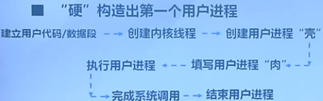
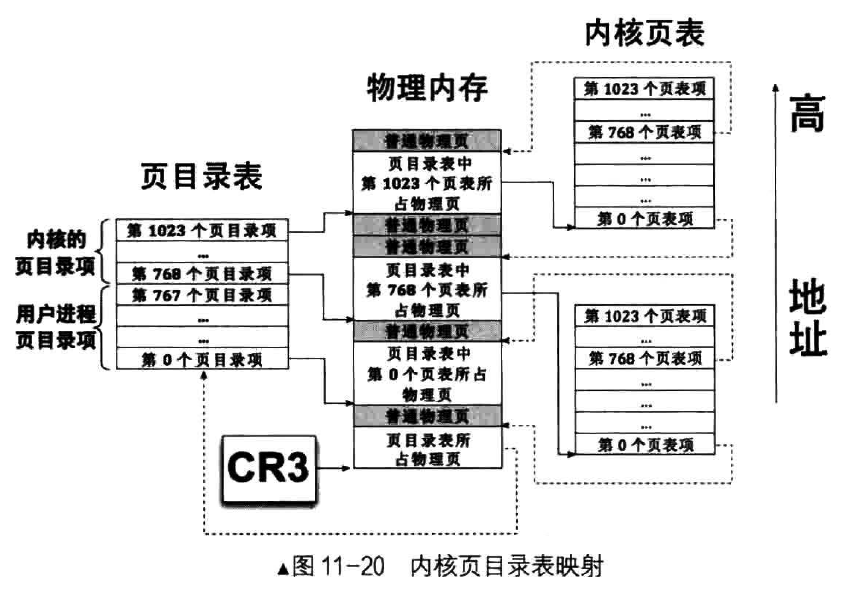
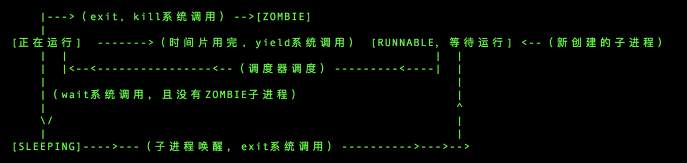

#### 1. 进程与线程

一个进程拥有一个存放程序和数据的的虚拟地址空间以及其他资源。一个进程基于程序的指令流执行，其执行过程可能与其它进程的执行过程交替进行。**因此，一个具有执行状态（运行态、就绪态等）的进程是一个被操作系统分配资源（比如分配内存）并调度（比如分时使用CPU）的单位。**在大多数操作系统中，这两个特点是进程的主要本质特征。但这两个特征相对独立，操作系统可以把这两个特征分别进行管理。

这样可以把**拥有资源所有权的单位通常仍称作进程**，对资源的管理成为进程管理；**把指令执行流的单位称为线程**，对线程的管理就是线程调度和线程分派。对属于同一进程的所有线程而言，这些线程共享进程的虚拟地址空间和其他资源，但每个线程都有一个独立的栈，还有独立的线程运行上下文，用于包含表示线程执行现场的寄存器值等信息。

在多线程环境中，进程被定义成资源分配与保护的单位，与进程相关联的信息主要有存放进程映像的虚拟地址空间等。在一个进程中，可能有一个或多个线程，每个线程有线程执行状态（运行、就绪、等待等），保存上次运行时的线程上下文、线程的执行栈等。考虑到CPU有不同的特权模式，参照进程的分类，线程又可进一步细化为用户线程和内核线程。

到目前为止，我们就可以明确用户进程、内核进程（可把ucore看成一个内核进程）、用户线程、内核线程的区别了。从本质上看，线程就是一个特殊的不用拥有资源的轻量级进程，在ucore的调度和执行管理中，并没有区分线程和进程。且由于ucore内核中的所有内核线程共享一个内核地址空间和其他资源，所以这些内核线程从属于同一个唯一的内核进程，即ucore内核本身。理解了进程或线程的上述属性和特征，就可以进行进程/线程管理的设计与实现了。但是为了叙述上的简便，以下用户态的进程/线程统称为用户进程。


执行流程概要：




​	**原理与需求：**

​	不同的进程有各自的页表，所以即使不同进程的用户态虚拟地址相同，但由于页表把虚拟页映射到了不同的物理页帧，所以不同进程的虚拟内存空间是被隔离开的，相互之间无法直接访问。在用户态内存空间和内核态内核空间之间需要拷贝数据，让CPU处在内核态才能完成对用户空间的读或写，为此需要设计专门的拷贝函数（copy_from_user和copy_to_user）完成。但反之则会导致违反CPU的权限管理，导致内存访问异常。

​	在进程管理方面，主要涉及到的是**进程控制块中与内存管理相关的部分**，包括建立进程的页表和维护进程可访问空间（可能还没有建立虚实映射关系）的信息；加载一个ELF格式的程序到进程控制块管理的内存中的方法；在进程复制（fork）过程中，把父进程的内存空间拷贝到子进程内存空间的技术。另外一部分与**用户态进程生命周期管理**相关，包括让进程放弃CPU而睡眠等待某事件；让父进程等待子进程结束；一个进程杀死另一个进程；给进程发消息；建立进程的血缘关系链表。

#### 	**流程介绍：**

1. “硬”构造出第一个进程（idleproc)，它是后续所有进程的祖先；

2. 然后，在proc_init函数中，通过alloc把当前ucore的执行环境转变成idle内核线程的执行现场 (分配proc，并初始化)；

3. 然后**调用kernl_thread来创建第二个内核线程init_main**，而init_main内核线程又创建了user_main内核线程.。到此，内核线程创建完毕。

   ```
   proc_init函数中：int pid = kernel_thread(init_main, NULL, 0);
   ```

   ```
   init_main函数中：int pid = kernel_thread(user_main, NULL, 0);
   ```

   ​	user_main函数最终调用kernel_execve函数

   **kernel_execve**  作用是读取elf文件

   ​	本实验中第一个用户进程是由第二个内核线程initproc通过把hello应用程序执行码**覆盖**到initproc的用户虚拟内存空间来创建的

   ```
   // kernel_execve - do SYS_exec syscall to exec a user program called by user_main kernel_thread
   static int
   kernel_execve(const char *name, unsigned char *binary, size_t size) {
       int ret, len = strlen(name);
       asm volatile (
           "int %1;"
           : "=a" (ret)
           : "i" (T_SYSCALL), "0" (SYS_exec), "d" (name), "c" (len), "b" (binary), "D" (size)
           : "memory");
       return ret;
   }
   ```

4. 此时开始用户进程的创建过程，这第一步实际上是通过user_main函数调用kernel_thread创建子进程，通过kernel_execve调用来把某一具体程序的执行内容放入内存。具体的放置方式是**根据ld在此文件上的地址分配为基本原则，把程序的不同部分放到某进程的用户空间中，从而通过此进程来完成程序描述的任务。**一旦执行了这一程序对应的进程，就会从内核态切换到用户态继续执行。

   ```
   由于ld在链接hello应用程序执行码时定义了两全局变量：
       _binary_obj___user_hello_out_start：hello执行码的起始位置
       _binary_obj___user_hello_out_size中：hello执行码的大小
   
   kernel_execve把这两个变量作为SYS_exec系统调用的参数，让ucore来创建此用户进程。
   		参数：__KERNEL_EXECVE2(x, xstart, xsize)//即为上面提到的两参数
   		参数为：kernel_execve(name, binary, (size_t)(size));
   当ucore收到此系统调用后，将依次调用如下函数
       vector128(vectors.S)-->__alltraps(trapentry.S)-->trap(trap.c)-->trap_dispatch(trap.c)-->syscall(syscall.c)--\>sys_exec（syscall.c）-->do_execve(proc.c)-->load_icode-->do_exit
   
   .globl vector128
   vector128:
     pushl $0
     pushl $128
     jmp __alltraps
   ```

   

5. 此时，内核态切换到用户态。并由前文由于映射关系的不同，尽管CPU在用户空间执行的用户进程在同一个范围，但其地址空间不会被其他用户的进程影响。但由于**系统调用**（用户进程直接获得操作系统服务的唯一通道）、外设中断和异常中断的会随时产生，从而间接**推动了用户进程实现用户态到到内核态的切换工作**。ucore对CPU内核态与用户态的切换过程需要比较仔细地分析（这其实是实验一的扩展练习）。

   ​	即	**设置一个特定中断号的中断门，专门用于用户进程访问系统调用。**

   ```
   《真像》知识点摘录
   一般情况下， CPU 不允许从高特权级转向低特权级，除非是从中断和调用门返回的情况下。咱们系统中不打算使用调用门，因此，咱们进入特权级3 只能借助从中断返回的方式，但用户进程还没有运行，何谈被中断？更谈不上从中断返回了……但是CPU 比较呆头呆脑，我们可以骗过CPU，在用户进程运行之前，使其以为我们在中断处理环境中，这样便“假装”从中断返回。
   ```

   

6. 当进程执行结束后，需回收进程占用和没消耗完毕的设备整个过程，且为新的创建进程请求提供服务。在本实验中，当系统中存在多个进程或内核线程时，ucore采用了一种FIFO的很简单的调度方法来管理每个进程占用CPU的时间和频度等。在ucore运行过程中，由于调度、时间中断、系统调用等原因，使得进程会进行切换、创建、睡眠、等待、发消息等各种不同的操作，周而复始，生生不息。

----------------

#### 练习0：填写已有实验

本实验依赖实验1/2/3/4。请把你做的实验1/2/3/4的代码填入本实验中代码中有“LAB1”/“LAB2”/“LAB3”/“LAB4”的注释相应部分。注意：为了能够正确执行lab5的测试应用程序，可能需对已完成的实验1/2/3/4的代码进行进一步改进。

进行代码改进

**改进介绍**
根据试验要求，我们需要对部分代码进行改进，这里讲需要改进的地方的代码和说明罗列如下：

1. 在初始化IDT的时候，设置系统调用对应的中断描述符，使其能够在用户态下被调用，并且设置为trap类型。（事实上这个部分已经在LAB1的实验中顺手被完成了）
2. 在时钟中断的处理部分，每过TICK_NUM个中断，就将当前的进程设置为可以被重新调度的，这样使得当前的线程可以被换出，从而实现多个线程的并发执行；
3. 在alloc_proc函数中，额外对进程控制块中新增加的 wait_state，cptr，yptr，optr成员变量进行初始化；
4. 在do_fork函数中，使用set_links函数来完成将fork的线程添加到线程链表中的过程，值得注意的是，该函数中就包括了对进程总数加1这一操作，因此需要将原先的这个操作给删除掉；

-----------

1：实验4的alloc_proc函数需要增加两行（kern/process/proc.c，118——119行）

这两行代码主要是初始化进程等待状态、和进程的相关指针，例如父进程、子进程、同胞等等。新增的几个proc指针给出相关的解释如下：

```
parent: proc->parent (proc is children)
children: proc->cptr (proc is parent)
older sibling: proc->optr (proc is older sibling)
younger sibling: proc->yptr (proc is younger sibling)长兄
```

2、实验4的do_fork函数需要增加两行（kern/process/proc.c，411行、426行）

3：软中断(syscall功能)

设置一个特定中断号的中断门，专门用于用户进程访问系统调用。在上述代码中，可以看到在执行加载中断描述符表lidt指令前，专门设置了一个特殊的中断描述符idt[T_SYSCALL]，它的特权级设置为DPL_USER，中断向量处理地址在vectors[T_SYSCALL]处。这样建立好这个中断描述符后，一旦用户进程执行INT_SYSCALL后，由于此中断允许用户态进程产生（它的特权级设置为DPL_USER），所以CPU就会从用户态切换到内核态，保存相关寄存器，并跳转到_vectors[T_SYSCALL]处开始执行，形成如下执行路径：

```
void
idt_init(void) {
	.....
  	int i;
    for (i = 0; i < sizeof(idt) / sizeof(struct gatedesc); i ++) {
        SETGATE(idt[i], 0, GD_KTEXT, __vectors[i], DPL_KERNEL);
    }
    SETGATE(idt[T_SYSCALL], 1, GD_KTEXT, __vectors[T_SYSCALL], DPL_USER);
    lidt(&idt_pd);
}

值得说明：
 *   - istrap: 1 for a trap (= exception) gate, 0 for an interrupt gate
 *   - sel: Code segment selector for interrupt/trap handler
 *   - off: Offset in code segment for interrupt/trap handler
 *   - dpl: Descriptor Privilege Level - 中断前的特权级，用于用户进程访问系统调用，因此设为User
#define SETGATE(gate, istrap, sel, off, dpl)
```


#### 练习1: 加载应用程序并执行（需要编码）

**do_execv**函数调用load_icode（位于kern/process/proc.c中）来加载并解析一个处于内存中的ELF执行文件格式的应用程序，建立相应的用户内存空间来放置应用程序的代码段、数据段等，且要设置好proc_struct结构中的成员变量trapframe中的内容，确保在执行此进程后，能够从应用程序设定的起始执行地址开始执行。需设置正确的trapframe内容。

```
// do_execve - call exit_mmap(mm)&put_pgdir(mm) to reclaim memory space of current process
//           - call load_icode to setup new memory space accroding binary prog.
/*
 * 先回收自身所占用户空间，然后调用load_icode，用新的程序覆盖内存空间，形成一个执行新程序的新进程。
 */
int
do_execve(const char *name, size_t len, unsigned char *binary, size_t size) {
    struct mm_struct *mm = current->mm;
    if (!user_mem_check(mm, (uintptr_t)name, len, 0)) {
        return -E_INVAL;
    }
    if (len > PROC_NAME_LEN) {
        len = PROC_NAME_LEN;
    }

    char local_name[PROC_NAME_LEN + 1];
    memset(local_name, 0, sizeof(local_name));
    memcpy(local_name, name, len);
    //清空空间
    if (mm != NULL) {
        lcr3(boot_cr3);//cr3指向内核页表
        if (mm_count_dec(mm) == 0) {
            exit_mmap(mm);		//清空内存管理部分和对应页表
            put_pgdir(mm);		//清空页表
            mm_destroy(mm);		//清空内存
        }
        current->mm = NULL;//指向空
    }
    int ret;
    if ((ret = load_icode(binary, size)) != 0) {
        goto execve_exit;
    }
    set_proc_name(current, local_name);
    return 0;

execve_exit:
    do_exit(ret);
    panic("already exit: %e.\n", ret);
}
```

load_icode函数的主要工作就是给用户进程建立一个能够让用户进程正常运行的用户环境。此函数有一百多行，完成了如下重要工作：

1. 调用mm_create函数来申请进程的内存管理数据结构mm所需内存空间，并对mm进行初始化；

2. 调用setup_pgdir来申请一个页目录表所需的一个页大小的内存空间，并把描述ucore内核虚空间映射的内核页表（boot_pgdir所指）的内容拷贝到此新目录表中，最后mm->pgdir指向此页目录表，这就是进程新的页目录表了，且能够正确映射内核。

3. 根据应用程序执行码的起始位置来解析此ELF格式的执行程序，并调用mm_map函数根据ELF格式的执行程序说明的各个段（代码段、数据段、BSS段等）的起始位置和大小建立对应的vma结构，并把vma插入到mm结构中，从而表明了用户进程的合法用户态虚拟地址空间。

4. 调用根据执行程序各个段的大小分配物理内存空间，并根据执行程序各个段的起始位置确定虚拟地址，并在页表中建立好物理地址和虚拟地址的映射关系，然后把执行程序各个段的内容拷贝到相应的内核虚拟地址中，至此应用程序执行码和数据已经根据编译时设定地址放置到虚拟内存中了；

5. 需要给用户进程设置用户栈，为此调用mm_mmap函数建立用户栈的vma结构，明确用户栈的位置在用户虚空间的顶端，大小为256个页，即1GB，并分配一定数量的物理内存且建立好栈的虚地址<-->物理地址映射关系；

   ```
   为什么是256个页？
   目前我们的内核位于OxcOOOOOOO 以上的地址空间，也就是位于页目录表中第768～ 1023 个页目录项所
   指向的页表中，这一共是256 个页目录项，即lGB 空间（当然我们的内核没那么大，不会把lGB 空间占
   满）
   ```

   

6. 至此,进程内的内存管理vma和mm数据结构已经建立完成，于是把mm->pgdir赋值到cr3寄存器中，即更新了用户进程的虚拟内存空间，此时的initproc已经被hello的代码和数据覆盖，成为了第一个用户进程，但此时这个用户进程的执行现场还没建立好；

7. 先清空进程的中断帧，再重新设置进程的中断帧，使得在执行中断返回指令“iret”后，能够让CPU转到用户态特权级，并回到用户态内存空间，使用用户态的代码段、数据段和堆栈，且能够跳转到用户进程的第一条指令执行，并确保在用户态能够响应中断；

调用create_mm函数

```
// mm_create -  alloc a mm_struct & initialize it.
struct mm_struct *
mm_create(void) {
    struct mm_struct *mm = kmalloc(sizeof(struct mm_struct));

    if (mm != NULL) {
        list_init(&(mm->mmap_list));
        mm->mmap_cache = NULL;
        mm->pgdir = NULL;
        mm->map_count = 0;

        if (swap_init_ok) swap_init_mm(mm);
        else mm->sm_priv = NULL;
        
        set_mm_count(mm, 0);
        lock_init(&(mm->mm_lock));
    }    
    return mm;
}
```

可以看到这个函数首先申请了一块内存空间，如果内存空间申请成功了，那么就会把这个内存空间返回给外面调用它的mm变量，如果申请失败，那么新开辟的空间都不存在，即为NULL，且会返回它自己，因此外部的判断条件是mm不能等于NULL，如果等于NULL，说明创建空间失败了，否则，就能够说明创建成功。

--------------

2.调用setup_pgdir分配页目录

```
// setup_pgdir - alloc one page as PDT
static int
setup_pgdir(struct mm_struct *mm) {
    struct Page *page;	//页目录需要一个页
    if ((page = alloc_page()) == NULL) {
        return -E_NO_MEM;
    }
    pde_t *pgdir = page2kva(page);
    memcpy(pgdir, boot_pgdir, PGSIZE);
    pgdir[PDX(VPT)] = PADDR(pgdir) | PTE_P | PTE_W;
    mm->pgdir = pgdir;
    return 0;
}
```

如果没有返回0，那么分配页目录表失败，因此程序需要判断为0的情况，到一个错误的状态。

-------------------------

读取elf头部，以下为其数据结构（结合readelf来看更加清晰）

```
/* file header */
即为头部组成部分，依顺序读下来
struct elfhdr {
    uint32_t e_magic;     // must equal ELF_MAGIC
    uint8_t e_elf[12];
    uint16_t e_type;      // 1=relocatable, 2=executable, 3=shared object, 4=core image
    uint16_t e_machine;   // 3=x86, 4=68K, etc.
    uint32_t e_version;   // file version, always 1
    uint32_t e_entry;     // entry point if executable
    uint32_t e_phoff;     // file position of program header or 0
    uint32_t e_shoff;     // file position of section header or 0
    uint32_t e_flags;     // architecture-specific flags, usually 0
    uint16_t e_ehsize;    // size of this elf header
    uint16_t e_phentsize; // size of an entry in program header
    uint16_t e_phnum;     // number of entries in program header or 0
    uint16_t e_shentsize; // size of an entry in section header
    uint16_t e_shnum;     // number of entries in section header or 0
    uint16_t e_shstrndx;  // section number that contains section name strings
};
```

在bootloader启动的过程中，已经将ucore内核和用户代码全部加载到内存，因为没有文件管理系统，我们只需要关注这个代码在内存中的哪里，找到了开头就能根据它找到数据段。

```
/* program section header */ 代码段头部
struct proghdr {
    uint32_t p_type;   // loadable code or data, dynamic linking info,etc.
    uint32_t p_offset; // file offset of segment
    uint32_t p_va;     // virtual address to map segment
    uint32_t p_pa;     // physical address, not used
    uint32_t p_filesz; // size of segment in file
    uint32_t p_memsz;  // size of segment in memory (bigger if contains bss）
    uint32_t p_flags;  // read/write/execute bits
    uint32_t p_align;  // required alignment, invariably hardware page size
};
```

load_icode函数分析：

```
/* load_icode - load the content of binary program(ELF format) as the new content of current process
 * @binary:  the memory addr of the content of binary program
 * @size:  the size of the content of binary program
 */
static int
load_icode(unsigned char *binary, size_t size) {
    if (current->mm != NULL) {
        panic("load_icode: current->mm must be empty.\n");
    }

    int ret = -E_NO_MEM;
    struct mm_struct *mm;
    //(1) create a new mm for current process
    if ((mm = mm_create()) == NULL) {//申请内存
        goto bad_mm;
    }
    //(2) create a new PDT, and mm->pgdir= kernel virtual addr of PDT
    //创建页目录表，让mm->pgdir指向此页目录表
    if (setup_pgdir(mm) != 0) {
        goto bad_pgdir_cleanup_mm;
    }
    //第3步：读取ELF格式的文件，在内存中复制该进程所需要的代码段等信息
    //(3) copy TEXT/DATA section, build BSS parts in binary to memory space of process
    struct Page *page;
    //(3.1) get the file header of the bianry program (ELF format)
    struct elfhdr *elf = (struct elfhdr *)binary;//用于得到文件头
    //(3.2) get the entry of the program section headers of the bianry program (ELF format)
    struct proghdr *ph = (struct proghdr *)(binary + elf->e_phoff);//由readelf指令可知道段头 Program Headers:
    //(3.3) This program is valid?
    if (elf->e_magic != ELF_MAGIC) {//魔数
        ret = -E_INVAL_ELF;
        goto bad_elf_cleanup_pgdir;
    }

    uint32_t vm_flags, perm;
    struct proghdr *ph_end = ph + elf->e_phnum;
    for (; ph < ph_end; ph ++) {
    //(3.4) find every program section headers获取各个段头部，通过头部找到其中数据，分别进行解析
        if (ph->p_type != ELF_PT_LOAD) {//不可加载
            continue ;
        }
        if (ph->p_filesz > ph->p_memsz) {//物理地址大于虚拟地址大小
            ret = -E_INVAL_ELF;
            goto bad_cleanup_mmap;
        }
        if (ph->p_filesz == 0) {//物理地址大小为0
            continue ;
        }
    //(3.5) call mm_map fun to setup the new vma ( ph->p_va, ph->p_memsz)
        //分别建立新的映射关系 使用mm_map函数建立合法空间（kern/mm/vmm.c，159——165行）
        vm_flags = 0, perm = PTE_U;
        //分别对比，以改写flag
        if (ph->p_flags & ELF_PF_X) vm_flags |= VM_EXEC;
        if (ph->p_flags & ELF_PF_W) vm_flags |= VM_WRITE;
        if (ph->p_flags & ELF_PF_R) vm_flags |= VM_READ;
        if (vm_flags & VM_WRITE) perm |= PTE_W;
        //建立新的映射关系
        if ((ret = mm_map(mm, ph->p_va, ph->p_memsz, vm_flags, NULL)) != 0) {
            goto bad_cleanup_mmap;
        }
        unsigned char *from = binary + ph->p_offset;
        size_t off, size;
        uintptr_t start = ph->p_va, end, la = ROUNDDOWN(start, PGSIZE);//la初始化为起始地址

        ret = -E_NO_MEM;

     //(3.6) alloc memory, and  copy the contents of every program section (from, from+end) to process's memory (la, la+end)
        end = ph->p_va + ph->p_filesz;//起始虚拟地址+大小
     //(3.6.1) copy TEXT/DATA section of bianry program
        while (start < end) {
            if ((page = pgdir_alloc_page(mm->pgdir, la, perm)) == NULL) {
                goto bad_cleanup_mmap;
            }
            off = start - la, size = PGSIZE - off, la += PGSIZE;//4096即一页
            if (end < la) {
                size -= la - end;
            }
            memcpy(page2kva(page) + off, from, size);//复制上去
            start += size, from += size;
        }

      //(3.6.2) build BSS section of binary program
        /*
         * 　text和data段都在可执行文件中（在嵌入式系统里一般是固化在镜像文件中），由系统从可执行文件中加载；
         * 　　而bss段不在可执行文件中，由系统初始化。
         */
        end = ph->p_va + ph->p_memsz;//虚拟起始地址+本段大小
        if (start < la) {
            /* ph->p_memsz == ph->p_filesz */
            if (start == end) {
                continue ;
            }
            off = start + PGSIZE - la, size = PGSIZE - off;
            if (end < la) {
                size -= la - end;
            }
            memset(page2kva(page) + off, 0, size);
            start += size;
            assert((end < la && start == end) || (end >= la && start == la));
        }
        while (start < end) {
            if ((page = pgdir_alloc_page(mm->pgdir, la, perm)) == NULL) {
                goto bad_cleanup_mmap;
            }
            off = start - la, size = PGSIZE - off, la += PGSIZE;
            if (end < la) {
                size -= la - end;
            }
            memset(page2kva(page) + off, 0, size);//将bss置0
            start += size;
        }
    }
    //(4) build user stack memory
    //进程还需要用户堆栈空间。这里是构造用户堆栈。
    vm_flags = VM_READ | VM_WRITE | VM_STACK;
    if ((ret = mm_map(mm, USTACKTOP - USTACKSIZE, USTACKSIZE, vm_flags, NULL)) != 0) {
        goto bad_cleanup_mmap;
    }
    //重新建立mm_map堆栈 堆栈分配四页
    //明确用户栈的位置在用户虚空间的顶端，大小为256个页，即1GB 768-1023
    assert(pgdir_alloc_page(mm->pgdir, USTACKTOP-PGSIZE , PTE_USER) != NULL);
    assert(pgdir_alloc_page(mm->pgdir, USTACKTOP-2*PGSIZE , PTE_USER) != NULL);
    assert(pgdir_alloc_page(mm->pgdir, USTACKTOP-3*PGSIZE , PTE_USER) != NULL);
    assert(pgdir_alloc_page(mm->pgdir, USTACKTOP-4*PGSIZE , PTE_USER) != NULL);
    
    //(5) set current process's mm, sr3, and set CR3 reg = physical addr of Page Directory
    //建立好映射关系
    mm_count_inc(mm);
    current->mm = mm;
    current->cr3 = PADDR(mm->pgdir);//更换cr3的起始地址，PADDR 通过虚拟地址得到物理地址
    lcr3(PADDR(mm->pgdir));
    //截止目前，initproc这个用户进程的执行现场还没建立好；

    //(6) setup trapframe for user environment
    struct trapframe *tf = current->tf;//tf为中断桢，记录上下文
    memset(tf, 0, sizeof(struct trapframe));//先清空进程的中断帧，以重新设置
    /* LAB5:EXERCISE1 YOUR CODE
     * should set tf_cs,tf_ds,tf_es,tf_ss,tf_esp,tf_eip,tf_eflags
     * NOTICE: If we set trapframe correctly, then the user level process can return to USER MODE from kernel. So
     *          tf_cs should be USER_CS segment (see memlayout.h)
     *          tf_ds=tf_es=tf_ss should be USER_DS segment
     *          tf_esp should be the top addr of user stack (USTACKTOP)
     *          tf_eip should be the entry point of this binary program (elf->e_entry)
     *          tf_eflags should be set to enable computer to produce Interrupt
     */
    tf->tf_cs = USER_CS;
    tf->tf_ds = tf->tf_es = tf->tf_ss = USER_DS;
    tf->tf_esp = USTACKTOP;
    tf->tf_eip = elf->e_entry;//elf文件的虚拟地址开头。
    tf->tf_eflags = FL_IF;
    ret = 0;
out:
    return ret;
bad_cleanup_mmap:
    exit_mmap(mm);
bad_elf_cleanup_pgdir:
    put_pgdir(mm);
bad_pgdir_cleanup_mm:
    mm_destroy(mm);
bad_mm:
    goto out;
}
```

##### 问题回答：

**请在实验报告中描述当创建一个用户态进程并加载了应用程序后，CPU是如何让这个应用程序最终在用户态执行起来的。即这个用户态进程被ucore选择占用CPU执行（RUNNING态）到具体执行应用程序第一条指令的整个经过。**

在经过调度器占用了CPU的资源之后，用户态进程调用了exec系统调用，从而转入到了系统调用的处理例程；

在经过了正常的中断处理例程之后，最终控制权转移到了syscall.c中的syscall函数，然后根据系统调用号转移给了sys_exec函数，在该函数中调用了上文中提及的do_execve函数来完成指定应用程序的加载；

在do_execve中进行了若干设置，包括推出当前进程的页表，换用kernel的PDT之后，使用load_icode函数，完成了对整个用户线程内存空间的初始化，包括堆栈的设置以及将ELF可执行文件的加载，之后通过**current->tf**指针修改了当前系统调用的trapframe，使得**最终中断返回的时候能够切换到用户态**，并且同时可以正确地将控制权转移到应用程序的入口处；

在完成了do_exec函数之后，进行正常的中断返回的流程，由于中断处理例程的栈上面的eip已经被修改成了应用程序的入口处，而cs上的CPL是用户态，因此**iret进行中断返回的时候会将堆栈切换到用户的栈**，并且完成特权级的切换，并且**跳转到要求的应用程序的入口处**；

接下来开始具体执行应用程序的第一条指令；

```
.text
.globl kernel_thread_entry
kernel_thread_entry:        # void kernel_thread(void)

    pushl %edx              # push arg
    call *%ebx              # call fn

    pushl %eax              # save the return value of fn(arg)
    call do_exit            # call do_exit to terminate current thread
```


#### 练习2: 父进程复制自己的内存空间给子进程（需要编码）

创建子进程的函数do_fork在执行中将拷贝当前进程（即父进程）的用户内存地址空间中的合法内容到新进程中（子进程），完成内存资源的复制。具体是通过copy_range函数（位于kern/mm/pmm.c中）实现的，请补充copy_range的实现，确保能够正确执行。

-------------

CALL GRAPH: do_fork-> copy_mm-->dup_mmap-->copy_range

调用参数为：copy_range(to->pgdir, from->pgdir, vma->vm_start, vma->vm_end, share) 

我们回顾一下do_fork的执行过程，它完成的工作主要如下：

·1、分配并初始化进程控制块（alloc_proc函数）；
·2、分配并初始化内核栈，为内核进程（线程）建立栈空间（setup_stack函数）；
·3、根据clone_flag标志复制或共享进程内存管理结构（copy_mm函数）；
·4、设置进程在内核（将来也包括用户态）正常运行和调度所需的中断帧和执行上下文（copy_thread函数）；
·5、为进程分配一个PID（get_pid）函数）；
·6、把设置好的进程控制块放入hash_list和proc_list两个全局进程链表中；
·7、自此，进程已经准备好执行了，把进程状态设置为“就绪”态；
·8、设置返回码为子进程的PID号。、


copy_mm(clone_flags, proc) 

```
// copy_mm - process "proc" duplicate OR share process "current"'s mm according clone_flags
//         - if clone_flags & CLONE_VM, then "share" ; else "duplicate"
static int
copy_mm(uint32_t clone_flags, struct proc_struct *proc) {
    struct mm_struct *mm, *oldmm = current->mm;

    /* current is a kernel thread */
    if (oldmm == NULL) {
        return 0;
    }
    if (clone_flags & CLONE_VM) {//可以共享地址空间
        mm = oldmm;
        goto good_mm;
    }

    int ret = -E_NO_MEM;
    if ((mm = mm_create()) == NULL) {
        goto bad_mm;
    }
    if (setup_pgdir(mm) != 0) {
        goto bad_pgdir_cleanup_mm;
    }

    lock_mm(oldmm);//打开互斥锁，避免多个进程同时访问内存
    {
        ret = dup_mmap(mm, oldmm);
    }
    unlock_mm(oldmm);//释放互斥锁

    if (ret != 0) {
        goto bad_dup_cleanup_mmap;
    }

good_mm:
    mm_count_inc(mm);//共享地址空间的进程数+1
    proc->mm = mm;//复制空间地址
    proc->cr3 = PADDR(mm->pgdir);//复制也表地址
    return 0;
bad_dup_cleanup_mmap:
    exit_mmap(mm);
    put_pgdir(mm);
bad_pgdir_cleanup_mm:
    mm_destroy(mm);
bad_mm:
    return ret;
}
```


dup_mmap函数：（kern/mm/vmm.c，191——209行）

​	 dup_mmap(mm, oldmm);

首先看传入的参数，是两个内存mm，这是为什么呢？

在上一个函数copy_mm中，传入的两个内存叫做mm和oldmm，其中，第一个mm只是调用了mm_create()声明，但没有初始化，更没有分配内容；第二个oldmm是current进程的内存空间，由此可见，前一个mm是待复制的内存，而复制的源内容在oldmm（父进程）内容中。

```
int
dup_mmap(struct mm_struct *to, struct mm_struct *from) {
    assert(to != NULL && from != NULL);
    //mmap_list为虚拟地址空间的首地址
    list_entry_t *list = &(from->mmap_list), *le = list;
    while ((le = list_prev(le)) != list) {//遍历所有段
        struct vma_struct *vma, *nvma;
        vma = le2vma(le, list_link);
        nvma = vma_create(vma->vm_start, vma->vm_end, vma->vm_flags);//取
        if (nvma == NULL) {
            return -E_NO_MEM;
        }

        insert_vma_struct(to, nvma);//向心进程插入段

        bool share = 0;
        if (copy_range(to->pgdir, from->pgdir, vma->vm_start, vma->vm_end, share) != 0) {
            return -E_NO_MEM;
        }
    }
    return 0;
}
```

copy_range函数：（kern/mm/pmm.c，506——556行）

 解释：copy_range - copy content of memory (start, end) of one process A to another process B

 * @to:    the addr of process B's Page Directory

 * @from:  the addr of process A's Page Directory

 * @share: flags to indicate to dup OR share. We just use dup method, so it didn't be used.

   **实现思路：**
   copy_range 函数的具体执行流程是遍历父进程指定的**某一段内存空间中**的每一个虚拟页，如果这个虚拟页是存在的话，为子进程对应的同一个地址（但是页目录表是不一样的，因此不是一个内存空间）也申请分配一个物理页，然后将前者中的所有内容复制到后者中去，然后为子进程的这个物理页和对应的虚拟地址（事实上是线性地址）建立映射关系；而在本练习中需要完成的内容就是**内存的复制和映射**的建立，具体流程如下：
   1.找到父进程指定的某一物理页对应的内核虚拟地址；
   2.找到需要拷贝过去的子进程的对应物理页对应的内核虚拟地址；
   3.将前者的内容拷贝到后者中去；
   4.为子进程当前分配这一物理页映射上对应的在子进程虚拟地址空间里的一个虚拟页；

在上一个函数中（dup_mmap），只是完成了新进程中的段创建，但是段中还没有具体内容，需要在copy_range中具体复制父进程对应段中的具体内容。这个函数传入的参数都是段指针，告诉系统应该复制内存中需要复制内容的起止地址。

1.首先回顾get_pte

```
    //回顾
    //get_pte - get pte and return the kernel virtual address of this pte for la
    //  la:     the linear address need to map
    // return vaule: the kernel virtual address of this pte
    //    get_pte(pde_t *pgdir, uintptr_t la, bool create) 
```

2.

```
int
copy_range(pde_t *to, pde_t *from, uintptr_t start, uintptr_t end, bool share) {
    assert(start % PGSIZE == 0 && end % PGSIZE == 0);
    assert(USER_ACCESS(start, end));
    //回顾
    //get_pte - get pte and return the kernel virtual address of this pte for la
    //  la:     the linear address need to map
    // return vaule: the kernel virtual address of this pte
    //    get_pte(pde_t *pgdir, uintptr_t la, bool create)

    // copy content by page unit.
    do {
        //call get_pte to find process A's pte according to the addr start
        pte_t *ptep = get_pte(from, start, 0), *nptep;////获取父进程的页表内容，获取页表entry
        if (ptep == NULL) {
            start = ROUNDDOWN(start + PTSIZE, PTSIZE);
            continue ;
        }
        //call get_pte to find process B's pte according to the addr start. If pte is NULL, just alloc a PT
        if (*ptep & PTE_P) {
            if ((nptep = get_pte(to, start, 1)) == NULL) {//子进程的地址
                return -E_NO_MEM;
            }
        uint32_t perm = (*ptep & PTE_USER);
        //get page from ptep
        //page2pa(page): get the physical address of memory which this (struct Page *) page  manages
        struct Page *page = pte2page(*ptep);//使用pte2page获取页表的物理地址
        // alloc a page for process B
        struct Page *npage=alloc_page();
        assert(page!=NULL);
        assert(npage!=NULL);
        int ret=0;
        /* LAB5:EXERCISE2 YOUR CODE
         * replicate content of page to npage, build the map of phy addr of nage with the linear addr start
         *
         * Some Useful MACROs and DEFINEs, you can use them in below implementation.
         * MACROs or Functions:
         *    page2kva(struct Page *page): return the kernel vritual addr of memory which page managed (SEE pmm.h)
         *    page_insert: build the map of phy addr of an Page with the linear addr la
         *    memcpy: typical memory copy function
         *
         * (1) find src_kvaddr: the kernel virtual address of page
         * (2) find dst_kvaddr: the kernel virtual address of npage
         * (3) memory copy from src_kvaddr to dst_kvaddr, size is PGSIZE
         * (4) build the map of phy addr of  nage with the linear addr start
         */
        void * src_kvaddr = page2kva(page);//获取父进程的虚拟地址
        void * dst_kvaddr = page2kva(npage);//获取子进程的虚拟地址
        //memcpy(void *dst, const void *src, size_t n)
        memcpy(dst_kvaddr, src_kvaddr, PGSIZE);//复制，页表为一页
        //  perm:  the permission of this Page which is setted in related pte
        //page_insert(pde_t *pgdir, struct Page *page, uintptr_t la, uint32_t perm)
        ret = page_insert(to,npage,start,perm);

        assert(ret == 0);
        }
        start += PGSIZE;
    } while (start != 0 && start < end);
    return 0;
}
```

请在实验报告中简要说明如何设计实现”Copy on Write 机制“，给出概要设计，鼓励给出详细设计。

> Copy-on-write（简称COW）的基本概念是指如果有多个使用者对一个资源A（比如内存块）进行读操作，则每个使用者只需获得一个指向同一个资源A的指针，就可以该资源了。若某使用者需要对这个资源A进行写操作，系统会对该资源进行拷贝操作，从而使得该“写操作”使用者获得一个该资源A的“私有”拷贝—资源B，可对资源B进行写操作。该“写操作”使用者对资源B的改变对于其他的使用者而言是不可见的，因为其他使用者看到的还是资源A。

​	接下来将说明如何实现“Copy on Write”机制，该机制的主要思想为使得进程执行fork 系统调用进行复制的时候，父进程不会简单地将整个内存中的内容复制给子进程，而是暂时共享相同的物理内存页；而当其中一个进程需要对内存进行修改的时候，再额外创建一个自己私有的物理内存页，将共享的内容复制过去，然后在自己的内存页中进行修改；根据上述分析，主要对实验框架的修改应当主要有两个部分，一个部分在于进行fork操作的时候不直接复制内存，另外一个处理在于出现了内存页访问异常的时候，会将共享的内存页复制一份，然后在新的内存页进行修改，具体的修改部分如下：
​	**do fork部分**：在进行内存复制的部分，比如copy_range函数内部，不实际进行内存的复制，而是将子进程和父进程的虚拟页映射上同一个物理页面，然后在分别在这两个进程的虚拟页对应的PTE部分将这个页置成是不可写的，同时利用PTE中的保留位将这个页设置成共享的页面，这样的话如果应用程序试图写某一个共享页就会产生页访问异常，从而可以将控制权交给操作系统进行处理；
​	**page fault部分**：在page fault的ISR部分，新增加对当前的异常是否由于尝试写了某一个共享页面引起的，如果是的话，额外申请分配一个物理页面，然后将当前的共享页的内容复制过去，建立出错的线性地址与新创建的物理页面的映射关系，将PTE 设置设置成非共享的；然后查询原先共享的物理页面是否还是由多个其它进程共享使用的，如果不是的话，就将对应的虚地址的PTE进行修改，删掉共享标记，恢复写标记；这样的话page fault 返回之后就可以正常完成对虚拟内存（原想的共享内存）的写操作了；上述实现有一个较小的缺陷，在于在do fork的时候需要修改所有的PTE，会有一定的时间效率上的损失；可以考虑将共享的标记加在PDE上，然后一旦访问了这个PDE之后再将标记下传给对应的PTE，这样的话就起到了标记延迟和潜在的标记合并的左右，有利于提升时间效率；

------------

#### 练习3: 阅读分析源代码，理解进程执行 fork/exec/wait/exit 的实现，以及系统调用的实现（不需要编码）

请在实验报告中简要说明你对 fork/exec/wait/exit函数的分析。并回答如下问题：

- 请分析fork/exec/wait/exit在实现中是如何影响进程的执行状态的？
- 请给出ucore中一个用户态进程的执行状态生命周期图（包执行状态，执行状态之间的变换关系，以及产生变换的事件或函数调用）。（字符方式画即可）

执行：make grade。如果所显示的应用程序检测都输出ok，则基本正确。（使用的是qemu-1.0.1）

------------------

##### 一、首先介绍系统调用System Call

​	基于操作系统开发程序使开发效率大大提升了，但人们也因此受到了束缚，必须要遵循操作系统制定的规则。为什么要制定规则呢？一部分原因是为安全起见，不能由程序“乱来”。操作系统不允许用户程序过于“神通广大飞它用户程序的能力限制得很低，即使用户程序做了坏事，也不会影响到整个计算机的安全。不过，在很多时候用户进程还是需要提升“战斗力”以完成一些合法的工作，比如访问打印机为用户打印文件等。操作系统对用户进程绝对是不放心的，绝对不能把权力放出去，为满足这一合理需求，操作系统说了：“有事您找我，我亲自帮您办。”操作系统提供了一组“提升战斗力”的接口，每个接口都是不同的功能，用户进程需要什么功能就调用什么，这组接口就是系统调用接口。系统调用就是让用户进程申请操作系统的帮助，让操作系统帮其完成某项工作，也就是相当于用户进程调用了操作系统的功能，因此**“系统调用”准确地来说应该被称为“操作系统功能调用”**。

​	在本节实验之前，新加的 中断门，便是专门用于用户进程访问系统调用。

```
SETGATE(idt[T_SYSCALL], 1, GD_KTEXT, __vectors[T_SYSCALL], DPL_USER);
```

​	专门设置了一个特殊的中断描述符idt[T_SYSCALL]，它的特权级设置为DPL_USER，中断向量处理地址在__ vectors[T_SYSCALL]处。这样建立好这个中断描述符后，一旦用户进程执行“INT  T_SYSCALL”后，由于**此中断允许用户态进程产生**（注意它的特权级设置为DPL_USER），所以CPU就会从用户态切换到内核态，保存相关寄存器，并跳转到__vectors[T_SYSCALL]处开始执行，形成如下执行路径：

```
vector128(vectors.S)-->__alltraps(trapentry.S)-->trap(trap.c)-->trap_dispatch(trap.c)---->syscall(syscall.c)
```

执行系统调用可导致进程等待某事件发生，从而可引起进程切换；	

​	在syscall中，根据 系统调用号eax 来完成不同的系统调用服务。

```
小知识：
	Linux 中的系统调用是用寄存器来传递参数的，这些参数需要按照从左到右的顺序依次存入到不同的通用寄存器（除esp ）中。其中，寄存器eax用来保存子功能号， ebx 保存第1 个参数， ecx 保存第2 个参数， edx 保存第3 个参数， esi 保存第4 个参数， edi 保存第5 个参数。传递参数还可以用栈（内存），不知道您想过没有，为什么Linux 用寄存器来传递参数，而不用枝？用寄存器快？肯定是这样的，没有哪个操作系统愿意更慢。不过这个“快”可不是出于存储介质方面的考虑，而是用寄存器传参的步骤少一些，听我慢慢道来。
		用户进程执行int Ox80 时还处于用户态，编译器根据c 调用约定，系统调用所用的参数会被压到用户战中，这是3 特权级战。当int Ox80 执行后，任务陆入内核态，此时进入了。特权级，因此需要用到0 特权级钱，但系统调用的参数还在3 特权级的战中，为了获取用户战地址，还得在0 特权级战中获取处理器自动压入的用户拢的SS 和esp 寄存器的值，然后再次从用户战中获取参数。您看，光传递参数就涉及到了多次内存访问的情况，内存比寄存器要慢，而且步骤很麻烦。
```


-------

与进程相关的各个系统调用属性如下所示：

| 系统调用名 | 含义                                      | 具体完成服务的函数                                           |
| ---------- | ----------------------------------------- | ------------------------------------------------------------ |
| SYS_exit   | process exit                              | do_exit                                                      |
| SYS_fork   | create child process, dup mm              | do_fork—>wakeup_proc                                         |
| SYS_wait   | wait child process                        | do_wait                                                      |
| SYS_exec   | after fork, process execute a new program | load a program and refresh the mm                            |
| SYS_yield  | process flag itself need resecheduling    | proc->need_sched=1, then scheduler will rescheule this process |
| SYS_kill   | kill process                              | do_kill—>proc->flags \|= PF_EXITING,                                                         —>wakeup_proc—>do_wait—>do_exit |
| SYS_getpid | get the process’s pid                     |                                                              |


1. do_fork

前面已经讲过

它完成的工作主要如下：

·1、分配并初始化进程控制块（alloc_proc函数）；
·2、分配并初始化内核栈，为内核进程（线程）建立栈空间（setup_stack函数）；
·3、根据clone_flag标志复制或共享进程内存管理结构（copy_mm函数）；
·4、设置进程在内核（将来也包括用户态）正常运行和调度所需的中断帧和执行上下文（copy_thread函数）；
·5、为进程分配一个PID（get_pid）函数）；
·6、把设置好的进程控制块放入hash_list和proc_list两个全局进程链表中；
·7、自此，进程已经准备好执行了，把进程状态设置为“就绪”态；
·8、设置返回码为子进程的PID号。、

---------------

2. **do_execv**

函数调用load_icode（位于kern/process/proc.c中）来加载并解析一个处于内存中的ELF执行文件格式的应用程序，建立相应的用户内存空间来放置应用程序的代码段、数据段等，且要设置好proc_struct结构中的成员变量trapframe中的内容，确保在执行此进程后，能够从应用程序设定的起始执行地址开始执行。需设置正确的trapframe内容。

- 首先为加载新的执行码做好用户态内存空间清空准备。如果mm不为NULL，则设置页表为内核空间页表，且进一步判断mm的引用计数减1后是否为0，如果为0，则表明没有进程再需要此进程所占用的内存空间，为此将根据mm中的记录，释放进程所占用户空间内存和进程页表本身所占空间。最后把当前进程的mm内存管理指针为空。由于此处的initproc是内核线程，所以mm为NULL，整个处理都不会做。
- 接下来的一步是加载应用程序执行码到当前进程的新创建的用户态虚拟空间中。这里涉及到读ELF格式的文件，申请内存空间，建立用户态虚存空间，加载应用程序执行码等。load_icode函数完成了整个复杂的工作。

load_icode具体见前面

------------------

```
	首先思考，initproc是怎样退出的？

	kernel_thread（proc.c）函数fork完了就会return到IP=kernel_thread_entry（entry.S）里面，kernel_thread_entry里面调用*%ebx（就是init_main）后会回到`pushl %eax`（entry.S）这一行，就把%eax传给do_exit（proc.c）了。
```

3. **do_exit**

exit函数会把一个退出码error_code传递给ucore，ucore通过执行内核函数do_exit来完成对当前进程的退出处理，主要工作简单地说就是回收当前进程所占的大部分内存资源，并通知父进程完成最后的回收工作，具体流程如下：

**1.** 如果current->mm != NULL，表示是用户进程，则开始回收此用户进程所占用的用户态虚拟内存空间；

​		a) 首先执行“lcr3(boot_cr3)”，切换到内核态的页表上，这样当前用户进程目前只能在内核虚拟地址空间执行了，这是为了确保后续释放用户态内存和进程页表的工作能够正常执行；

​		b) 如果当前进程控制块的成员变量mm的成员变量mm_count减1后为0（表明这个mm没有再被其他进程共享，可以彻底释放进程所占的用户虚拟空间了。），则开始回收用户进程所占的内存资源：

​			i. 调用exit_mmap函数释放current->mm->vma链表中每个vma描述的进程合法空间中实际分配的内存，然后把对应的页表项内容清空，最后还把页表所占用的空间释放并把对应的页目录表项清空；

​			ii. 调用put_pgdir函数释放当前进程的页目录所占的内存；

​			iii. 调用mm_destroy函数释放mm中的vma所占内存，最后释放mm所占内存；

​		c) 此时设置current->mm为NULL，表示与当前进程相关的用户虚拟内存空间  和  对应的内存管理成员变量所占的内核虚拟内存空间已经回收完毕；

**2.** 这时，设置当前进程的执行状态current->state=PROC_ZOMBIE，当前进程的退出码current->exit_code=error_code。此时当前进程已经不能被调度了，需要此进程的父进程来做最后的回收工作（即回收描述此进程的内核栈和进程控制块）；

**3.**  如果当前进程的父进程current->parent处于等待子进程状态：

current->parent->wait_state==WT_CHILD，

则唤醒父进程（即执行“wakup_proc(current->parent)”），让父进程帮助自己完成最后的资源回收；

**4.** 如果当前进程还有子进程，则需要把这些子进程的父进程指针设置为内核线程initproc，且各个子进程指针需要插入到initproc的子进程链表中。如果某个子进程的执行状态是PROC_ZOMBIE，则需要唤醒initproc来完成对此子进程的最后回收工作。

```
parent: proc->parent (proc is children)
children: proc->cptr (proc is parent)
older sibling: proc->optr (proc's older sibling)
younger sibling: proc->yptr (proc's younger sibling)长兄
```

**5.** 执行schedule()函数，选择新的进程执行。

4. do_wait

   那么父进程如何完成对子进程的最后回收工作呢？这要求父进程要执行wait用户函数或wait_pid用户函数，这两个函数的区别是，wait函数等待任意子进程的结束通知，而wait_pid函数等待进程id号为pid的子进程结束通知。这两个函数最终访问sys_wait系统调用接口让ucore来完成对子进程的最后回收工作，即回收子进程的内核栈和进程控制块所占内存空间，具体流程如下：

**1.** 如果pid!=0，表示只找一个进程id号为pid的退出状态的子进程，否则找任意一个处于退出状态的子进程；

**2.** 如果此子进程的执行状态不为PROC_ZOMBIE，表明此子进程还没有退出，则当前进程只好设置自己的执行状态为PROC_SLEEPING，睡眠原因为WT_CHILD（即等待子进程退出），调用schedule()函数选择新的进程执行，自己睡眠等待，如果被唤醒，则重复跳回步骤1处执行；

**3.** 如果此子进程的执行状态为PROC_ZOMBIE，表明此子进程处于退出状态，需要当前进程（即子进程的父进程）完成对子进程的最终回收工作，即首先把子进程控制块从两个进程队列proc_list和hash_list中删除，并释放子进程的内核堆栈和进程控制块。自此，子进程才彻底地结束了它的执行过程，消除了它所占用的所有资源。


**do_yield** - ask the scheduler to reschedule

```
int do_yield(void) {
    current->need_resched = 1;
    return 0;
}
```





```
fork 创建新的 PCB 进程状态为 UNINIT
exec 将当前进程的内存布局清除 再调用 load_icode 读出 ELF映像中的内存布局 并填写 进程状态不改变
wait 当前进程若无子进程 则返回错误 若有子进程 则判定 是否为 ZOMBIE 子进程 有则释放子进程的资源 并返回子进程的返回状态码
若无 ZOMBIE 状态子进程 则进入 SLEEPING 状态 等子进程唤醒
exit 清除当前进程几乎所有资源(PCB和内核栈不清除) 将所有子进程(如果有的话)设置为 init 进程(内核) 将当前进程状态设置为 ZOMBIE
若有父进程在等待当前进程exit 则 唤醒父进程
```


-----------------

# initproc是怎样退出的

我在做实验的时候通过观察qemu输出

```
stride sched correct result: 1 2 3 4 5
all user-mode processes have quit.
init check memory pass.
kernel panic at kern/process/proc.c:491:
 initproc exit.
Welcome to the kernel debug monitor!!
```


发现内核的第二个线程initproc最后会退出，因为有"initproc exit."这一句

这一句输出来源于do_exit函数的开头

```
do_exit(int error_code) {
    if (current == idleproc) {
        panic("idleproc exit.\n");
    }
    if (current == initproc) {
        panic("initproc exit.\n");
    }
```

我想问一下initproc是如何到达的do_exit的呢？

该内核线程在创建的时候是

```
    int pid = kernel_thread(init_main, NULL, 0);
```

而init_main函数的结尾是

```
    while (do_wait(0, NULL) == 0) {
        schedule();
    }

    cprintf("all user-mode processes have quit.\n");
    assert(initproc->cptr == NULL && initproc->yptr == NULL && initproc->optr == NULL);
    assert(nr_process == 2);
    assert(list_next(&proc_list) == &(initproc->list_link));
    assert(list_prev(&proc_list) == &(initproc->list_link));

    cprintf("init check memory pass.\n");
    return 0;
}
```

最后的那一个return 0是return到什么地方了呢？为什么又会跳转到do_exit？


如果是用户进程的话还是挺好理解的，因为每个用户进程的最后都有一个系统调用exit

但是这个内核线程，结尾的时候是怎么exit的呢？


answer

kernel_thread（proc.c）函数fork完了就会return到kernel_thread_entry（entry.S）里面，kernel_thread_entry里面调用*%ebx（就是init_main）后会回到`pushl %eax`（entry.S）这一行，就把%eax传给do_exit（proc.c）了。

--------------------------------------------------

# lab5 关于用户进程exit 以及进程调度

老师和同学们：

   我有2个问题：

​         1、用户进程执行完毕时，是如何把控制权交给ucore并调用exit的？

​      

​         2、调度是只有在内核态才能进行么？比如一个用户态进程只有通过中断或者系统调用进入内核态才能再进行调度，

   

  

​        谢谢！   


[lab5](https://piazza.com/class/i5j09fnsl7k5x0?cid=623#)

[edit](https://piazza.com/class/i5j09fnsl7k5x0?cid=623#)·[good question](https://piazza.com/class/i5j09fnsl7k5x0?cid=623#)0

Updated 4 years ago by 

wangpeng

the students' answer,

where students collectively construct a single answer

等老师解答

[edit](https://piazza.com/class/i5j09fnsl7k5x0?cid=623#)·[thanks!](https://piazza.com/class/i5j09fnsl7k5x0?cid=623#)0

Updated 4 years ago by 

wangpeng

the instructors' answer,

where instructors collectively construct a single answer

\1. Ucore  通过用户库中的umain函数然后调转到main函数执行， 从main返回后在umain中调用exit

\2. 在Ucore中调度的发生都是在内核态，因为调度的程序在内核中。

[thanks!](https://piazza.com/class/i5j09fnsl7k5x0?cid=623#)1

Updated 4 years ago by 

Youren Shen

followup discussions

for lingering questions and comments

Resolved Unresolved


[wangpeng](https://piazza.com/class/i5j09fnsl7k5x0?cid=623#) [4 years ago](https://piazza.com/class/i5j09fnsl7k5x0?cid=623#)老师，是不是没个程序都要在编写的时候自己进行exit的调用？

[helpful!](https://piazza.com/class/i5j09fnsl7k5x0?cid=623#) 0


 [Youren Shen](https://piazza.com/class/i5j09fnsl7k5x0?cid=623#) [4 years ago](https://piazza.com/class/i5j09fnsl7k5x0?cid=623#) 你可以看下umain的实现以及umain的caller, umain调用main是操作系统写好的，不需要用户程序自己来实现。也就是说，某些情况下，从用户程序的角度来看，main函数中return相当于调用exit。

[helpful!](https://piazza.com/class/i5j09fnsl7k5x0?cid=623#) 0


[李宇轩_JFLFY2255](https://piazza.com/class/i5j09fnsl7k5x0?cid=623#) [4 years ago](https://piazza.com/class/i5j09fnsl7k5x0?cid=623#) 用户态的程序的main之外还有一个壳，就是umain，这个umain是操作系统写好的，负责进入main，main的return也会返回到umain，之后umain会调用syscall exit。