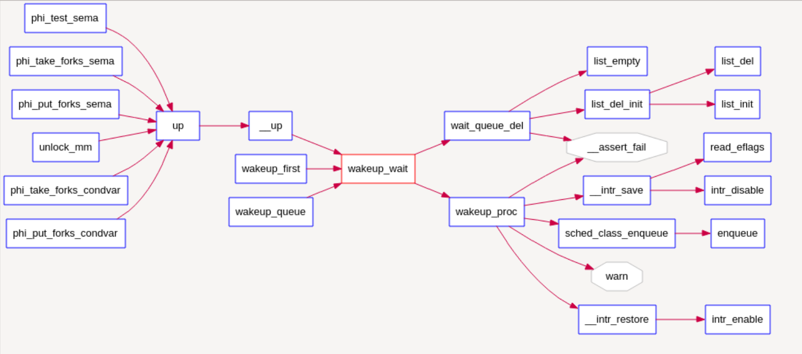
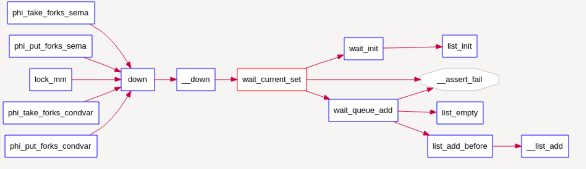
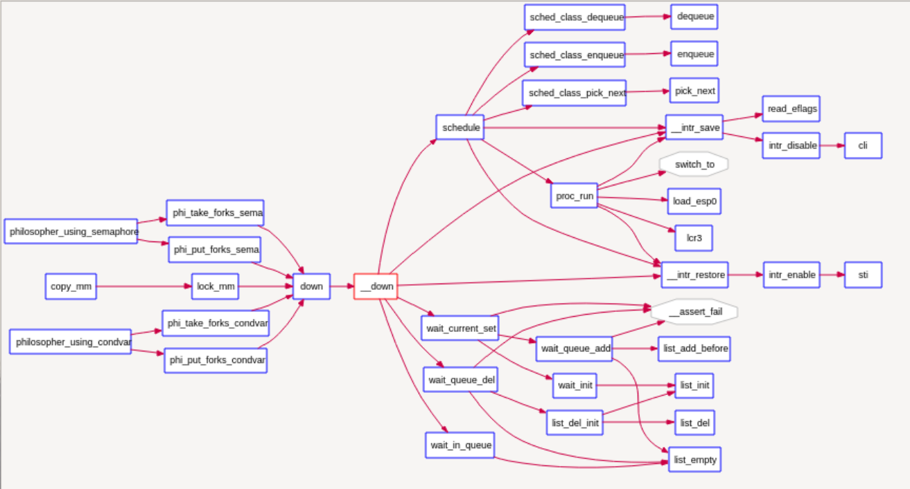
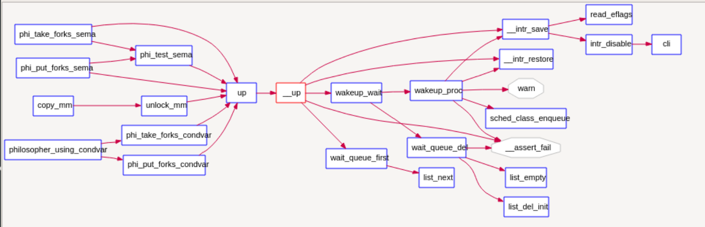

### 练习

对实验报告的要求：

- 基于markdown格式来完成，以文本方式为主
- 填写各个基本练习中要求完成的报告内容
- 完成实验后，请分析ucore_lab中提供的参考答案，并请在实验报告中说明你的实现与参考答案的区别
- 列出你认为本实验中重要的知识点，以及与对应的OS原理中的知识点，并简要说明你对二者的含义，关系，差异等方面的理解（也可能出现实验中的知识点没有对应的原理知识点）
- 列出你认为OS原理中很重要，但在实验中没有对应上的知识点

#### 练习0：填写已有实验

本实验依赖实验1/2/3/4/5/6。请把你做的实验1/2/3/4/5/6的代码填入本实验中代码中有“LAB1”/“LAB2”/“LAB3”/“LAB4”/“LAB5”/“LAB6”的注释相应部分。并确保编译通过。注意：为了能够正确执行lab7的测试应用程序，可能需对已完成的实验1/2/3/4/5/6的代码进行进一步改进。

#### 练习1: 理解内核级信号量的实现和基于内核级信号量的哲学家就餐问题（不需要编码）

完成练习0后，建议大家比较一下（可用meld等文件diff比较软件）个人完成的lab6和练习0完成后的刚修改的lab7之间的区别，分析了解lab7采用信号量的执行过程。执行`make grade`，大部分测试用例应该通过。

请在实验报告中给出内核级信号量的设计描述，并说其大致执行流流程。

请在实验报告中给出给用户态进程/线程提供信号量机制的设计方案，并比较说明给内核级提供信号量机制的异同。

1. 首先查看init_main函数，增加了check_sync函数，为lab7的起始总控函数

```
static int
init_main(void *arg) {
	...
	extern void check_sync(void);
    check_sync();                // check philosopher sync problem

    while (do_wait(0, NULL) == 0) {
        schedule();
    }
```

2. check_sync可以看到这个函数主要分为了两个部分，第一部分是实现基于信号量的哲学家问题，第二部分是实现基于管程的哲学家问题。

```
void check_sync(void){

    int i;

    //check semaphore基于信号量
    sem_init(&mutex, 1);
    for(i=0;i<N;i++){//N为5
        sem_init(&s[i], 0);
        int pid = kernel_thread(philosopher_using_semaphore, (void *)i, 0);
        if (pid <= 0) {
            panic("create No.%d philosopher_using_semaphore failed.\n");
        }
        philosopher_proc_sema[i] = find_proc(pid);
        set_proc_name(philosopher_proc_sema[i], "philosopher_sema_proc");
    }

    //check condition variable基于管程
    monitor_init(&mt, N);
    for(i=0;i<N;i++){
        state_condvar[i]=THINKING;
        int pid = kernel_thread(philosopher_using_condvar, (void *)i, 0);
        if (pid <= 0) {
            panic("create No.%d philosopher_using_condvar failed.\n");
        }
        philosopher_proc_condvar[i] = find_proc(pid);
        set_proc_name(philosopher_proc_condvar[i], "philosopher_condvar_proc");
    }
}
```

​	对于check_sync函数的第一部分，首先实现初始化了一个互斥信号量，然后创建了对应5个哲学家行为的5个信号量，并创建5个内核线程代表5个哲学家，每个内核线程完成了基于信号量的哲学家吃饭睡觉思考行为实现。这部分是给学生作为练习参考用的。学生可以看看信号量是如何实现的，以及如何利用信号量完成哲学家问题。

​	对于check_sync函数的第二部分，首先初始化了管程，然后又创建了5个内核线程代表5个哲学家，每个内核线程要完成基于管程的哲学家吃饭、睡觉、思考的行为实现。这部分需要学生来具体完成。学生需要掌握如何用信号量来实现条件变量，以及包含条件变量的管程如何能够确保哲学家能够正常思考和吃饭。

3. timer_t以及相关函数

```
typedef struct {
    unsigned int expires;       //the expire time
    struct proc_struct *proc;   //the proc wait in this timer. If the expire time is end, then this proc will be scheduled
    list_entry_t timer_link;    //the timer list
} timer_t;
```

- sched.h, sched.c 定义了有关timer的各种相关接口来使用 timer 服务，其中主要包括:
- typedef struct {……} timer_t: 定义了 timer_t 的基本结构，其可以用 sched.h 中的timer_init函数对其进行初始化。
- void timer_init(timer t *timer, struct proc_struct *proc, int expires): 对某定时器 进行初始化，让它在 expires 时间片之后唤醒 proc进程。
- void add_timer(timer t *timer): 向系统添加某个初始化过的timer_t，该定时器在指定时间后被激活，并将对应的进程唤醒至runnable（如果当前进程处在等待状态）。
- void del_timer(timer_t *time): 向系统删除（或者说取消）某一个定时器。该定时器在取消后不会被系统激活并唤醒进程。
- void run_timer_list(void): 更新当前系统时间点，遍历当前所有处在系统管理内的定时器，找出所有应该激活的计数器，并激活它们。该过程在且只在每次定时器中断时被调用。在ucore 中，其还会调用调度器事件处理程序。

#### **一个 timer_t 在系统中的存活周期可以被描述如下：**

1. **timer_t 在某个位置被创建和初始化，并通过add_timer加入系统管理列表run_timer_list中( sleep->Runnable**
2. **系统时间被不断累加，直到 run_timer_list 发现该 timer_t到期。**
3. **run_timer_list更改对应的进程状态，并从系统管理列表中移除该timer_t。**

----------------------

4. 屏蔽与使能中断

```
关中断：local_intr_save --> __intr_save --> intr_disable --> cli
开中断：local_intr_restore--> __intr_restore --> intr_enable --> sti
```

```
static inline bool
__intr_save(void) {
    if (read_eflags() & FL_IF) {
        intr_disable();
        return 1;
    }
    return 0;
}

static inline void
__intr_restore(bool flag) {
    if (flag) {
        intr_enable();
    }
}

#define local_intr_save(x)      do { x = __intr_save(); } while (0)
#define local_intr_restore(x)   __intr_restore(x);
---------------------
/* intr_enable - enable irq interrupt */
void
intr_enable(void) {
    sti();
}

/* intr_disable - disable irq interrupt */
void
intr_disable(void) {
    cli();
}
```


等待队列wait_queue ，进入后被设为等待状态（PROC_SLEEPING）

等待队列和每一个事件（睡眠结束、时钟到达、任务完成、资源可用等）联系起来

```
    typedef  struct {
        struct proc_struct *proc;     //等待进程的指针
        uint32_t wakeup_flags;        //进程被放入等待队列的原因标记
        wait_queue_t *wait_queue;     //指向此wait结构所属于的wait_queue
        list_entry_t wait_link;       //用来组织wait_queue中wait节点的连接
    } wait_t;
    
    typedef struct {
        list_entry_t wait_head;       //wait_queue的队头
    } wait_queue_t;
    le2wait(le, member)               //实现wait_t中成员的指针向wait_t 指针的转化
```

**调用函数**

与wait和wait queue相关的函数主要分为两层，

**底层函数**是对wait queue的初始化、插入、删除和查找操作，相关函数如下：

```
    void wait_init(wait_t *wait, struct proc_struct *proc);    //初始化wait结构
    bool wait_in_queue(wait_t *wait);                          //wait是否在wait queue中
    void wait_queue_init(wait_queue_t *queue);                 //初始化wait_queue结构
    void wait_queue_add(wait_queue_t *queue, wait_t *wait);    //把wait前插到wait queue中
    void wait_queue_del(wait_queue_t *queue, wait_t *wait);    //从wait queue中删除wait
    wait_t *wait_queue_next(wait_queue_t *queue, wait_t *wait);//取得wait的后一个链接指针
    wait_t *wait_queue_prev(wait_queue_t *queue, wait_t *wait);//取得wait的前一个链接指针
    wait_t *wait_queue_first(wait_queue_t *queue);             //取得wait queue的第一个wait
    wait_t *wait_queue_last(wait_queue_t *queue);              //取得wait queue的最后一个wait
    bool wait_queue_empty(wait_queue_t *queue);                //wait queue是否为空
```

**高层函数**基于底层函数实现了让进程进入等待队列—`wait_current_set`，以及从等待队列中唤醒进程—`wakeup_wait`，相关函数如下：

```
    //让wait与进程关联，且让当前进程关联的wait进入等待队列queue，当前进程睡眠
    void wait_current_set(wait_queue_t *queue, wait_t *wait, uint32_t wait_state);
    //把与当前进程关联的wait从等待队列queue中删除
    wait_current_del(queue, wait);
    //唤醒与wait关联的进程
    void wakeup_wait(wait_queue_t *queue, wait_t *wait, uint32_t wakeup_flags, bool del);
    //唤醒等待队列上挂着的第一个wait所关联的进程
    void wakeup_first(wait_queue_t *queue, uint32_t wakeup_flags, bool del);
    //唤醒等待队列上所有的等待的进程
    void wakeup_queue(wait_queue_t *queue, uint32_t wakeup_flags, bool del);
```


wakeup_wait由up调用

如下图所示，对于唤醒进程的函数`wakeup_wait`，可以看到它会被各种信号量的V操作函数`up`调用，并且它会调用`wait_queue_del`函数和`wakup_proc`函数来完成唤醒进程的操作。




wait_current_set

如下图所示，而对于让进程进入等待状态的函数`wait_current_set`，可以看到它会被各种信号量的P操作函数`down`调用，并且它会调用wait_init完成对等待项的初始化，并进一步调用`wait_queue_add`来把与要处于等待状态的进程所关联的等待项挂到与信号量绑定的等待队列中。



-------------------

**信号量**

```
 以下来源于操作系统精髓实现
 struct semaphore {
    int count;
    queueType queue;
    };
    
void semWait(semaphore s)
    {
    s.count--;
    if (s.count < 0) {
    /* place this process in s.queue */;
    /* block this process */;
    }
    }
    
void semSignal(semaphore s)
    {
    s.count++;
    if (s.count<= 0) {
    /* remove a process P from s.queue */;
    /* place process P on ready list */;
    }
    }
```


```
typedef struct {
	int value;                   //信号量的当前值
    wait_queue_t wait_queue;     //信号量对应的等待队列
} semaphore_t;
```

在ucore中最重要的信号量操作是P操作函数down(semaphore_t *sem)和V操作函数 up(semaphore_t  *sem)。但这两个函数的具体实现是__down(semaphore_t *sem, uint32_t wait_state)  函数和__up(semaphore_t *sem, uint32_t wait_state)函数，二者的具体实现描述如下：

● __down(semaphore_t *sem, uint32_t wait_state, timer_t  *timer)：具体实现信号量的P操作，首先关掉中断，然后判断当前信号量的value是否大于0。如果是>0，则表明可以获得信号量，故让value减一，并打开中断返回即可；如果不是>0，则表明无法获得信号量，故需要将当前的进程加入到等待队列中，并打开中断，然后运行调度器选择另外一个进程执行。如果被V操作唤醒，则把自身关联的wait从等待队列中删除（此过程需要先关中断，完成后开中断）。具体实现如下所示：

```
static __noinline uint32_t __down(semaphore_t *sem, uint32_t wait_state) {
    bool intr_flag;
    local_intr_save(intr_flag);
    if (sem->value > 0) {
        sem->value --;
        local_intr_restore(intr_flag);
        return 0;
    }
    wait_t __wait, *wait = &__wait;
    wait_current_set(&(sem->wait_queue), wait, wait_state);
    local_intr_restore(intr_flag);

    schedule();

    local_intr_save(intr_flag);
    wait_current_del(&(sem->wait_queue), wait);
    local_intr_restore(intr_flag);

    if (wait->wakeup_flags != wait_state) {
        return wait->wakeup_flags;
    }
    return 0;
}
```





● __up(semaphore_t *sem, uint32_t
wait_state)：具体实现信号量的V操作，首先关中断，如果信号量对应的wait
queue中没有进程在等待，直接把信号量的value加一，然后开中断返回；如果有进程在等待且进程等待的原因是semophore设置的，则调用wakeup_wait函数将waitqueue中等待的第一个wait删除，且把此wait关联的进程唤醒，最后开中断返回。具体实现如下所示：

```
    static __noinline void __up(semaphore_t *sem, uint32_t wait_state) {
        bool intr_flag;
        local_intr_save(intr_flag);
        {
            wait_t *wait;
            if ((wait = wait_queue_first(&(sem->wait_queue))) == NULL) {
                sem->value ++;
            }
            else {
                wakeup_wait(&(sem->wait_queue), wait, wait_state, 1);
            }
        }
        local_intr_restore(intr_flag);
    }
```



V: up函数实现先关闭中断，如果没有等待的，即有空闲位，就将信号量+1，增加空闲位，返回来进行调度；如果等待队列中有在等待的，且确保等待的是由于down导致，便将其唤醒。

P: down函数实现先关闭中断，如果有空闲位，就将信号量-1，并打开中断后直接返回；否则说明还无法直接获得信号量，因此需要将当前进程放到wait中，打开中断，进行调度下一个进程。若在调度之后进程后，被释放信号量，便将该等待进程从wait_queue中删除（删除时要用中断保护）。

对照信号量的原理性描述和具体实现，可以发现二者在流程上基本一致，只是具体实现采用了关中断的方式保证了对共享资源的互斥访问，通过等待队列让无法获得信号量的进程睡眠等待。另外，我们可以看出信号量的计数器value具有有如下性质：

- value>0，表示共享资源的空闲数
- value<0，表示该信号量的等待队列里的进程数
- value=0，表示等待队列为空

------------------------

现进入第一题的代码分析

init_main调用 check_sync函数，

```
// init_main - the second kernel thread used to create user_main kernel threads
static int
init_main(void *arg) {
    size_t nr_free_pages_store = nr_free_pages();
    size_t kernel_allocated_store = kallocated();

    int pid = kernel_thread(user_main, NULL, 0);
    if (pid <= 0) {
        panic("create user_main failed.\n");
    }
 extern void check_sync(void);
    check_sync();                // check philosopher sync problem

    while (do_wait(0, NULL) == 0) {
        schedule();
    }

    cprintf("all user-mode processes have quit.\n");
    assert(initproc->cptr == NULL && initproc->yptr == NULL && initproc->optr == NULL);
    assert(nr_process == 2);
    assert(list_next(&proc_list) == &(initproc->list_link));
    assert(list_prev(&proc_list) == &(initproc->list_link));

    cprintf("init check memory pass.\n");
    return 0;
}
```


```
//---------- philosophers problem using semaphore ----------------------
int state_sema[N]; /* 记录每个人状态的数组 */
/* 信号量是一个特殊的整型变量 */
semaphore_t mutex; /* 临界区互斥 */
semaphore_t s[N]; /* 每个哲学家一个信号量 */
```


```
void phi_take_forks_sema(int i) /* i：哲学家号码从0到N-1 */
{ 
        down(&mutex); /* 进入临界区 P */
        state_sema[i]=HUNGRY; /* 记录下哲学家i饥饿的事实 */
        phi_test_sema(i); /* 试图得到两只叉子 */
        up(&mutex); /* 离开临界区 */
        down(&s[i]); /* 如果得不到叉子就阻塞 */
}

void phi_put_forks_sema(int i) /* i：哲学家号码从0到N-1 */
{ 
        down(&mutex); /* 进入临界区 */
        state_sema[i]=THINKING; /* 哲学家进餐结束 */
        phi_test_sema(LEFT); /* 看一下左邻居现在是否能进餐 */
        phi_test_sema(RIGHT); /* 看一下右邻居现在是否能进餐 */
        up(&mutex); /* 离开临界区 */
}
```

左右宏定义

```
#define LEFT (i-1+N)%N /* i的左邻号码 */
#define RIGHT (i+1)%N /* i的右邻号码 */
```

现看test函数

```
void phi_test_sema(i) /* i：哲学家号码从0到N-1 */
{     	if(state_sema[i]==HUNGRY&&state_sema[LEFT]!=EATING&&state_sema[RIGHT]!=EATING)
    {
        state_sema[i]=EATING;
        up(&s[i]);
    }
}
```

意思如下：若i本身为hungry，且两边都为没有吃的状态，那便让i得到两个叉子来进餐，并且V来对哲学家 i 进行空闲+1，是为了返回后在down(i)试图阻塞时，进行抵消；

在take_forks中使用，之后会有down(i)因为试图拿起叉子，若得不到的话，便会将其堵塞住，一直等待两边空闲，当两边put后，会咨询左右是否进餐，此时便会回到刚刚的等待进程中，将其释放；

```
phi_test_sema(i); /* 试图得到两只叉子 */
up(&mutex); /* 离开临界区 */
down(&s[i]); /* 如果得不到叉子就阻塞 */
```

在put_forks中使用

```
phi_test_sema(LEFT); /* 看一下左邻居现在是否能进餐 */
phi_test_sema(RIGHT); /* 看一下右邻居现在是否能进餐 */
```

------------------------

--------------------------

请在实验报告中给出内核级信号量的设计描述，并说其大致执行流流程。

1. **举例说明**：现状况为：3想拿两边叉子，2为think，4为eating。

​	首先3想拿叉子--[phi_take_forks_sema(3)]，进入take函数中，先记录3为饥饿，再调用phi_test_sema(3)函数，进入test函数中，判断不能通过(即此时s[3]==0，没有空闲位)，回到take函数中，对down(s[3])，这样进入down函数，此时s[3]没有空闲位，即还无法直接获得信号量，因此需要将当前进程放到wait中，打开中断，进行调度下一个进程。

​	若此时进程为4现在吃完想要放下叉子--phi_put_forks_sema(4)，将4状态改为thinking，再调用左边的3，进行test---phi_test_sema(LEFT)，此时3开始判断两边是否是满足，发现满足，调用up函数，发现等待队列中有在等待的，且确保等待的是由于down导致，便将其唤醒。唤醒后回到哲学家进餐函数中，进行do_sleep控制的一段时间eating后，将叉子放回。

​	**2. 函数说明**

·sem_init：对信号量进行初始化的函数，根据在原理课上学习到的内容，信号量包括了等待队列和一个整型数值变量，该函数只需要将该变量设置为指定的初始值，并且将等待队列初始化即可；·

up：对应到了原理课中提及到的V操作，表示释放了一个该信号量对应的资源，如果有等待在了这个信号量上的进程，则将其唤醒执行；结合函数的具体实现可以看到其采用了禁用中断的方式来保证操作的原子性，函数中操作的具体流程为：

​	查询等待队列是否为空，如果是空的话，给整型变量加1；如果等待队列非空，取出其中的一个进程唤醒；
down：同样对应到了原理课中提及的P操作，表示请求一个该信号量对应的资源，同样采用了禁用中断的方式来保证原子性，具体流程为：
​	查询整型变量来了解是否存在多余的可分配的资源，是的话取出资源（整型变量减1），之后当前进程便可以正常进行；o如果没有可用的资源，整型变量不是正数，当前进程的资源需求得不到满足，因此将其状态改为SLEEPING态，然后将其挂到对应信号量的等待队列中，调用schedule函数来让出CPU，在资源得到满足，重新被唤醒之后，将自身从等待队列上删除掉；
·up，down：对up，down函数的简单封装；
·try_down：不进入等待队列的P操作，即时是获取资源失败也不会堵塞当前进程；

-----------

请在实验报告中给出给用户态进程/线程提供信号量机制的设计方案，并比较说明给内核级提供信号量机制的异同。

​	将内核信号量机制迁移到用户态的最大麻烦在于，用于保证操作原子性的禁用中断机制、以及CPU提供的Test and Set指令机制都只能在用户态下运行，而使用软件方法的同步互斥又相当复杂，这就使得没法在用户态下直接实现信号量机制；

​	于是，为了方便起见，可以将信号量机制的实现放在OS中来提供，然后使用系统调用的方法统一提供出若干个管理信号量的**系统调用**，分别如下所示：

```
·申请创建一个信号量的系统调用，可以指定初始值，返回一个信号量描述符（类似文件描述符）；
·将指定信号量执行P操作；·将指定信号量执行V操作；
·将指定信号量释放掉；给内核级线程提供信号量机制和给用户态进程/线程提供信号量机制的异同点在于：
·相同点：
·提供信号量机制的代码实现逻辑是相同的；
·不同点：
·由于实现原子操作的中断禁用、Test and Set 指令等均需要在内核态下运行，因此提供给用户态进程的信号量机制是通过系统调用来实现的，而内核级线程只需要直接调用相应的函数就可以了；
```


#### 练习2: 完成内核级条件变量和基于内核级条件变量的哲学家就餐问题（需要编码）

首先掌握管程机制，然后基于信号量实现完成条件变量实现，然后用管程机制实现哲学家就餐问题的解决方案（基于条件变量）。

执行：`make grade`
。如果所显示的应用程序检测都输出ok，则基本正确。如果只是某程序过不去，比如matrix.c，则可执行

```
make run-matrix
```

命令来单独调试它。大致执行结果可看附录。

请在实验报告中给出内核级条件变量的设计描述，并说其大致执行流流程。

请在实验报告中给出给用户态进程/线程提供条件变量机制的设计方案，并比较说明给内核级提供条件变量机制的异同。

请在实验报告中回答：能否不用基于信号量机制来完成条件变量？如果不能，请给出理由，如果能，请给出设计说明和具体实现。

### 管程和条件变量的原理回顾

引入了管程是为了将对共享资源的所有访问及其所需要的同步操作集中并封装起来。Hansan为管程所下的定义：“一个管程定义了一个数据结构和能为并发进程所执行（在该数据结构上）的一组操作，这组操作能同步进程和改变管程中的数据”。有上述定义可知，管程由四部分组成：

- 管程内部的共享变量；
- 管程内部的条件变量；
- 管程内部并发执行的进程；
- 对局部于管程内部的共享数据设置初始值的语句。

局限在管程中的数据结构，只能被局限在管程的操作过程所访问，任何管程之外的操作过程都不能访问它；另一方面，局限在管程中的操作过程也主要访问管程内的数据结构。由此可见，管程相当于一个隔离区，它把共享变量和对它进行操作的若干个过程围了起来，所有进程要访问临界资源时，都必须经过管程才能进入，而管程每次只允许一个进程进入管程，从而需要确保进程之间互斥。

但在管程中仅仅有互斥操作是不够用的。进程可能需要等待某个条件Cond为真才能继续执行。如果采用[忙等](http://zh.wikipedia.org/w/index.php?title=忙等待&action=edit&redlink=1)(busy
waiting)方式：

```
while not( Cond ) do {}
```

在单处理器情况下，将会导致所有其它进程都无法进入[临界区](http://zh.wikipedia.org/wiki/临界区)使得该条件Cond为真，该管程的执行将会发生[死锁](http://zh.wikipedia.org/wiki/死锁)。为此，可引入条件变量（Condition Variables，简称CV）。**一个条件变量CV可理解为一个进程的等待队列**，队列中的进程正等待某个条件Cond变为真。每个条件变量关联着一个条件，如果条件Cond不为真，则进程需要等待，如果条件Cond为真，则进程可以进一步在管程中执行。**需要注意当一个进程等待一个条件变量CV（即等待Cond为真），该进程需要退出管程，这样才能让其它进程可以进入该管程执行，并进行相关操作，比如设置条件Cond为真，改变条件变量的状态，并唤醒等待在此条件变量CV上的进程。**因此对条件变量CV有两种主要操作：

- wait_cv： 被一个进程调用，以等待断言Pc被满足后该进程可恢复执行.
  进程挂在该条件变量上等待时，不被认为是占用了管程。
- signal_cv：被一个进程调用，以指出断言Pc现在为真，从而可以唤醒等待断言Pc被满足的进程继续执行。


1. monitor定义

```
typedef struct monitor{
    semaphore_t mutex;      // 二值信号量，用来互斥访问管程，只允许一个进程进入管程，初始化为1，1表示未上锁
    semaphore_t next;       // 用于进程同步操作的信号量（条件同步），发出signal操作的进程等条件为真之前进入睡眠
    int next_count;         // 记录发出signal操作而睡眠的进程数
    condvar_t *cv;          // 条件变量
} monitor_t;
```

管程中的成员变量mutex是一个二值信号量，是实现每次只允许一个进程进入管程的关键元素，**确保了[互斥](http://zh.wikipedia.org/wiki/互斥)访问性质**。管程中的条件变量cv通过执行`wait_cv`，会使得等待某个条件Cond为真的进程能够离开管程并睡眠，且让其他进程进入管程继续执行；而进入管程的某进程设置上述条件Cond为真并执行`signal_cv`时，能够让等待该条件Cond为真的睡眠进程被唤醒，从而继续进入管程中执行。

注意：管程中的成员变量信号量next和整型变量next_count是配合进程对条件变量cv的操作而设置的，这是由于发出`signal_cv`的进程A会唤醒由于`wait_cv`而睡眠的进程B，由于管程中只允许一个进程运行，所以进程B执行会导致唤醒进程B的进程A睡眠，直到进程B离开管程，进程A才能继续执行，这个同步过程是通过信号量next完成的；而next_count表示了由于发出`singal_cv`而睡眠的进程个数。

----------

2. ucore的condvar条件变量 定义：

```
typedef struct condvar{
    semaphore_t sem;        // 用于让发出`wait_cv`操作的等待某个条件Cond为真的进程睡眠，而让发出`signal_cv`操作的进程通过这个sem来唤醒睡眠的进程
    int count;              // 等在这个条件变量上的睡眠进程的个数
    monitor_t * owner;      // 此条件变量的宿主是哪个管程
} condvar_t;
```

条件变量的定义中也包含了一系列的成员变量，信号量sem用于让发出`wait_cv`操作的等待某个条件Cond为真的进程睡眠，而让发出`signal_cv`操作的进程通过这个sem来唤醒睡眠的进程。count表示等在这个条件变量上的睡眠进程的个数。owner表示此条件变量的宿主是哪个管程。

--------------------

​	3. **wait_cv的原理描述** 

```
    cv.count++;
    if(monitor.next_count > 0)
       sem_signal(monitor.next);
    else
       sem_signal(monitor.mutex);
    sem_wait(cv.sem);
    cv.count -- ;
```

对照着可分析出`cond_wait`函数的具体执行过程。可以看出如果进程A执行了`cond_wait`函数，表示此进程等待某个条件Cond不为真，需要睡眠。因此表示等待此条件的睡眠进程个数cv.count要加一。接下来会出现两种情况。

​	情况一：如果monitor.next_count如果大于0，表示有大于等于1个进程执行cond_signal函数且睡了，就睡在了monitor.next信号量上（假定这些进程挂在monitor.next信号量相关的等待队列Ｓ上），因此需要唤醒等待队列Ｓ中的一个进程B；然后进程A睡在当前cv.sem上。如果进程A醒了，则让cv.count减一，表示等待此条件变量的睡眠进程个数少了一个，可继续执行了！

> 这里隐含这一个现象，即某进程A在时间顺序上先执行了`cond_signal`，而另一个进程B后执行了`cond_wait`，这会导致进程A没有起到唤醒进程B的作用。
>
> 问题: 在cond_wait有sem_signal(mutex)，但没有看到哪里有sem_wait(mutex)，这好像没有成对出现，是否是错误的？
> 答案：其实在管程中的每一个函数的入口处会有wait(mutex)，这样二者就配好对了。

​	情况二：如果monitor.next_count如果小于等于0，表示目前没有进程执行cond_signal函数且睡着了，那需要唤醒的是由于互斥条件限制而无法进入管程的进程，所以要唤醒睡在monitor.mutex上的进程。然后进程A睡在cv.sem上，如果睡醒了，则让cv.count减一，表示等待此条件的睡眠进程个数少了一个，可继续执行了！


对照着可分析出`cond_signal`函数的具体执行过程。

​	首先进程B判断cv.count，**如果小于等于0**，则表示当前没有执行cond_wait而睡眠的进程，因此就没有被唤醒的对象了，直接函数返回即可；**如果大于0**，这表示当前有执行cond_wait而睡眠的进程A，因此需要唤醒等待在cv.sem上睡眠的进程A。由于只允许一个进程在管程中执行，所以一旦进程B唤醒了别人（进程A），那么自己就需要睡眠。故让monitor.next_count加一，且让自己（进程B）睡在信号量monitor.next上。如果睡醒了，这让monitor.next_count减一。

```
void 
cond_signal (condvar_t *cvp) {
   //LAB7 EXERCISE1: YOUR CODE
   cprintf("cond_signal begin: cvp %x, cvp->count %d, cvp->owner->next_count %d\n", cvp, cvp->count, cvp->owner->next_count);
   if(cvp->count > 0){
	   cvp->owner->next_count++;//这说明为唤醒的进程睡眠了。
	   up(&(cvp->sem));//唤醒条件变量不足而睡眠的进程
	   //现在需要将自己阻塞
	   down(&(cvp->owner->next));
	   cvp->owner->next_count--;//说明down操作已经被唤醒
   }
  /*
   *      cond_signal(cv) {
   *          if(cv.count>0) {
   *             mt.next_count ++;
   *             signal(cv.sem);
   *             wait(mt.next);
   *             mt.next_count--;
   *          }
   *       }
   */
   cprintf("cond_signal end: cvp %x, cvp->count %d, cvp->owner->next_count %d\n", cvp, cvp->count, cvp->owner->next_count);
}
```

为啥要在最开始进行一个count++?这是由于现在即将up当前进程，进入该进程，即在此之前需要表明已经唤醒


/*phi_take_forka_condvar（）函数实现思路：
1.获取管程的锁
2.将自己设置为饥饿状态
3.判断当前叉子sem是否足够就餐，如不能，等待其他人释放资源
4.释放管程的锁
*/


也就是说，现在总共考虑两个进程，owner和next。判断cv.count即是当前由于cv不满足而阻塞的进程数量，睡在owner的sem上，而next_count则表示由于next进程signal操作后，会进入睡眠，就睡在next的sem上(原因就在于唤醒一个，就需要将自己进行阻塞，以保证管程中只有一个进程)。


#### 扩展练习 Challenge ：　在ucore中实现简化的死锁和重入探测机制

在ucore下实现一种探测机制，能够在多进程/线程运行同步互斥问题时，动态判断当前系统是否出现了死锁产生的必要条件，是否产生了多个进程进入临界区的情况。
如果发现，让系统进入monitor状态，打印出你的探测信息。

#### 扩展练习 Challenge ：　参考Linux的RCU机制，在ucore中实现简化的RCU机制

在ucore
下实现下Linux的RCU同步互斥机制。可阅读相关Linux内核书籍或查询网上资料，可了解RCU的设计实现细节，然后简化实现在ucore中。
要求有实验报告说明你的设计思路，并提供测试用例。下面是一些参考资料：

- http://www.ibm.com/developerworks/cn/linux/l-rcu/
- http://www.diybl.com/course/6_system/linux/Linuxjs/20081117/151814.html

​          