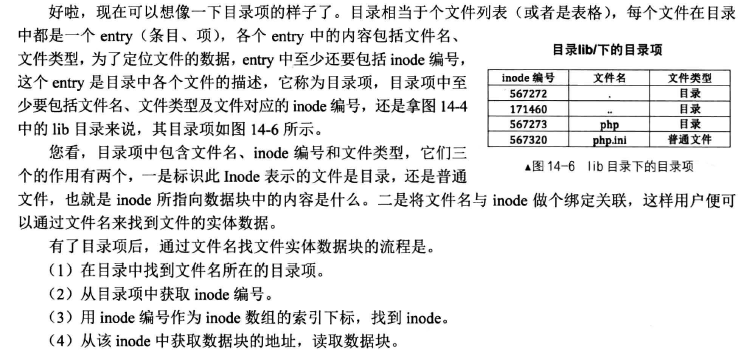
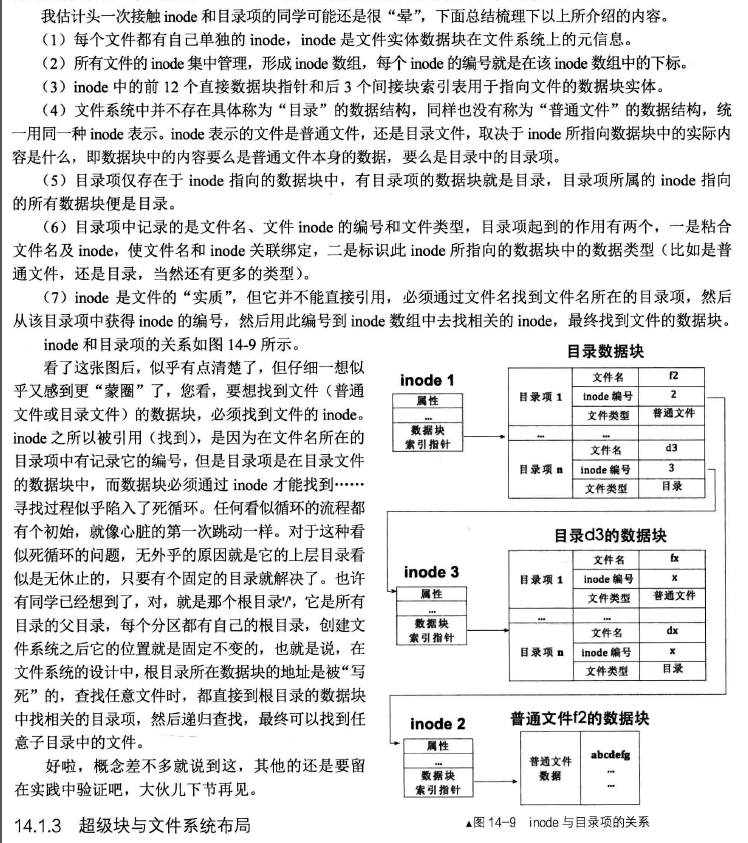
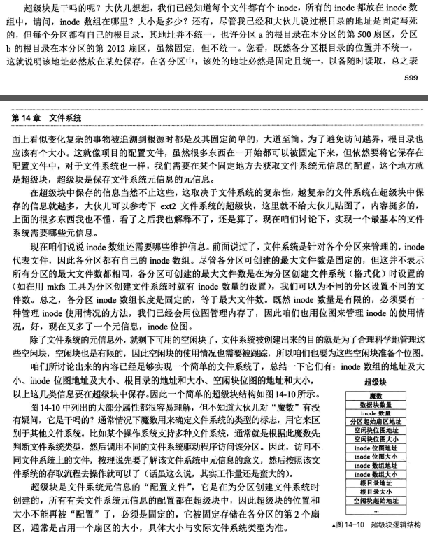
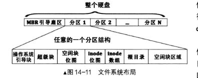
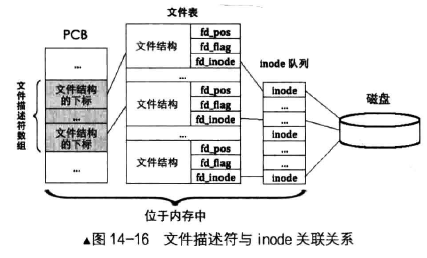

### ucore 文件系统总体介绍

操作系统中负责管理和存储可长期保存数据的软件功能模块称为文件系统。在本次试验中，主要侧重文件系统的设计实现和对文件系统执行流程的分析与理解。

ucore的文件系统模型源于Havard的OS161的文件系统和Linux文件系统。但其实这二者都是源于传统的UNIX文件系统设计。UNIX提出了四个文件系统抽象概念：文件(file)、目录项(dentry)、索引节点(inode-->index node)和安装点(mount point)。

- 文件：UNIX文件中的内容可理解为是一有序字节buffer，文件都有一个方便应用程序识别的文件名称（也称文件路径名）。典型的文件操作有读、写、创建和删除等。
- 目录项：目录项不是目录（又称文件路径），而是目录的组成部分。在UNIX中目录被看作一种特定的文件，而目录项是文件路径中的一部分。如一个文件路径名是“/test/testfile”，则包含的目录项为：根目录“/”，目录“test”和文件“testfile”，这三个都是目录项。一般而言，目录项包含目录项的名字（文件名或目录名）和目录项的索引节点（见下面的描述）位置。
- 索引节点：UNIX将文件的相关元数据信息（如访问控制权限、大小、拥有者、创建时间、数据内容等等信息）存储在一个单独的数据结构中，该结构被称为索引节点。
- 安装点：在UNIX中，文件系统被安装在一个特定的文件路径位置，这个位置就是安装点。所有的已安装文件系统都作为根文件系统树中的叶子出现在系统中。

****

上述抽象概念形成了UNIX文件系统的逻辑数据结构，并需要通过一个具体文件系统的架构设计与实现把上述信息映射并储存到磁盘介质上，从而在具体文件系统的磁盘布局（即数据在磁盘上的物理组织）上具体体现出上述抽象概念。比如文件元数据信息存储在磁盘块中的索引节点上。当文件被载入内存时，内核需要使用磁盘块中的索引点来构造内存中的索引节点。

目录项与inode的总结：



超级块的描述



文件系统的分配，一般来说超级块为512字节，因为否则读取不知道啥时候停止




ucore模仿了UNIX的文件系统设计，ucore的文件系统架构主要由四部分组成：

- 通用文件系统访问接口层：该层提供了一个从用户空间到文件系统的标准访问接口。这一层访问接口让应用程序能够通过一个简单的接口获得ucore内核的文件系统服务。
- 文件系统抽象层：向上提供一个一致的接口给内核其他部分（文件系统相关的系统调用实现模块和其他内核功能模块）访问。向下提供一个同样的抽象函数指针列表和数据结构屏蔽不同文件系统的实现细节。
- Simple FS文件系统层：一个基于索引方式的简单文件系统实例。向上通过各种具体函数实现以对应文件系统抽象层提出的抽象函数。向下访问外设接口
- 外设接口层：向上提供device访问接口屏蔽不同硬件细节。向下实现访问各种具体设备驱动的接口，比如disk设备接口/串口设备接口/键盘设备接口等。

对照上面的层次我们再大致介绍一下文件系统的访问处理过程，加深对文件系统的总体理解。假如应用程序操作文件（打开/创建/删除/读写），首先需要通过文件系统的通用文件系统访问接口层给用户空间提供的访问接口进入文件系统内部，接着由文件系统抽象层把访问请求转发给某一具体文件系统（比如SFS文件系统），具体文件系统（Simple  FS文件系统层）把应用程序的访问请求转化为对磁盘上的block的处理请求，并通过外设接口层交给磁盘驱动例程来完成具体的磁盘操作。结合用户态写文件函数write的整个执行过程，我们可以比较清楚地看出ucore文件系统架构的层次和依赖关系。

    

**ucore文件系统总体结构**

从ucore操作系统不同的角度来看，ucore中的文件系统架构包含四类主要的数据结构,
它们分别是：

- 超级块（SuperBlock），它主要从文件系统的全局角度描述特定文件系统的全局信息。它的作用范围是整个OS空间。
- 索引节点（inode）：它主要从文件系统的单个文件的角度它描述了文件的各种属性和数据所在位置。它的作用范围是整个OS空间。
- 目录项（dentry）：它主要从文件系统的文件路径的角度描述了文件路径中的一个特定的目录项（注：一系列目录项形成目录/文件路径）。它的作用范围是整个OS空间。对于SFS而言，inode(具体为struct sfs_disk_inode)对应于物理磁盘上的具体对象，dentry（具体为struct  sfs_disk_entry）是一个内存实体，其中的ino成员指向对应的inode number，另外一个成员是file name(文件名).
- 文件（file），它主要从进程的角度描述了一个进程在访问文件时需要了解的文件标识，文件读写的位置，文件引用情况等信息。它的作用范围是某一具体进程。

如果一个用户进程打开了一个文件，那么在ucore中涉及的相关数据结构（其中相关数据结构将在下面各个小节中展开叙述）和关系如下图所示：

    

**ucore中文件相关关键数据结构及其关系**

```
注：
	只要用于管理，控制文件相关信息的数据结构都被称为FCB(File Contrl Block)，即文件控制块
	inode属于FCB，inode相当于通往文件实体数据块的大门，类似于内存段的段描述符，只不过inode是文件实体数据块的描述符，是文件在文件系统上的元信息。
	文件本身的元信息是他自己的文件头。
	要想通过文件系统得到文件的实体，就必须要先找到文件的inode，从这个意义上来说，inode等同于文件。
	创建文件的本质，就是创建了文件的文件控制块，即目录项和inode
```


1.open的全过程

```
-user/libs/file.c
int
open(const char *path, uint32_t open_flags) {
    return sys_open(path, open_flags);
}

-user/libs/syscall.c
int
sys_open(const char *path, uint32_t open_flags) {
    return syscall(SYS_open, path, open_flags);
}

static inline int
syscall(int num, ...) {
    va_list ap;
    va_start(ap, num);
    uint32_t a[MAX_ARGS];
    int i, ret;
    for (i = 0; i < MAX_ARGS; i ++) {
        a[i] = va_arg(ap, uint32_t);
    }
    va_end(ap);

    asm volatile (
        "int %1;"
        : "=a" (ret)
        : "i" (T_SYSCALL),
          "a" (num),
          "d" (a[0]),
          "c" (a[1]),
          "b" (a[2]),
          "D" (a[3]),
          "S" (a[4])
        : "cc", "memory");
    return ret;
}
```


### 文件系统抽象层 - VFS

vfs_init主要建立了一个device_list双向链表vdev_list，为后续具体设备（键盘、串口、磁盘）以文件的形式呈现建立查找访问通道。

```
// vfs_init -  vfs initialize
void
vfs_init(void) {
    sem_init(&bootfs_sem, 1);
    vfs_devlist_init();
}
```

文件系统抽象层是把不同文件系统的对外共性接口提取出来，形成一个函数指针数组，这样，通用文件系统访问接口层只需访问文件系统抽象层，而不需关心具体文件系统的实现细节和接口。


file&dir接口层定义了进程在内核中直接访问的文件相关信息，这定义在file数据结构中，具体描述如下：

```
    struct file {
        enum {
            FD_NONE, FD_INIT, FD_OPENED, FD_CLOSED,
        } status;                         //访问文件的执行状态
        bool readable;                    //文件是否可读
        bool writable;                    //文件是否可写
        int fd;                           //文件在filemap中的索引值
        off_t pos;                        //访问文件的当前位置
        struct inode *node;               //该文件对应的内存inode指针
        int open_count;                   //打开此文件的次数
    };
```

kern/process/proc.h中的proc_struct结构中描述了进程访问文件的数据接口files_struct，其数据结构定义如下：

```
/*
 * process's file related informaction
 */
    struct files_struct {
        struct inode *pwd;                //进程当前执行目录的内存inode指针
        									present working directory
        struct file *fd_array;            //进程打开文件的数组
        atomic_t files_count;             //访问此文件的线程个数
        semaphore_t files_sem;            //确保对进程控制块中fs_struct的互斥访问
    };
```

 index node
是位于内存的索引节点，它是VFS结构中的重要数据结构，因为它实际负责把不同文件系统的特定索引节点信息（甚至不能算是一个索引节点）统一封装起来，避免了进程直接访问具体文件系统。其定义如下：

```
    struct inode {
        union {                                 //包含不同文件系统特定inode信息的union成员变量
            struct device __device_info;          //设备文件系统内存inode信息
            struct sfs_inode __sfs_inode_info;    //SFS文件系统内存inode信息
        } in_info;   
        enum {
            inode_type_device_info = 0x1234,
            inode_type_sfs_inode_info,
        } in_type;                          //此inode所属文件系统类型
        atomic_t ref_count;                 //此inode的引用计数
        atomic_t open_count;                //打开此inode对应文件的个数
        struct fs *in_fs;                   //抽象的文件系统，包含访问文件系统的函数指针
        const struct inode_ops *in_ops;     //抽象的inode操作，包含访问inode的函数指针     
    };


```

在inode中，有一成员变量为in_ops，这是对此inode的操作函数指针列表，其数据结构定义如下：

```
    struct inode_ops {
        unsigned long vop_magic;
        int (*vop_open)(struct inode *node, uint32_t open_flags);
        int (*vop_close)(struct inode *node);
        int (*vop_read)(struct inode *node, struct iobuf *iob);
        int (*vop_write)(struct inode *node, struct iobuf *iob);
        int (*vop_getdirentry)(struct inode *node, struct iobuf *iob);
        int (*vop_create)(struct inode *node, const char *name, bool excl, struct inode **node_store);
    int (*vop_lookup)(struct inode *node, char *path, struct inode **node_store);
    ……
     };
```


#### 分析SFS

kern/fs/sfs.h   SFS文件系统包括：


超级块，包括识别的魔数，所有blocks的数量(即image的大小)，还未被使用的blocks，32字节长的字符串信息。

root-dir的inode，用来记录根目录的相关信息。根节点。

根据SFS中所有块的数量，位图表示。用1个bit来表示一个块的占用和未被占用的情况。

在剩余的磁盘空间中，存放了所有其他目录和文件的inode信息和内容数据信息。

```
/* filesystem for sfs */
struct sfs_fs {
    struct sfs_super super;                         /* on-disk superblock */
    struct device *dev;                             /* device mounted on */
    struct bitmap *freemap;                         /* blocks in use are mared 0 */
    bool super_dirty;                               /* true if super/freemap modified */
    void *sfs_buffer;                               /* buffer for non-block aligned io */
    semaphore_t fs_sem;                             /* semaphore for fs */
    semaphore_t io_sem;                             /* semaphore for io */
    semaphore_t mutex_sem;                          /* semaphore for link/unlink and rename */
    list_entry_t inode_list;                        /* inode linked-list */
    list_entry_t *hash_list;                        /* inode hash linked-list */
};
```

1. kern/fs/sfs.h **超级块**，包括识别的魔数，所有blocks的数量(即image的大小)，还未被使用的blocks，32字节长的字符串信息。

```
#define SFS_MAGIC                                   0x2f8dbe2a
/*
 * On-disk superblock
 */
struct sfs_super {
    uint32_t magic;                              /* magic number, should be SFS_MAGIC */
    uint32_t blocks;                                /* # of blocks in fs */
    uint32_t unused_blocks;                         /* # of unused blocks in fs */
    char info[SFS_MAX_INFO_LEN + 1];                /* infomation for sfs  */
};
```

2. root-dir的inode，用来记录根目录的相关信息。根节点。

在SFS文件系统中，需要记录文件内容的存储位置以及文件名与文件内容的对应关系。

sfs_disk_inode记录了文件或目录的内容存储的索引信息，该数据结构在硬盘里储存，需要时读入内存。sfs_disk_entry表示一个目录中的一个目录项，包含该项所对应inode的位置和文件名，同样也在硬盘里储存，需要时读入内存。

```
#define SFS_NDIRECT        12   //直接索引12个 
又因为ucore中默认数据块为4K，因此直接索引数据块大小为48K
使用一级索引时为 48K+1024*4K

/* inode (on disk) */
    struct sfs_disk_inode {
        uint32_t size;                              如果inode表示常规文件，则size是文件大小
        uint16_t type;                                  inode的文件类型
        uint16_t nlinks;                               此inode的硬链接数
        uint32_t blocks;                              此inode的数据块数的个数
        uint32_t direct[SFS_NDIRECT];              此inode的直接数据块索引值（有12个）
        uint32_t indirect;                          此inode的一级间接数据块索引值
    };
    
/* file entry (on disk) */
struct sfs_disk_entry {
    uint32_t ino;                                   /* inode number */
    char name[SFS_MAX_FNAME_LEN + 1];               /* file name */
};
```

目录项=inode值 + 文件名（文件类型在inode中进行判断）

1. 如果inode表示的是普通文件，则成员变量direct[]直接指向了保存文件内容数据的数据块索引值。

   用indirect间接指向了保存文件内容数据的数据块，indirect指向的是间接数据块（indirect
   block），此数据块实际存放的全部是数据块索引，这些数据块索引指向的数据块才被用来存放文件内容数据。

2. 若为目录，则为 sfs_disk_entry， 其指向一个inode块，里面包含的有目录项/文件

```
注：
	indiret 为 0 时，表示不使用一级索引块。（因为 block 0 用来保存 super block，它不可能被其他任何文件或目录使用，所以这么设计也是合理的）。
```

inode分为硬盘存储时的索引信息，和读入内存时的数据结构。

```
注意：
	一个内存inode是在打开一个文件后才创建的，如果关机则相关信息都会消失。而硬盘inode的内容是保存在硬盘中的，只是在进程需要时才被读入到内存中，用于访问文件或目录的具体内容数据。
	内存inode中存放的有sfs_disk_inode 
```

内存中的inode

```
    /* inode for sfs */
    struct sfs_inode {
        struct sfs_disk_inode *din;                     /* on-disk inode */硬盘inode
        uint32_t ino;                                   /* inode number */
        uint32_t flags;                                 /* inode flags */
        bool dirty;                                     /* true if inode modified */
        int reclaim_count;                              /* kill inode if it hits zero */
        semaphore_t sem;                                /* semaphore for din */
        list_entry_t inode_link;               /* entry for linked-list in sfs_fs */
        list_entry_t hash_link;                /* entry for hash linked-list in sfs_fs */
    };
```

可以看到SFS中的内存inode包含了SFS的硬盘inode信息，而且还增加了其他一些信息，这属于是便于进行是判断否改写、互斥操作、回收和快速地定位等作用。


inode的文件操作函数

```
// The sfs specific DIR operations correspond to the abstract operations on a inode.
static const struct inode_ops sfs_node_dirops = {
    .vop_magic                      = VOP_MAGIC,
    .vop_open                       = sfs_opendir,
    .vop_close                      = sfs_close,
    .vop_fstat                      = sfs_fstat,
    .vop_fsync                      = sfs_fsync,
    .vop_namefile                   = sfs_namefile,
    .vop_getdirentry                = sfs_getdirentry,
    .vop_reclaim                    = sfs_reclaim,
    .vop_gettype                    = sfs_gettype,
    .vop_lookup                     = sfs_lookup,
};
```

inode的目录操作函数

```
// The sfs specific FILE operations correspond to the abstract operations on a inode.
static const struct inode_ops sfs_node_fileops = {
    .vop_magic                      = VOP_MAGIC,
    .vop_open                       = sfs_openfile,
    .vop_close                      = sfs_close,
    .vop_read                       = sfs_read,
    .vop_write                      = sfs_write,
    .vop_fstat                      = sfs_fstat,
    .vop_fsync                      = sfs_fsync,
    .vop_reclaim                    = sfs_reclaim,
    .vop_gettype                    = sfs_gettype,
    .vop_tryseek                    = sfs_tryseek,
    .vop_truncate                   = sfs_truncfile,
};
```


device

```
    struct device {
        size_t d_blocks;    //设备占用的数据块个数            
        size_t d_blocksize;  //数据块的大小
        int (*d_open)(struct device *dev, uint32_t open_flags);  //打开设备的函数指针
        int (*d_close)(struct device *dev); //关闭设备的函数指针
        int (*d_io)(struct device *dev, struct iobuf *iob, bool write); //读写设备的函数指针
        int (*d_ioctl)(struct device *dev, int op, void *data); //用ioctl方式控制设备的函数指针
    };
```

但这个设备描述没有与文件系统以及表示一个文件的inode数据结构建立关系，为此，还需要另外一个数据结构把device和inode联通起来，这就是vfs_dev_t数据结构：

```
// device info entry in vdev_list 
typedef struct {
    const char *devname;
    struct inode *devnode;   //为设备的inode中的type为特定值0x1234
    struct fs *fs;
    bool mountable;
    list_entry_t vdev_link;
} vfs_dev_t;
```

利用vfs_dev_t数据结构，就可以让文件系统通过一个链接vfs_dev_t结构的双向链表找到device对应的inode数据结构，一个inode节点的成员变量in_type的值是0x1234，则此 inode的成员变量in_info将成为一个device结构。这样inode就和一个设备建立了联系，这个inode就是一个设备文件。

#### stdout设备文件

既然stdout设备是设备文件系统的文件，自然有自己的inode结构。在系统初始化时，即只需如下处理过程

```
    kern_init-->fs_init-->dev_init-->dev_init_stdout --> dev_create_inode(alloc_inode, vop_init-->inode_init ，inode_ref_inc-->将inode的引用+1) --> stdout_device_init（如下链接stdout相关函数）--> vfs_add_dev（-->vfs_do_add）
    其中alloc_inode进行初始化时 node->in_type = type;
    stdout_device_init对 __node->in_info 分别初始化好 类型 和 设备文件系统内存inode信息
```

stdout_device_init函数

```
static void
stdout_device_init(struct device *dev) {
    dev->d_blocks = 0;
    dev->d_blocksize = 1;
    dev->d_open = stdout_open;
    dev->d_close = stdout_close;
    dev->d_io = stdout_io;
    dev->d_ioctl = stdout_ioctl;//  ioctl是设备驱动程序中对设备的I/O通道进行管理的函数
}

-----stdout_open函数，我们发现若不是只写(O_WRONLY)则打开失败
static int
stdout_open(struct device *dev, uint32_t open_flags) {
    if (open_flags != O_WRONLY) {
        return -E_INVAL;
    }
    return 0;
}

-------stdout_io函数完成对设备的写操作
static int
stdout_io(struct device *dev, struct iobuf *iob, bool write) {
    if (write) {
        char *data = iob->io_base;//缓冲区位置
        for (; iob->io_resid != 0; iob->io_resid --) {
            cputchar(*data ++);
        }
        return 0;
    }
    return -E_INVAL;
}
-------------
写操作通过 cputchar-->  cons_putc --此函数最终将通过console外设驱动来完成把数据输出到串口、并口和CGA显示器上过程。（cputchar的功能是向屏幕上输出一个字符。）
详情分析见https://www.cnblogs.com/fatsheep9146/p/5066690.html
void cons_putc(int c) {
    bool intr_flag;
    local_intr_save(intr_flag);//上锁
    {
        lpt_putc(c);  /* - copy console output to parallel port将console的output内容复制到串口 */
        cga_putc(c);//字符输出到cga设备上面，即计算机的显示屏。
        serial_putc(c);
    }
    local_intr_restore(intr_flag);
}
```

[^注]: output是写，因为这都是相对内存而言，向内存中写东西，写完后会保存在硬盘中，所以对于内存而言是output；相反读是input，是由于读取硬盘上的某文件，需要先读到内存中来

```
 * iobuf is a buffer Rd/Wr status record 读取缓冲区
struct iobuf {
    void *io_base;     // the base addr of buffer (used for Rd/Wr)位置
    off_t io_offset;   // current Rd/Wr position in buffer, will have been incremented by the amount transferred
    size_t io_len;     // the length of buffer  (used for Rd/Wr)
    size_t io_resid;   // current resident length need to Rd/Wr, will have been decremented by the amount transferred. 当前还剩余的长度
};
```

#### stdin 设备文件

这里的stdin设备文件实际上就是指的键盘。这个设备文件是一个只读设备，如果写这个设备，就会出错。


```
static void
stdin_device_init(struct device *dev) {
    dev->d_blocks = 0;
    dev->d_blocksize = 1;
    dev->d_open = stdin_open;
    dev->d_close = stdin_close;
    dev->d_io = stdin_io;
    dev->d_ioctl = stdin_ioctl;

    p_rpos = p_wpos = 0;初始化读写位置
    wait_queue_init(wait_queue);
    //等待队列，当资源得不到满足时，会让出
}

按照上面分析，这里为只读
static int stdin_io(struct device *dev, struct iobuf *iob, bool write) {
    if (!write) {
        int ret;
        if ((ret = dev_stdin_read(iob->io_base, iob->io_resid)) > 0) {
            iob->io_resid -= ret;
        }
        return ret;
    }
    return -E_INVAL;
}
```

可以看到，如果是写操作，则stdin_io函数直接报错返回。所以这也进一步说明了此设备文件是只读文件。如果此读操作，则此函数进一步调用dev_stdin_read函数完成对键盘设备的读入操作。dev_stdin_read函数的实现相对复杂一些，主要的流程如下：

```
#define STDIN_BUFSIZE               4096
static int
dev_stdin_read(char *buf, size_t len) {//buff缓存区
    int ret = 0;
    bool intr_flag;
    local_intr_save(intr_flag);
    {
        for (; ret < len; ret ++, p_rpos ++) {
        try_again:
            if (p_rpos < p_wpos) {//表示有键盘输入的新字符在stdin_buffer中
                *buf ++ = stdin_buffer[p_rpos % STDIN_BUFSIZE];//按每一页写
            }
            else {
                wait_t __wait, *wait = &__wait;
                wait_current_set(wait_queue, wait, WT_KBD);
                local_intr_restore(intr_flag);

                schedule();

                local_intr_save(intr_flag);
                wait_current_del(wait_queue, wait);
                if (wait->wakeup_flags == WT_KBD) {
                    goto try_again;
                }
                break;
            }
        }
    }
    local_intr_restore(intr_flag);
    return ret;
}
```

​	在上述函数中可以看出，如果p_rpos <  p_wpos，则表示有键盘输入的新字符在stdin_buffer中，于是就从stdin_buffer中取出新字符放到iobuf指向的缓冲区中；如果p_rpos  >=p_wpos，则表明没有新字符，这样调用read用户态库函数的用户进程就需要采用等待队列的睡眠操作进入睡眠状态，等待键盘输入字符的产生。

​	键盘输入字符后，如何唤醒等待键盘输入的用户进程呢？回顾lab1中的外设中断处理，可以了解到，当用户敲击键盘时，会产生键盘中断，在trap_dispatch函数中，当识别出中断是键盘中断（中断号为IRQ_OFFSET +  IRQ_KBD）时，会调用dev_stdin_write函数，来把字符写入到stdin_buffer中，且会通过等待队列的唤醒操作唤醒正在等待键盘输入的用户进程。

```
 static void
trap_dispatch(struct trapframe *tf) {
		.... 
case IRQ_OFFSET + IRQ_KBD:键盘中断
        // There are user level shell in LAB8, so we need change COM/KBD interrupt processing.
        c = cons_getc();
        {
          extern void dev_stdin_write(char c);
          dev_stdin_write(c);
        }
        break;
      .....
}
调用dev_stdin_write，来把字符写入到stdin_buffer中，且会通过等待队列的唤醒操作唤醒正在等待键盘输入的用户进程。
void
dev_stdin_write(char c) {
    bool intr_flag;
    if (c != '\0') {
        local_intr_save(intr_flag);
        {
            stdin_buffer[p_wpos % STDIN_BUFSIZE] = c;
            if (p_wpos - p_rpos < STDIN_BUFSIZE) {
                p_wpos ++;
            }
            if (!wait_queue_empty(wait_queue)) {
                wakeup_queue(wait_queue, WT_KBD, 1);
            }
        }
        local_intr_restore(intr_flag);
    }
}
```


文件描述符：

​	由图很容易知道相对关系。PCB中有一个fs_struct，存放file数组fd_array(即文件表)

```
struct files_struct {
    struct inode *pwd;      // inode of present working directory
    struct file *fd_array;  // opened files array
    int files_count;        // the number of opened files
    semaphore_t files_sem;  // lock protect sem
};
```



**file_open函数**，它要给这个即将打开的文件分配一个file数据结构的变量，这个变量其实是当前进程的打开文件数组current->fs_struct->filemap[]中的一个空闲元素（即还没用于一个打开的文件），而这个元素的索引值就是最终要返回到用户进程并赋值给变量fd1。到了这一步还仅仅是给当前用户进程分配了一个file数据结构的变量，还没有找到对应的文件索引节点。

​	把file和node建立联系。通过执行语句“file->node=node;”，就把当前进程的current->fs_struct->filemap[fd]（即file所指变量）的成员变量node指针指向了代表sfs_filetest1文件的索引节点inode。这时返回fd。经过重重回退，通过系统调用返回，用户态的syscall->sys_open->open->safe_open等用户函数的层层函数返回，最终把把fd赋值给fd1。自此完成了打开文件操作。

```
file_open—> 1.分配一个file数据结构的变量; 2.找到path对应的inode; 3.把file和node建立联系
	1.分配一个file数据结构的变量 fd_array_alloc
	2.vfs_open 下文详细分析
	3.将file和node建立联系
	4.进行调用的沿路返回

1.fd_array_alloc：
	当前进程的打开文件数组current->fs_struct->fd_array[]（fd_array是file数组）中的一个空闲元素（即还没用于一个打开的文件）

file->node = node;
```

1. **找到文件设备的根目录“/”的索引节点：**这里的vfs_lookup函数是一个针对目录的操作函数，它会调用vop_lookup函数来找到SFS文件系统中的“/”目录下的“sfs_filetest1”文件。为此，vfs_lookup函数首先调用get_device函数，并进一步调用vfs_get_bootfs函数（其实调用了）来找到根目录“/”对应的inode。这个inode就是位于vfs.c中的inode变量bootfs_node。这个变量在init_main函数（位于kern/process/proc.c）执行时获得了赋值。

2. **sfs_lookup**有三个参数：node，path，node_store。其中node是根目录“/”所对应的inode节点；path是文件sfs_filetest1的绝对路径/sfs_filetest1，而node_store是经过查找获得的sfs_filetest1所对应的inode节点。

sfs_lookup函数以“/”为分割符，从左至右逐一分解path获得各个子目录和最终文件对应的inode节点。在本例中是调用sfs_lookup_once查找以根目录下的文件sfs_filetest1所对应的inode节点。当无法分解path后，就意味着找到了sfs_filetest1对应的inode节点，就可顺利返回了。

当然这里讲得还比较简单，sfs_lookup_once将调用sfs_dirent_search_nolock函数来查找与路径名匹配的目录项，如果找到目录项，则根据目录项中记录的inode所处的数据块索引值找到路径名对应的SFS磁盘inode，并读入SFS磁盘inode对的内容，创建SFS内存inode。

```
 vfs_lookup->找根节点 / 找根节点下的目录/文件
 1.找根节点 vfs_lookup->vop_lookup->get_device->vfs_get_bootfs->来找到SFS根目录的inode,而此根节点的赋值，在init_main中完成。
 2.找根节点下的目录/文件 vfs_lookup->vop_lookup->sfs_lookup
	 在sfs_inode.c中的sfs_node_dirops变量定义了“.vop_lookup = sfs_lookup”
	 sfs_lookup -> sfs_lookup_once -> 完成查找与路径名匹配的目录项，获取inode
     	1. sfs_lookup_onces -> fs_dirent_search_nolock 来查找与路径名匹配的目录项
 		2. sfs_lookup_onces -> sfs_load_inode （读入SFS磁盘inode的内容，创建SFS内存inode）
        						->sfs_rbuf。
int
vfs_lookup(char *path, struct inode **node_store) {
    int ret;
    struct inode *node;
    if ((ret = get_device(path, &path, &node)) != 0) {//找到根目录“/”对应的inode
        return ret;
    }
    if (*path != '\0') {
        ret = vop_lookup(node, path, node_store);//找到inode
        vop_ref_dec(node);
        return ret;
    }
    *node_store = node;
    return 0;
}

 
get_device函数中获取根目录的inode
if (*path == '/') {
        if ((ret = vfs_get_bootfs(node_store)) != 0) {
            return ret;
        }
    }
    
vfs.c
static struct inode *bootfs_node = NULL;//根目录节点，在init_main中赋值


static int
init_main(void *arg) {
    int ret;
    //vfs_set_bootfs---change the dir of file system
    //完成不同系统根节点的赋值
    if ((ret = vfs_set_bootfs("disk0:")) != 0) {
        panic("set boot fs failed: %e.\n", ret);
    }
```


#### 读文件

读文件其实就是读出目录中的目录项，首先假定文件在磁盘上且已经打开。用户进程有如下语句：

```
read(fd, data, len);
```

即读取fd对应文件，读取长度为len，存入data中。下面来分析一下读文件的实现。

**通用文件访问接口层的处理流程**

先进入通用文件访问接口层的处理流程，即进一步调用如下用户态函数：read->sys_read->syscall，从而引起系统调用进入到内核态。到了内核态以后，通过中断处理例程，会调用到sys_read内核函数，并进一步调用sysfile_read内核函数，进入到文件系统抽象层处理流程完成进一步读文件的操作。

1) 检查错误，即检查读取长度是否为0和文件是否可读。

2) 分配buffer空间，即调用kmalloc函数分配4096字节的buffer空间。

3) 读文件过程

[1] 实际读文件

​	循环读取文件，每次读取buffer大小。每次循环中，先检查剩余部分大小，若其小于4096字节，则只读取剩余部分的大小。然后调用file_read函数（详细分析见后）将文件内容读取到buffer中，alen为实际大小。

​	调用copy_to_user函数将读到的内容拷贝到用户的内存空间中，调整各变量以进行下一次循环读取，直至指定长度读取完成。最后函数调用层层返回至用户程序，用户程序收到了读到的文件内容。

**[2] file_read函数**

这个函数是读文件的核心函数。函数有4个参数，fd是文件描述符，base是缓存的基地址，len是要读取的长度，copied_store存放实际读取的长度。函数首先调用fd2file函数找到对应的file结构，并检查是否可读。调用fd_array_acquire 函数使打开这个文件的计数加1。调用vop_read函数将文件内容读到iob中（详细分析见后）。调整文件指针偏移量pos的值，使其向后移动实际读到的字节数iobuf_used(iob)。最后调用fd_array_release函数使打开这个文件的计数减1，若打开计数为0，则释放file。

```
/* sysfile_read - read file */
int
sysfile_read(int fd, void *base, size_t len) {
    struct mm_struct *mm = current->mm;
    if (len == 0) {
        return 0;
    }
    if (!file_testfd(fd, 1, 0)) {
        return -E_INVAL;
    }
    void *buffer;
    if ((buffer = kmalloc(IOBUF_SIZE)) == NULL) {
        return -E_NO_MEM;
    }

    int ret = 0;
    size_t copied = 0, alen;
    //循环读取
    while (len != 0) {
        if ((alen = IOBUF_SIZE) > len) {//剩余部分比4096小，就读剩余部分，最多读4096
            alen = len;
        }
        ret = file_read(fd, buffer, alen, &alen);
        if (alen != 0) {
            lock_mm(mm);
            {
                if (copy_to_user(mm, base, buffer, alen)) {//读到的内容拷贝到用户的内存空间中
                    assert(len >= alen);
                    base += alen, len -= alen, copied += alen;//调整各指针，进行下一步读取
                }
                else if (ret == 0) {
                    ret = -E_INVAL;
                }
            }
            unlock_mm(mm);
        }
        if (ret != 0 || alen == 0) {
            goto out;
        }
    }

out:
    kfree(buffer);
    if (copied != 0) {
        return copied;
    }
    return ret;
}


----------------------------------------
// read file
int
file_read(int fd, void *base, size_t len, size_t *copied_store) {
    int ret;
    struct file *file;
    *copied_store = 0;
    if ((ret = fd2file(fd, &file)) != 0) {//找到对应的file结构，并检查是否可读。
        return ret;
    }
    if (!file->readable) {
        return -E_INVAL;
    }
    fd_array_acquire(file);//计数+1

    struct iobuf __iob, *iob = iobuf_init(&__iob, base, len, file->pos);
    ret = vop_read(file->node, iob);//将文件内容读到iob中

    size_t copied = iobuf_used(iob);
    if (file->status == FD_OPENED) {
        file->pos += copied;//调整文件指针
    }
    *copied_store = copied;
    fd_array_release(file);//计数-1
    return ret;
}
```

vop_read函数实际上是对sfs_read的包装。在sfs_inode.c中sfs_node_fileops变量定义了.vop_read = sfs_read，所以下面来分析sfs_read函数的实现。

sfs_read函数调用sfs_io函数。它有三个参数，node是对应文件的inode，iob是缓存，write表示是读还是写的布尔值（0表示读，1表示写），这里是0。函数先找到inode对应sfs和sin，然后调用sfs_io_nolock函数进行读取文件操作，最后调用iobuf_skip函数调整iobuf的指针。

在**sfs_io_nolock函数**中，先计算一些辅助变量，并处理一些特殊情况（比如越界），然后有sfs_buf_op =  sfs_rbuf,sfs_block_op =  sfs_rblock，设置读取的函数操作。接着进行实际操作，先处理起始的没有对齐到块的部分，再以块为单位循环处理中间的部分，最后处理末尾剩余的部分。每部分中都调用sfs_bmap_load_nolock函数得到blkno对应的inode编号，并调用sfs_rbuf或sfs_rblock函数读取数据（中间部分调用sfs_rblock，起始和末尾部分调用sfs_rbuf），调整相关变量。完成后如果offset + alen >  din->fileinfo.size（写文件时会出现这种情况，读文件时不会出现这种情况，alen为实际读写的长度），则调整文件大小为offset + alen并设置dirty变量。

sfs_bmap_load_nolock函数将对应sfs_inode的第index个索引指向的block的索引值取出存到相应的指针指向的单元（ino_store）。它调用sfs_bmap_get_nolock来完成相应的操作。sfs_rbuf和sfs_rblock函数最终都调用sfs_rwblock_nolock函数完成操作，而sfs_rwblock_nolock函数调用dop_io->disk0_io->disk0_read_blks_nolock->ide_read_secs完成对磁盘的操作。

```
vop_read -> sfs_read -> sfs_io -> sfs_io_nolock


// sfs_read - read file
static int
sfs_read(struct inode *node, struct iobuf *iob) {
    return sfs_io(node, iob, 0);
}

/*
 * sfs_io - Rd/Wr file. the wrapper of sfs_io_nolock
            with lock protect
 */
static inline int
sfs_io(struct inode *node, struct iobuf *iob, bool write) {
    struct sfs_fs *sfs = fsop_info(vop_fs(node), sfs);
    struct sfs_inode *sin = vop_info(node, sfs_inode);
    int ret;
    lock_sin(sin);
    {
        size_t alen = iob->io_resid;
        ret = sfs_io_nolock(sfs, sin, iob->io_base, iob->io_offset, &alen, write);
        if (alen != 0) {
            iobuf_skip(iob, alen);
        }
    }
    unlock_sin(sin);
    return ret;
}
```

